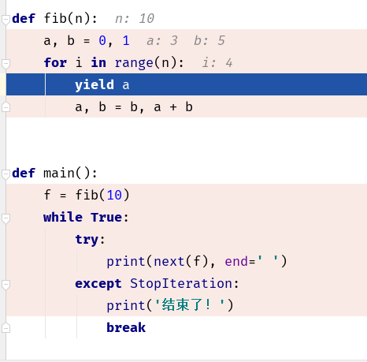

#### 关于 GIL

-   Pyhton的全局解释器锁


### 协程

-   协程其实就是一个线程， 在执行过程中， 在程序内部中断，然后转而执行别的程序，在适当的时候再返回来接着执行

##### 优势

-   最大的优势就是协程极高的执行效率。因为子程序切换不是线程切换，而是由程序自身控制，因此，没有线程切换的开销，和多线程比，线程数量越多，协程的性能优势就越明显。
-   第二大优势就是不需要多线程的锁机制，因为只有一个线程，也不存在同时写变量冲突，在协程中控制共享资源不加锁，只需要判断状态就好了，所以执行效率比多线程高很多。
-   因为协程是一个线程执行，那怎么利用多核CPU呢？最简单的方法是多进程+协程，既充分利用多核，又充分发挥协程的高效率，可获得极高的性能。


##### 原因 :

-   cpython解释器中存在一个GIL(全局解释器锁),他的作用就是保证同一时刻只有一个线程可以执行代码,
-   因此造成了我们使用多线程的时候无法实现并行。

##### 解决方案法 :

1.  更换解释器 比如使用jpython(java实现的python解释器)    
2.  使用多进程完成多任务的处理
3.  ​


1.  Python语言和GIL没有关系。仅仅是由于历史原因在Cpython虚拟机(解释器)，难以移除GIL。    
2.  GIL：

全局解释器锁。

-   每个线程在执行的过程都需要先获取GIL，保证同一时刻只有一个线程可以执行代码。    
-   线程释放GIL锁的情况： 在IO操作等可能会引起阻塞的system call之前,可以暂时释放GIL,但在执行完毕后, 必须重新获取GIL Python 3.x使用计时器（执行时间达到阈值后，当前线程释放GIL）或Python 2.x，tickets计数达到100    Python使用多进程是可以利用多核的CPU资源的。    多线程爬取比单线程性能有提升，因为遇到IO阻塞会自动释放GIL锁    
-   结论:

1.  在 处理像科学计算 这类需要持续使用cpu的任务的时候 单线程会比多线程快    
2.  在 处理像IO操作等可能引起阻塞的这类任务的时候 多线程会比单线程


### yield函数

-   生成器函数， 可以理解为暂停，程序会暂停在yield的地方， 等待下一次调用 next() 时， 程序又会执行一次， 然后继续执行


可以通过打断点来进行理解， 让程序一步一步执行， 查看程序到底执行到了那里， 暂停到了那里




next()  让 yield 向下执行

send(n)  将值传入到 yield ， 让后向下执行

```python

import time


def consumer():
    r = ''
    while True:
        n = yield r
        if not n:
            return
        print('[CONSUMER] 消费者：%s' % n)
        time.sleep(1)
        r = 'CONSUMER，结束状态！'


def produce(c):
    next(c)  # 启动程序 ，让执行到 yield 处， 暂停, 等待
    n = 0
    while n < 3:
        n += 1
        print('n的值：%s...' % n)
        # 将 n 传入到 yield 中， yield r 的值 替换为 n，
        # 同时 将原来的r 的值获取到， 赋值给当前的 r
        r = c.send(n)
        print('r的值：%s' % r)
        print('--' * 20)
    c.close()


def main():
    c = consumer()
    produce(c)


if __name__ == '__main__':
    main()

```


### 总结

-   next()  激活， 向下执行
-   yield   暂停  停止， 并且返回值
-   sent()  激活 并且 替换 yield 的值


