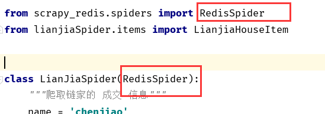
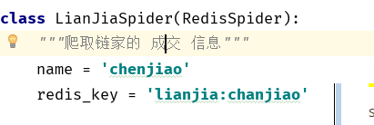
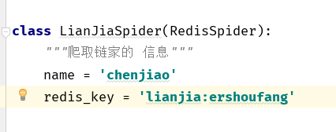
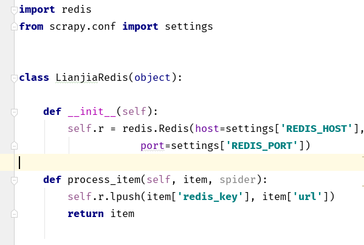

分布式


#### 分布式和集中式对比

#### 集中式系统：

-   整个系统就是一个独立的应用，整个应用也就是整个项目，所有

的业务逻辑功能都在一个应用里面。如果遇到并发的瓶颈的时候，就多增加几台服务器来部署项目，以此来解决并发分问题。在nginx中进行负载均衡即可。

缺点：

>   a) 不易于扩展
>
>   b) 如果发现你的项目代码中有bug的话，那么你的所有的服务器中的项目代码都是有问题的，这时候要更新这个bug的时候，就需要同时更新所有的服务器了。

优点：

-   维护方便


#### 分布式系统

-   将整个项目拆分为很多个业务模块，每个业务单独进行集群部署，将各个模块之间进行了解耦合，项目很容易进行横向的拓展，也可以很好的将用户的并发量提升上去。


缺点：

>   a) 项目拆分的过于复杂，给运维带来了很高的维护成本

>   b) 数据的一致性，分布式事务，分布式锁等问题不能得到很好的解决

优点：

>   a) 一个业务模块崩了，并不影响其他的业务

>   b) 利于扩展

>   c) 在上线某个新功能的时候，只需要新增对应的分布式的节点即可，测试也只需要测试该业务功能即可。很好的避免了测试在上线之前需要将整个系统进行全方面的测试


scrapy_分布式示意图

-   Master 负责 Request 产生请求地址, 并放入队列中
-   slave 负责从请求队列中获取请求，执行下载


#### ==从机==配置 没有  slave

-   REDIS_START_AS_SET 存入redis 的数据的格式

settings.py  添加

```python


# redis 配置
# 设置链接redis的配置，或者如下分别设置端口和IP地址
# REDIS_URL = 'redis://127.0.0.1:6379'
REDIS_HOST = '127.0.0.1'
REDIS_PORT = 6379


# scrapy-redis
# REDIS_URL = 'redis://:yzd@127.0.0.1:6379'  # for master
# # REDIS_URL = 'redis://:yzd@10.140.0.2:6379'  # for slave (master's ip)

# SCHEDULER 是任务分发与调度，把所有的爬虫开始的请求都放在redis里面，
# 所有爬虫都去redis里面读取请求。
SCHEDULER = "scrapy_redis.scheduler.Scheduler"

# 如果这一项设为True，那么在Redis中的URL队列不会被清理掉，
# 但是在分布式爬虫共享URL时，要防止重复爬取。
# 如果设为False，那么每一次读取URL后都会将其删掉，
# 但弊端是爬虫暂停后重新启动，他会重新开始爬取。
SCHEDULER_PERSIST = True

# REDIS_START_URLS_AS_SET指的是使用redis里面的set类型（简单完成去重），
# 如果你没有设置，默认会选用list。
# REDIS_START_URLS_AS_SET = True

# DUPEFILTER_CLASS 是去重队列，负责所有请求的去重
DUPEFILTER_CLASS = "scrapy_redis.dupefilter.RFPDupeFilter"

# 爬虫的请求调度算法，有三种可供选择
# scrapy_redis.queue.SpiderQueue：队列。先入先出队列，先放入Redis的请求优先爬取；
# scrapy_redis.queue.SpiderStack：栈。后放入Redis的请求会优先爬取；
# scrapy_redis.queue.SpiderPriorityQueue：优先级队列。根据优先级算法计算哪个先爬哪个后爬
SCHEDULER_QUEUE_CLASS = "scrapy_redis.queue.SpiderQueue"

```

==spider==中修改继承




==redis_key==设置




#### ==主机==配置   master


==spider==



==pipelines==




settings.py

```python

# redis 配置
# 设置链接redis的配置，或者如下分别设置端口和IP地址
# REDIS_URL = 'redis://127.0.0.1:6379'
REDIS_HOST = '127.0.0.1'
REDIS_PORT = 6379

# # scrapy-redis
# REDIS_URL = 'redis://:yzd@127.0.0.1:6379'  # for master
# # REDIS_URL = 'redis://:yzd@10.140.0.2:6379'  # for slave (master's ip)
#
# # SCHEDULER 是任务分发与调度，把所有的爬虫开始的请求都放在redis里面，
# # 所有爬虫都去redis里面读取请求。
SCHEDULER = "scrapy_redis.scheduler.Scheduler"
#
# # 如果这一项设为True，那么在Redis中的URL队列不会被清理掉，
# # 但是在分布式爬虫共享URL时，要防止重复爬取。如果设为False，
# # 那么每一次读取URL后都会将其删掉，但弊端是爬虫暂停后重新启动，他会重新开始爬取。
SCHEDULER_PERSIST = True
#
# # REDIS_START_URLS_AS_SET指的是使用redis里面的set类型（简单完成去重），
# # 如果你没有设置，默认会选用list。
# REDIS_START_URLS_AS_SET = True
#
# # DUPEFILTER_CLASS 是去重队列，负责所有请求的去重
DUPEFILTER_CLASS = "scrapy_redis.dupefilter.RFPDupeFilter"
#
# # 爬虫的请求调度算法，有三种可供选择
# # scrapy_redis.queue.SpiderQueue：队列。先入先出队列，先放入Redis的请求优先爬取；
# # scrapy_redis.queue.SpiderStack：栈。后放入Redis的请求会优先爬取；
# # scrapy_redis.queue.SpiderPriorityQueue：优先级队列。根据优先级算法计算哪个先爬哪个后爬
SCHEDULER_QUEUE_CLASS = "scrapy_redis.queue.SpiderQueue"

```


