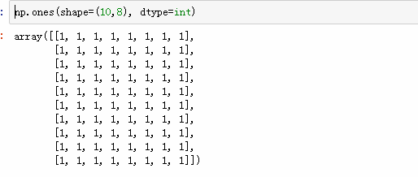
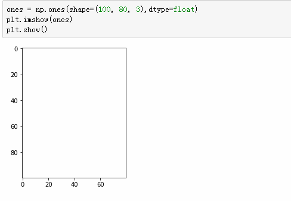
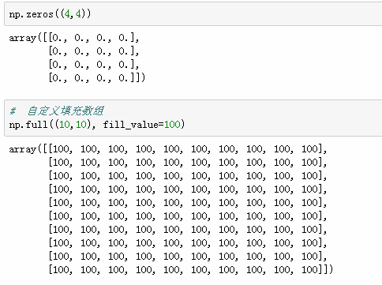
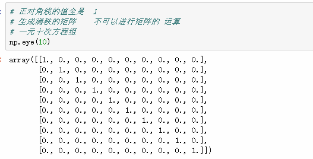
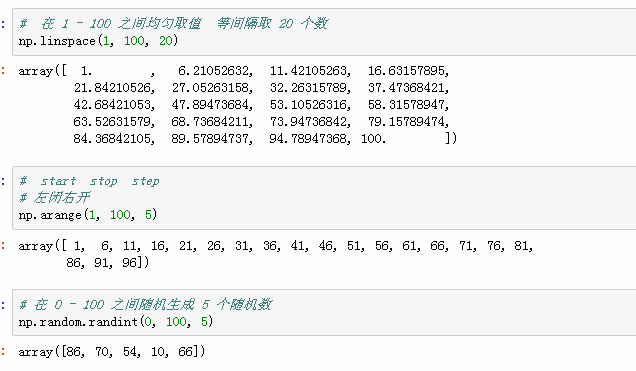
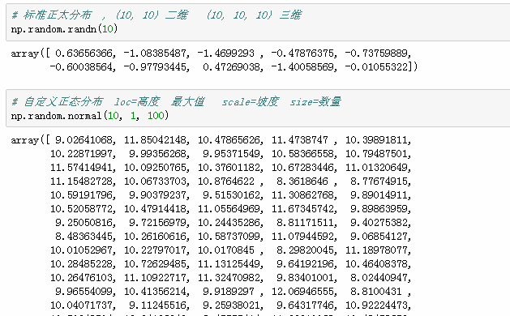
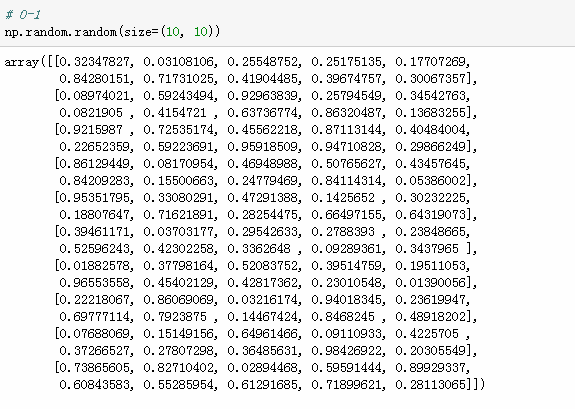
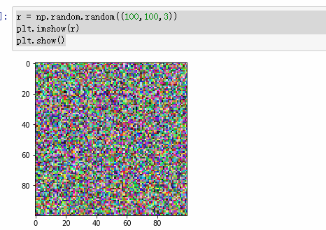

numpy


```python
pip freeze >requirement.txt   # 将所有需要的包写入到文件
pip inastall -r requirement.txt   # 安装文件中的所有的包
```


png   0-1     颜色范围    255份

jpg   0-255

### 傅里叶变换
> 可以将图片的主要轮廓抠取出来


```python
np.__version__

# pyolotlib 显示画图 数据分析和可视化
import matplotlib.pyplot as plt

# 读取图片  得到的是数组   是一个 RGB 数组
cat = plt.imread('icon.jpg')
cat2 = cat - 200
plt.imshow(cat2)
plt.show()

# 形状
cat2.shape

r = np.random.random((100,100,3))
plt.imshow(r)
plt.show()
```


`n4 = np.array([1, 2, 3, 'python'])`

### 创建数组优先级 str > int > float





















## 级联
1. np.concatenate()
2. 参数必须是列表  一定要加中括号或小括号
3. 维度必须相同
4. 形状必须相同
5. 级联的方向默认是 shape 这个 tuple 的第一个值所代表的维度方向
6. 可通过 axis 参数改变级联的方向


