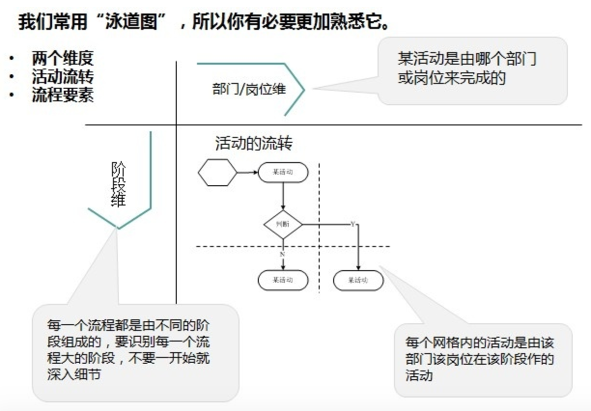

# 流程图

流程图=流程+图 流程图表现的是有一定规律可循的过程。

# 图分类

## 用例图

一个角色在系统中完成的活动有哪些，可以不考虑任何活动过程，通常是，产品经理或者开发工程师看使用。

## 信息架构图，站点地图

功能和内容的展现层次。设计师常使用信息架构图;HR常用组织架构图。

## 线框图（Wireframe)

将具体每个界面的内容布局和权重表达出来，且标注出一些交互细节的设计，比如当密码错误后，如何提示下一步动作。常用线框图的人是设计师

## 实体关系图(E-R图)

数据库架构的工作，业务系统系统或场景中实体的关系。比如储户和银行卡的关系是归属关系，通过开卡产生关联。一般用矩形来表示实体，用椭圆标志这个实体的属性。

# 流程图

6大要素：参与者，活动，次序，输入，输出，标准化。

- 参与者：谁在这个流程中，可以是系统，人，打印机等等
- 活动：做了什么事，比如点餐，结账等
- 次序：这些事情发生的前后顺序如何？那个任务是其他任务的条件。比如：结账是出发票的前提
- 输入：每个活动开始取决于什么样的输入或者数据。比如厨师需要收到具体的点菜单，才能进行
- 输出：没想活动结束后，会输入什么样的一个文档或者数据传给下一方。比如厨师做好菜后，如何让传菜的人知道菜已经做好了
- 标准化：采用标准化的符号，是受众更容易明白

# 流程如的分类

常见的有：业务流程图，页面流程如

战略、战术、业务流程图到页面流程图的关系

- 先是有一个业务需求和业务目标，也即我们的愿景是什么？（战略）
- 然后就诞生了我们需要分解出什么样的任务，如何执行战术？（战术）
- 然后就诞生了需要架构什么部门，岗位去分工协作？（组织架构）
- 然后就诞生了不同的部门在协作完成某件任务时的业务流程？（业务流程）
- 业务流程基本稳定后，往往会考虑优化效率，所以会诞生出系统来支持流程，减少人肉环节，促进数据采集（系统愿景）
- 为了设计这个系统，PD需要思考什么功能能够取代某个环节的人肉工作（功能需求，系统流程）
- 不管是怎么样的功能最终都会以界面的方式呈现，设计师们会关注用户在系统里的任务流，行为路径，让用户完成任务更加高效愉悦。（页面流程）

# 业务流程再分

按表现形式：任务流程如，泳道图

按符号复杂程度：基本流程图，完整流程图

# 泳道图

# 绘制业务流程图可遵循的流程

- 调研
- 快速将调研得到的文字和问题，快速转化为业务流程图
- 评审与确认,真正让业务流程图反映现实中的业务
- 归档维护:流程不断变更，业务流程图

## 业务流程图的关键要素给搜集一番

1. 整个流程的起始点是什么？整个流程的终结点是什么？
2. 在整个流程中，涉及到的角色都是谁？
3. 在整个流程中，都需要做什么事情？
4. 这些会议和任务是可选还是必选的？
5. 分别产出什么文档？

## 调研——问正确的问题，多问问题，多问几个人

**让熟悉整体业务的人讲解，了解大局；实地观察询问，验证讲解以及发现细节。**(问的问题可能本身是错的，或者问的人不对，所以需要实地观察验证)

调研过程解决的仍然是who，what，why，how，以及where。就是：谁，在什么情况下，做了什么事情，这个事情有什么前提，又输出了什么，这个事情在哪里完成的。

流程图的表现：
1. who：谁，部门，角色，岗位
2. what：什么事情
3. where：在哪里做的？
4. document：产生的这份文档叫什么名字
5. condition：条件，在这种条件下，下一个活动还能够继续，即用逻辑链接线的方式来表示一项活动的输入和输出，指向某个活动的箭头就表示此活动的前置输入条件。
6. Dicision：决策。有些活动会产生一个条件判断，根据不同的判断结果从而走不同的分支流程。
