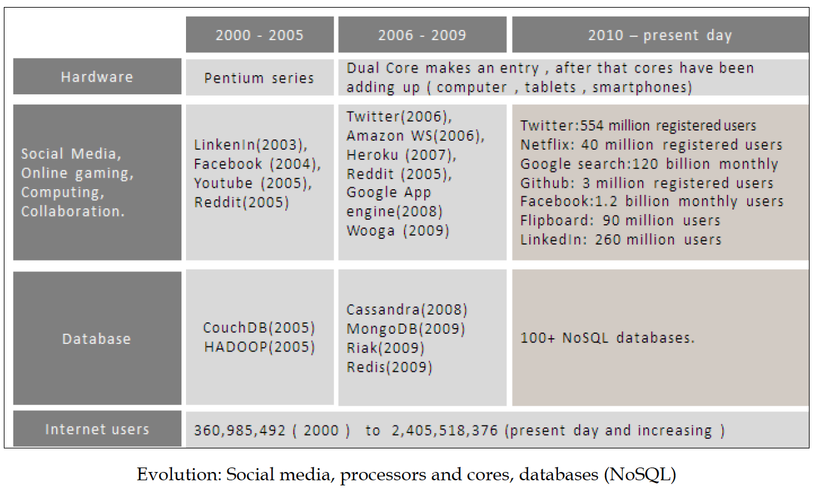

# Learning Redis(Design efficient web and business solutions with Redis)

{ [PACKET] 2015 }

# 目录

## 1\. NoSQL介绍(Introduction to NoSQL)

## 2\. 开始(Getting Started with Redis)

## 3\. 数据结构和通信协议(Data Structures and Communicating Protocol in Redis)

## 4\. Redis服务器的功能(Functions in the Redis Server)

## 5\. 在Redis中处理数据(Handling Data in Redis)

## 6\. Redis在web应用中(Redis in Web Applications)

## 7\. Redis在商业应用中(Redis in Business Applications)

## 8\. Redis集群(Clustering)

## 9\. Redis维护(Maintaining Redis)

# -----------------------------------正文-------------------------------

## 1\. Nosql介绍

主题:

- 企业数据
- NoSQL
- NoSQL使用场景

### 互联世界

未来会是并行计算并且他们将会部署在商业级机器上

随着硬件产业指示着并行计算的到来,新方案需要原生支持分布式和并行.这意味着他们需要逻辑上支持并行和存储的分布式数据库.换句话说就是水平扩展.

所有解决方案中最关键的一层是数据层.

### NoSQL介绍
NoSQL(Not Only SQL).以前所有的数据存储方案只能用RDBMS来完成.
