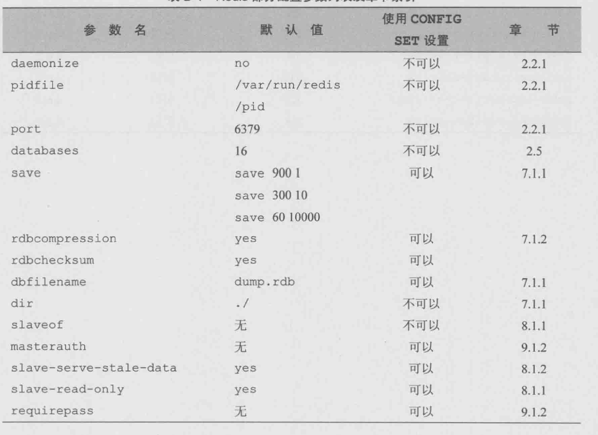
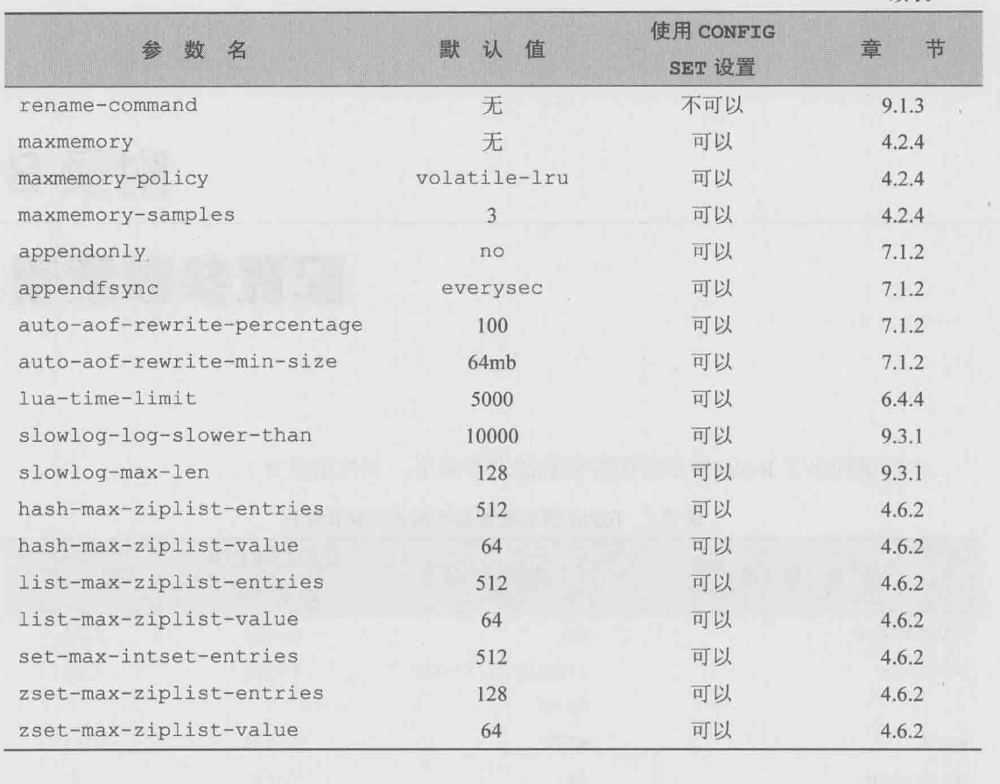

# Redis入门指南 第二版 人民邮电出版社

设置登录密码
/etc/redis/redis.conf requirepass pwd

/etc/redis/redis.conf bind 0.0.0.0

(error) ERR max number of clients reached`kill -9 redis-pid `

## 1 简介

Redis是一个开源,高性能,基于键值对的缓存与存储系统.通过多种键值数据类型来适应不同场景下的缓存与存储需求.同时Redis的诸多高级功能使其可以胜任消息队列,任务队列等不同的角色

### 1.2 特性

#### 1.2.1 存储结构

Redis以字典结构存储数据.Redis支持的键值数据类型如下:

- 字符串类型
- 散列
- 列表
- 集合
- 有序集合

#### 1.2.2 内存存储与持久化

Redis数据保存在内存中,同时提供了异步方式将内存数据写入磁盘中

#### 1.2.3 功能丰富

Redis虽然作为数据库,但是由于其功能丰富,越来越多的人用它来做缓存,队列系统等.

> 在性能上redis属于单线程模型,memcached支持多线程.redis的新功能已经足够优异,而且功能支持比memcache多,而且原生支持集群,memcache需要第三方工具来集群.所以新项目中直接选择redis将会是非常好的选择

除此之外,redis的列表类型键可以用来实现队列,并且支持阻塞式读取,可以很容易的实现一个高性能的优先级队列.redis同时还支持"发布/订阅"消息模式,可以基于此构建聊天室等系统

#### 1.2.4 简单稳定

redis使用c语言开发,代码量只有3万行.

## 2 准备

### 2.1 安装启动

redis可执行文件

- redis-server:redis服务器
- redis-cli:redis命令行工具
- redis-benchmark:redis性能测试工具
- redis-check-aof:aof文件修复工具
- redis-check-dump:rdb文件检查工具
- redis-sentinel:sentinel服务器

配置文件

- daemonize: yes 是Redis以守护进程模式运行
- pidfile: /var/run/redis_端口号.pid 设置redis的pid文件位置
- port: 端口号 设置redis监听的端口号
- dir: /var/redis/端口号 设置持久化文件存放位置

#### 2.2.2 停止redis

通过shutdown来通知redis,这样redis会把数据同步到磁盘上`redis-cli shutdown`

### 2.3 redis命令行客户端

redis-cli

```
Usage: redis-cli [OPTIONS] [cmd [arg [arg ...]]]
  -h <hostname>      服务器地址 (默认: 127.0.0.1).
  -p <port>          服务器端口 (默认: 6379).
  -s <socket>        服务器socket (是 hostname 和 port 无效).
  -a <password>      连接服务器时的密码
  -r <repeat>        指定的命令执行N次
  -i <interval>      当使用 -r 时,每个命令等待interval秒
                     可以使用二级时间,例如 -i 0.1.
  -n <db>            数据库号码.
  -x                 从STDIN读取最后一个参数.
  -d <delimiter>     分隔符 (default: \n).
  -c                 启动集群模式 (遵循 -ASK and -MOVED 重定向).
  --raw              使用原始格式答复 (当STDOUT不是tty时,默认).
  --no-raw           轻质格式化输出,即使STDOUT不是tty时
  --csv              输出CSV格式
  --stat             打印服务器滚动状态:men,clients,....
  --latency          进入一个特殊模式连续采集延迟问题
  --latency-history  类似 --latency 但是随着时间来跟踪延迟问题,默认是每15秒,使用 -i来修改
  --latency-dist     Shows latency as a spectrum, requires xterm 256 colors.
                     Default time interval is 1 sec. Change it using -i.
  --lru-test <keys>  Simulate a cache workload with an 80-20 distribution.
  --slave            Simulate a slave showing commands received from the master.
  --rdb <filename>   Transfer an RDB dump from remote server to local file.
  --pipe             Transfer raw Redis protocol from stdin to server.
  --pipe-timeout <n> In --pipe mode, abort with error if after sending all data.
                     no reply is received within <n> seconds.
                     Default timeout: 30\. Use 0 to wait forever.
  --bigkeys          Sample Redis keys looking for big keys.
  --scan             List all keys using the SCAN command.
  --pattern <pat>    Useful with --scan to specify a SCAN pattern.
  --intrinsic-latency <sec> Run a test to measure intrinsic system latency.
                     The test will run for the specified amount of seconds.
  --eval <file>      Send an EVAL command using the Lua script at <file>.
  --help             Output this help and exit.
  --version          Output version and exit.

Examples:
  cat /etc/passwd | redis-cli -x set mypasswd
  redis-cli get mypasswd
  redis-cli -r 100 lpush mylist x
  redis-cli -r 100 -i 1 info | grep used_memory_human:
  redis-cli --eval myscript.lua key1 key2 , arg1 arg2 arg3
  redis-cli --scan --pattern '*:12345*'

  (Note: when using --eval the comma separates KEYS[] from ARGV[] items)
```

#### 2.3.2 命令返回值

命令的返回值有5种类型

1. 状态回复:返回执行的状态,例如OK,PONG
2. 错误回复:出现命令不存在或者命令格式有误等情况是,返回具体错误消息
3. 整数回复:redis没有整数类型,但是提供了一些关于整数操作的命令
4. 字符串回复:例如当请求一个字符串类型键的键值或一个其他类型键中的某个元素时就会得到一个字符串回复
5. 多行字符串回复

### 2.4 配置

直接使用配置文件`redis-server /path/to/redis.conf`

不用重新启动redis,在redis运行时通过**CONFIG SET** 例如:`redis>CONFIG SET loglevel warning`

**CONFIG GET** 可以获得当前配置的情况

### 2.5 所数据库

每个数据库对外都是从0开始的递增数字命名,redis默认支持16个数据库,通过修改`databases`来修改这一数字,客户端建立连接后会自动选择0号数据库,不过可以随时使用`SELECT`来更换数据库.例如:`SELECT 1`

redis数据库不支持命名,每个数据库使用相同的密码,数据库的访问权限都一样.

## 3 入门

### 3.1 热身

**获得符合规则的键名列表**

`keys pattern` pattern匹配规则如下

- `?` 匹配一个字符
- `*`匹配任意个(包括0个)字符
- `[]` 匹配括号间人一个字符,可以使用 - 表示范围,例如`[a-z]`
- `\x` 匹配字符x,用于转义符号.如要匹配`?` 就使用`\?` 匹配`*` 就用 `\*`

```
设置名为bar的键
127.0.0.1:6379> set bar 1
OK
keys * 获取所有键
127.0.0.1:6379> keys *
1) "bar"
```

**判断一个键是否存在**

```
127.0.0.1:6379> EXISTS bar
(integer) 1
```

**删除键**

DEL key [key...] 返回删除键的个数

```
127.0.0.1:6379> DEL bar
(integer) 1
127.0.0.1:6379> DEL bar
(integer) 0
这里因为已经删除掉了,所以返回0
```

**获得键值的数据类型**

TYPE key

```
127.0.0.1:6379> TYPE bar
string
```

### 3.2 字符串类型

他可以用来存储任何形式的字符串,一个字符串键允许存储的数据的最大容量是512MB

字符串类型是其他4个类型的基础,其他类型从某种角度来说只是组织字符串的形式不同

#### 3.2.2 命令

**赋值与取值**

```
SET name value
GET name

例如

设置key
127.0.0.1:6379> SET test_key hello

获取key
127.0.0.1:6379> GET test_key
"hello"

当键不存在时返回空结果
127.0.0.1:6379> GET null_key
(nil)
```

**递增数字**

```
INCR name

127.0.0.1:6379> INCR num
(integer) 1

127.0.0.1:6379> INCR num
(integer) 2
如果键不存在,默认值是0,所以第一次放回结果1,如果键值不是整数,redis返回错误

127.0.0.1:6379> set num 'hello'
OK
127.0.0.1:6379> get num
"hello"
127.0.0.1:6379> INCR num
(error) ERR value is not an integer or out of range
```

**增加指定的整数**

```
127.0.0.1:6379> INCRBY num number

127.0.0.1:6379> INCRBY num 10
(integer) 10

127.0.0.1:6379> INCRBY num 15
(integer) 25
```

**减少指定的整数**

```
DECRBY name
127.0.0.1:6379> DECRBY num 15
(integer) 10
```

**增加浮点数**

```
127.0.0.1:6379> INCRBYFLOAT num 10.2212
"20.2212"

127.0.0.1:6379> INCRBYFLOAT num 10
"30.2212"
```

**向尾部追加值**

```
APPEND name value
如果键不存在,则相当于set key value

127.0.0.1:6379> APPEND num '12'
(integer) 9
127.0.0.1:6379> get num
"30.221212"
127.0.0.1:6379> INCRBYFLOAT num 10
"40.221212"
127.0.0.1:6379> APPEND num '12sdf'
(integer) 14
127.0.0.1:6379> INCRBYFLOAT num 10
(error) ERR value is not a valid float
上面append '12'后,num还是一个浮点数,可以继续当做浮点数来操作
```

**获取字符串长度**

```
STRLEN name
```

**同时获取/设置多个键值**

```
MGET name [name ...]

MSET name value [name value]

127.0.0.1:6379> MSET num 1 num2 2
OK

127.0.0.1:6379> KEYS *
1) "num"
2) "num2"

127.0.0.1:6379> MGET num num2
1) "1"
2) "2"
```

**位操作**

```
GETBIT name offset
SETBIT name offset value
BITCOUNT name [start] [end]
BITOP operation destkey name [name ...]
```

一个字节有8个二进制位组成.

GETBIT 可以获得一个字符串类型键指定位置的二进制位的值(0或1),索引从0开始.如果二进制位索引超出范围则默认值是0

```
127.0.0.1:6379> set test f
127.0.0.1:6379> getbit test 10
(integer) 0

127.0.0.1:6379> SETBIT test 1 0
(integer) 1
127.0.0.1:6379> get test
"&"
```

BITCOUNT 可以获得字符串中值为1的二进制位的个数

```
127.0.0.1:6379> get test
"&"
127.0.0.1:6379> BITCOUNT test
(integer) 3
```

BITOP 可以对多个字符串类型键进行位运算,并将结果存储在destkey参数指定的键中,bitop支持and,or,xor,not

```
127.0.0.1:6379> set foo1 bar
OK
127.0.0.1:6379> set foo2 aar
OK
127.0.0.1:6379> BITOP or foo3 foo1 foo2
(integer) 3
127.0.0.1:6379> get foo3
"car"
```

### 3.3 散列类型

散列类型也是一种字典结构{key:value...},key只能是字符串,一个散列类型可以包含2**32-1个key

#### 3.3.2 命令

**赋值与取值**

```
HSET name key value
HGET name key
HMSET name key value [key value...]
HMGET name key [key...]
HGETALL name
```

HSET不区分更新还是插入,当不存在该键时返回1,存在时返回0

**判断key是否存在**

```
HEXISTS name key
```

存在返回1,不存在返回0

**当key不存在时赋值**

```
HSETNX  name key value
```

如果key存在不执行任何操作

**增加数字**

```
HINCRBY name key number
HINCRBYFLOAT name key number
```

**删除字段**

```
HDEL name key[key...]
返回删除的key个数
```

**只获取字段名或字段值或key数量**

```
HKEYS name
HVALS name
HLEN name
```

### 3.4 列表类型

列表可以存储一个 **有序** 的字符串列表,常用的操作是向列表两端添加元素或者获得列表的某一个片段

列表内部使用双向链表实现,所以向两端添加元素的时间复杂度O(1),获取越接近两端的元素速度就越快.

但是通过索引访问元素比较慢,因为要一个一个的读取到第n位

这些特性使得redis还可以作为队列使用

列表最多容纳2**32-1个元素

#### 3.4.2 命令

```
LPUSH name value [value...] 向左边增加元素
RPUSH name value [value...] 向右边增加元素

LPOP name 从左边弹出元素
RPOP name 从右边弹出元素

LLEN name 获取元素个数

LRANGE name start end 获取区间内元素索引可以是负数,例如lrange numbers -5 -1

LREM name count value 删除列表前count个值为value的元素,count>0时从左边开始删除,count<0时从右边开始删除,count=0时删除所有值为value的元素

LINDEX name index 获取指定index位置的值,index>0从左边开始,index<0从右边开始

LSET name index value 设置指定index位置的值 index>0从左边开始,index<0从右边开始

LTRIM name start end 只保留指定范围内的元素,start end 可以是负数

LISERT name BEFORE|AFTER pivot value,从左边查找值为第一个pivot的元素,然后将value插入

RPOPLPUSH source destination 将source元素从右边开始弹出,并从destination左边开始插入
```

### 3.5 集合类型

集合可以存储2**32-1 个元素,所有元素唯一,元素无序.内部通过值为空的散列表(hash table)来实现,所有插入删除,时间复杂度为O(1).还支持并,交,差运算

#### 3.5.1 命令

```
SADD name member [member] 返回新增元素个数

SREM name member [member...] 返回删除成功的个数

SMEMBERS name 获取所有的元素

SISMEMBER name member 返回0 member不存在 返回1 member存在

SDIFF name [name...] 差操作

SINTER name [name...] 交操作

SUNION name [name...] 并操作

SCARD name 获得集合元素个数

SDIFFSTORE destination name [name] 差操作后存入destination

SINTERSTORE destination name [name...] 交操作后存入destination

SUNIONSTORE destination name [name...] 并操作后存入destination

SRANDMEMBER name [count] 随机返回count个元素,count>0时,返回不重复的元素,count<0时元素可能相同

SPOP name从集合中弹出一个元素
```

### 3.6 有序集合

每一个元素都关联了一个分数,这使得不仅可以完成插入,删除,判断等操作还能够根据分数最高或者最低的前N个元素,获得指定分数范围内的元素等与分数有关的操作.

有序集合和列表的区别

- 二者都是有序的
- 都可以获得某一范围内的元素
- 列表通过链表实现,获取两端数据较快,获取中间数据较慢,
- 有序集合使员工散列表和跳跃表,读取中间的数据也很快(时间复杂度O(log(N)))
- 列表中不能简单的调整某个元素的位置,单有序集合可以通过该分数实现
- 有序集合比列表更耗内存

#### 3.6.1 命令

```
ZADD name score member [score member] 添加元素,返回新增元素个数 score可以是整数,也可以是浮点数

ZSCORE name member 获得元素的分数

ZRANGE name start stop [WITHSCORES]按照元素分数从小到大从start到end去除元素,start和end可以是负数. withscores在取出元素时也也取出元素分数.默认redis会按照0<9<A<Z<a<z来排序

ZRANGBYSCORE name min max [WITHSCORES] [LIMIT offset count]

ZINCRBY name increment member 增加一个元素的分数,返回更改后的分数

ZCARD name 获取元素个数

ZCOUNT name min max 获取执行范围内个数

ZREM name member [member]删除元素

ZREMRANGESCORE name min max 删除指定分数范围内圆度

ZRANK name member 获得元素的排名从小到大排

ZREVRANK name member 获得元素排名从大到小排

ZINTERSTORE destination numkeys key [key...] [WEIGHTS weight [weight...]] [AGGREGATE SUM|MIN|MAX]有序集合的交集
AGGREGATE SUM表示destination中元素的分数是每个参与计算的集合中该元素分数的和,MIN分数是每个参与计算的集合中该元素分数的最小值,MAX参与计算的集合中该元素根数的最大值
weight每个集合参与计算时会乘上该集合的权重

ZUNIONSTORE destination numkeys key [key...] [WEIGHTS weight [weight...]] [AGGREGATE SUM|MIN|MAX]
```

## 4 进阶

### 4.1 事务

#### 4.1.1 概述

redis中的事务是一组命令的集合.事务同命令一样都是redis的最小执行单位,一个事务的命令要么都执行,要么都不执行

```
启动事务
127.0.0.1:6379> MULTI
OK

127.0.0.1:6379> set a 'a'
QUEUED
127.0.0.1:6379> set b 'b'
QUEUED

执行事务
127.0.0.1:6379> EXEC
1) OK
2) OK
```

#### 4.1.2 错误处理

**语法错误**

```
127.0.0.1:6379> MULTI
OK
127.0.0.1:6379> set key value
QUEUED
127.0.0.1:6379> set key
(error) ERR wrong number of arguments for 'set' command
127.0.0.1:6379> EXEC
(error) EXECABORT Transaction discarded because of previous errors.
```

这种情况是命令的语法错误,只要有一个命令语法错误,exec后就直接返回错误

**运行错误**

在命令执行时发生错误,如利用散列命令操作集合累型的键,这样的命令会被redis接受并执行.如果一条事务语句运行错误,事务的其他命令会继续执行

**redis没有提供事务回滚功能**

#### 4.1.3 WATCH命令

watch命令可以监控一个或多个键,一旦其中一个键被修改或删除,之后的事务就不会执行,监控一直持续到exec

```
127.0.0.1:6379> watch key
OK
127.0.0.1:6379> set key 'tttt' 修改key
OK
127.0.0.1:6379> MULTI
OK
127.0.0.1:6379> set t t
QUEUED
127.0.0.1:6379> set key sss
QUEUED
127.0.0.1:6379> EXEC 事务完全没有执行
(nil)
127.0.0.1:6379> get t
(nil)
127.0.0.1:6379> get key
"tttt"
```

EXEC后所有watch都失效

### 4.2 过期时间

#### 4.2.1 命令介绍

EXPIRE设置一个键的过期时间 `EXPIRE name seconds`

TTL可以查看一个键还有多久失效,键不存在时返回-2 ,如果没有为键设置过期时间就返回-1

PERSIST可以取消键的过期时间,取消成功返回1 否则返回0(因为键不存在或键本来就是永久性的)

除了EXPIRE外,SET命令也会清楚键的国企时间,对值的操作不会影响过期时间

PEXPIRE可以使用的事毫秒 `PEXPIRE 1000`等同于`EXPIRE 1`

EXPIREAT和PEXPIREAT使用UNIX时间作为第二个参数表示键的过期时间`EXPIREAT 1351858600`

```
127.0.0.1:6379> set key 'ss'
OK
127.0.0.1:6379> EXPIRE key 100
(integer) 1

127.0.0.1:6379> ttl key
(integer) 95
```

#### 4.2.2 实现访问频率限制

设置一个键的过期时间为1分钟,1分钟内没来一个请求,键自增1,1分钟后再创建一个

#### 4.2.4 实现缓存

redis中缓存常用设置,maxmemeory限制redis使用的最大内存,单位字节.如果内存不够时,redis会使用maxmemory-policy指定的策略来删除不需要的键知道redis占用内存小于指定内存

maxmemory-policy支持4中策略LRU是`最近最少使用`,即最近最少使用的键未来一段时间内也不会用到

- volatile-lru:使用LRU算法删除一个键,只对设置了过期时间键
- allkeys-lru:使用LRU删除一个键
- volatile-random:随机删除一个键,只对设置了过期时间的键
- allkeys-random:随机删除一个键
- volatile-ttl:删除过期时间最近的一个键
- noeviction:不删除键,只返回错误

### 4.3 排序

#### 4.3.1 有序集合的集合操作

集合提供了强大的操作命令,但是如果需要排序就要用到有序集合类型

有序集合常见的使用场景是大数据排序.redis人为开发者在做完交集,并集运算后不需要直接获得全部结果,而是会希望将结果存入新的键中一遍后续处理

#### 4.3.2 sort命令

除了使用有序集合外,我们还可以借助redis提供的sort命令.sort命令可以对列表,集合和有序集合键进行排序,并且可以完成与关系数据库中连接查询相类似的任务.

```
127.0.0.1:6379> lpush list 2 4.12 9 3 123 332394
(integer) 6
127.0.0.1:6379> SORT list
1) "2"
2) "3"
3) "4.12"
4) "9"
5) "123"
6) "332394"
```

对有序集合排序会忽略分数,只针对元素自身值排序

```
127.0.0.1:6379> ZADD set 50 1 40 2 30 3
(integer) 3
127.0.0.1:6379> sort set
1) "1"
2) "2"
3) "3"
```

除了按数字排序,还可以通过`ALPHA`来按字母排序

```
127.0.0.1:6379> LPUSH tlist a s dd ase lkkd jasd we
(integer) 7
127.0.0.1:6379> sort tlist alpha
1) "a"
2) "ase"
3) "dd"
4) "jasd"
5) "lkkd"
6) "s"
7) "we"
```

DESC按照降序排序

结合limit可以取一段排序好的数据

#### 4.3.3 BY参数

希望将有序集合按照其他的参考排序,例如有序集合 ID( 1,6,12,26),包含是文章的id,想让文章以创建时间排序,文章是以hash类型存放

by命令可以让元素不按照自身值进行排序,而是参考字符串类型键或者散列类型键的某个字段来排序

```
tag:ruby:posts=(2,6,12,26)
sort tag:ruby:posts BY post:*->time DESC

上面会按照post:2,post:6,post:12,post:26这几个散列键的time字段的值并以此决定tag:ruby:posts键中各个ID的排序


127.0.0.1:6379> lpush sortlist 2 1 3
(integer) 3
127.0.0.1:6379> set itemscore:1 50
OK
127.0.0.1:6379> set itemscore:2 100
OK
127.0.0.1:6379> set itemscore:3 10
OK
127.0.0.1:6379> SORT sortlist by itemsocore:* DESC
1) "3"
2) "2"
3) "1"
```

如果元素的参考键值相同,则按照元素本身值来决定排序

#### 4.3.4 GET参数

get参数可以返回get参数中指定的键值.get也支持字符类型和散列类型的键,并用`*`作为占位符

```
sort tag:ruby:posts by post:*->time get post:*->title get post:*->time get #
这里返回post:*的title字段,time字段.
get # 返回tag:rugy:posts中对应元素的值
```

#### 4.3.5 STORE参数

将结果保存到指定键中

```
sort tag:ruby:posts by post:*->time get post:*->title get post:*->time get # store sort.result
```

#### 4.3.6 性能优化

sort时间复杂度O(n+mlog(m)) n表示要排序的元素列表,m表示要读取的元素

- 尽可能减少带排序元素数量,是的n尽可能小
- limit只获取必要的数据,是的m尽可能小
- 如果要排序的数据量较大,尽可能使用store将结果缓存

### 4.4 消息通知

#### 4.4.1 任务队列

生产者-->队列-->消费者

#### 4.4.2 redis实现任务队列

利用列表类型 LPUSH和RPOP,实现方式可以是来了消息就LPUSH,读一个消息使用RPOP,但是这样的话,如果队列没有消息每秒都会RPOP.使用BRPOP时,当列表没有元素时,BRPOP就会阻塞连接,知道有新元素加入.

BRPOP接受两个参数,第一个键名,第二个超时时间,单位秒,如果超过超时时间就返回nil,如果不设置超时时间,即超时时间为0,就一直阻塞.

#### 4.4.3 优先级队列

#### 4.4.4 "发布/订阅"模式

发布订阅包含两种角色,订阅者可以订阅一个或多个频道(channel),发布者可以向指定的频道发送消息

发布消息的命令是PUBLISH,用法是`PUBLISH channel message`,消息不是持久化的.

订阅使用SUBSCRIBE,`SUBSCRIBE channel`,进入订阅状态后,客户端只能使用SUBSCRIBE,UNSUBSCRIBE,PSUBSCRIBE和PUNSUBSCRIBE这4个属于发布订阅模式命令,否则会报错

#### 4.4.5 按照规则订阅

PSUBSCRIBE可以订阅指定规则的channel,支持glob风格的通配符,例如 `PSUBSCRIBE channel.?*`

### 4.5 管道

redis使用TCP协议连接,客户服务端来回交互一条命令的需要一定时间,多条命令执行,需要等待上一条命令执行完.

redis提供了管道机制,可以一次发送多个命令,如果这些命令不依赖于之前执行的命令,就可以打包一次发送,从而降低通信次数

### 4.6 节省空间

精简键名和键值是最直观的减少内存使用的方式

#### 4.6.2 内部编码优化

redis内部,每种数据类型都提供了两种内部编码方式

## 7 持久化

redis支持两种方式的持久化:RDB和AOF,RDB会'定时'将内存数据存储到磁盘上,AOF,每次执行命令后将命令记录下来.两种方式可以单独使用,也可以结合使用

### 7.1 RDB方式
RDB是通过快照完成的,当符合一定条件是redis会将内存所有数据生成一份副本并保存在磁盘上,有以下集中情况:
- 根据配置规则进行自动快照
- 用户执行SAVE或BGSAVE命令
- 执行FLUSHALL命令
- 执行复制时

#### 7.1.1 根据配置文件

快照条件在配置文件中定义,两个参数:时间窗口M和改动的键的个数N.每当时间M内被更改的键数目大于N时,执行快照.
可以同时存在多个条件,他们是 或 方式

```
save 900 1
save 300 10
save 60 10000
```

#### 7.1.2 用户执行SAVE或BGSAVE

SAVE命令,redis同步地进行快照,此时会阻塞所有来自客户端的请求

BGSAVE,手动执行时,推荐使用BGSAVE.他可以异步地在后台库阿斯的进行快照

#### 7.1.3 执行FLUSHALL

执行flushall时,redis会清楚所有数据库中的数据.不论清空数据库的过程是否触发了自动快照,只要自动快照条件不为空,redis就执行一次快照操作

#### 7.1.4 执行复制时

redis主从模式时,在复制初始化时会进行自动快照,及时没有定义自动快照条件,也会生成RDB快照

#### 7.1.5 快照原理

redis默认汇报快照存储在当前进程工作目录的dump.rdb文件中,通过设置dir和dbfilename来修改

1. redis使用fork函数复制一份当前进程(父进程)的副本(子进程)
2. 父进程继续接受并处理客户端的命令,子进程将内存中的数据写入磁盘的临时文件
3. 当紫金陈写入完所有数据时,会将临时文件替换就得RDB文件

redis启动后就读取RDB文件快照

### 7.2 AOF方式
如果数据相对重要,希望将损失降到最小,可以使用AOF持久化.如果数据非临时,一般也用AOF方式.

redis可以将执行的每一条写命令追加到磁盘文件,这过程会降低redis性能

默认redis是没有开启AOF的 通过参数`appendonly yes`打开.AOF文件和RDB在一个地方,默认名为appendonly.aof 通过appendfilename修改

#### 7.2.2 AOF实现

有些命令重复了多次,那么只有一条是实际有用的,redis只会记录这一条.当达到一定条件时redis就会自动重写AOF文件,设置如下
- auto-aof-rewrite-percentage 100 当目前aof文件的大小超过上一次重写时aof文件大小的百分之多少回载重写,如果没有冲写过,则以启动时的aof文件大小为依据
- auto-aof-rewrite-min-size 64mb,允许重写的最小aof文件大小,通常在aof文件很小时,我们会不关心冗余的语句

#### 7.2.3 同步磁盘数据
由于操作系统缓存机制,数据并没有真正写到磁盘,而是进入磁盘缓存,默认每个30秒执行一次同步操作,一遍将磁盘缓存内容真正写到磁盘

通过appendfsync来设置同步上时间,`appendfsync everysec`每秒同步,always表示每次执行写入都会同步(最安全,最慢),no不主动同步


## 8 集群

- 从结构上,单个 redis 服务器会发生单点故障,同时一台服务器需要承受所有的请求负载,这就需要为数据生成多个副本并分配在不同的服务器上
- 从容量上,单个 redis 服务器的内存非常容易成为存储瓶颈,所以需要进行数据分片

### 8.1 复制
通过持久化,保证redis即使在服务器重启的情况下也不会损失数据,但是一台机器故障或者硬盘问题就会导致数据丢失.redis通过复制功能,将一台数据库数据自动更新到另一台服务器上

### 8.1.1 配置

在复制的概念中,数据库分为两类.一类是主数据库,一类是从数据库.主数据库可以进行读写操作,当写操作导致数据变化时会自动将数据同步给从数据库.而从数据库一般是只读的,并接受来自主数据库同步过来的数据.一个主数据库拥有多个从数据库,从而一个从数据库只能有一个主数据库

redis实现复制很容易.只需要在数据库配置文件总加入`slaveof 主数据库地址 主数据库端口`

### 8.1.2 原理
当一个从数据启动后,向主数据库发送sync命令.同时主数据接收到sync命令后开始在后台执行快照,并将快照保存期间接收到的命令缓存起来.当快照完成后.将快照文件和所有缓存的命令发送个从数据库.从数据库收到后,载入快照并执行缓存的命令.上面成为复制过程.复制完成后主数据库每当接受到写命令时,就会将命令同步给从数据库.

如果从数据库断开了,主数据库只会把断开期间的命令发送给从数据库

同步过程中数据库并不会阻塞,默认情况下从数据库会使用同步前的数据来进行响应.或者设置`slave-serve-stable-data no`这样在同步完成前都会回复错误.

redis容忍在一段时间内主从数据库数据不一致,单最终会一致.

### 8.1.3 图结构

每个从数据库又可以再作为其他从数据库的主数据库.

### 8.1.4 读写分离与一致性

一般一主多从的结构适合读多写少的场景,如果单个主数据库不能满足需求是要用到8.3的集群方案

### 8.1.5 从数据库持久化
另一个相对耗时的操作是持久化,为了提高性能,可以通过复制功能建立一个或多个从数据库,并在从数据库启用持久化,主数据库禁用持久化.当从数据库崩溃时,主数据库会自动将数据同步过来

当主数据库崩溃时.通过从数据库恢复主数据库
1. 在从数据库中使用slaveof no one来提升为主数据库
2. 启动之前崩溃的主数据库.然后使用slaveof将其设为新的主库的从库

### 8.1.6 无磁盘复制
因为复制时,会先生成RDB文件,生成到写入磁盘很耗时间.所以直接通过网络将快照发给从库

### 8.1.7 增量复制

增量复制基于3点
1. 从库会存储主库的运行ID.每个redis实例都会有一个唯一ID,每当重启后会自动生成一个新的ID
2. 复制时同步阶段中.主库每将一个命令传送给从库,都会把命令存放到以及挤压队列.并记录下偏移量
3. 同时,从库接受到命令时,会记录下该命令的偏移量

从库发送psync而不是sync.`psync 主库运行ID断开前最新的命令偏移量`.主库收到命令后判断ID是否和自己的ID相同,查看偏移量时候再挤压队列中.在则进行增量复制

### 8.2 哨兵
哨兵监控redis的运行状态,包括两个功能:
- 监控主从数据库是否运行正常
- 主数据库异常时自动将从数据库转换为主数据库

哨兵是独立的进程,可以使用多个哨兵来保证系统足够稳健

### 8.3 集群
及时有哨兵,redis集群中的数据量也是受限于最小的结点的内存总量.

对redis进行水平扩充,

## 9 管理
### 9.1 安全

#### 9.1.2 密码

配置文件中使用`requirepass pwd_str`

#### 9.1.3 命令重命名

配置文件中`rename-command command new_command`这样只有自己的应用可以使用该命令

### 9.3 管理工具

#### 9.3.1 redis-cli

slowlog可以查看耗时日志.耗时命令的日志存储在内存中,`slowlog-log-slower-than 10000`默认超过10000微秒时.记录该日志

monitor打开时会打印所有命令
```
127.0.0.1:6379> MONITOR
OK
1490102260.441338 [0 127.0.0.1:50790] "keys" "*"
```

#### 9.3.3 Rdbtools
Rdbtools是redis快照文件的解析器.它将快照文件导出为json格式,分析redis每个键的占用空间等情况.Rdbtools使用python开发的

## redis配置参数



