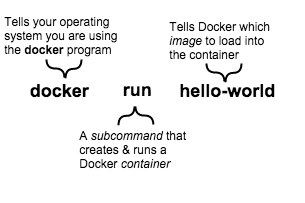

# [安装](https://docs.docker.com/engine/installation/linux/ubuntulinux/)

配置vpn[...](http://zhidao.baidu.com/question/234095633.html?qbl=relate_question_0&word=linux%C1%AC%BD%D3vpn)

```shell
sudo apt-get update

sudo apt-get install apt-transport-https ca-certificates

sudo apt-key adv --keyserver hkp://p80.pool.sks-keyservers.net:80 --recv-keys 58118E89F3A912897C070ADBF76221572C52609D

# 链接vpn

sudo pptpsetup --create pptpd --server ‘’ --username ‘’ --password ‘’ --encrypt --start
```

# 入门

`docker ps -a`现实当前系统所有的容器(container)

# image和container

运行`docker run hello-world`执行了3件事情 

image是一个文件系统以及运行时的一些参数，他没有状态并且不会修改。container是image的一个实例。当执行`run`的时候，执行几个步骤：

1. 检查指定的image是否存在
2. 从docker hub下载image
3. 将image加载到container中并运行

# 查找别人的image

[whalesay image](https://hub.docker.com/?utm_source=getting_started_guide&utm_medium=embedded_MacOSX&utm_campaign=find_whalesay) `docker search image-name`来查找docker hub中的image<br>
`docker run docker/whalesay cowsay boo`本地没有这个image会从docker hub中下载。

# 构建自己的image

## 写一个Dockerfile

```shell
mkdir mydockerbuild
cd mydockerbuild
touch Dockerfile
```

修改Dockerfile:

```
FROM docker/whalesay:latest
#告诉docker，这个image依赖于哪一个基础image  
RUN apt-get -y update && apt-get install -y fortunes
#启动后执行的安装软件  
CMD /usr/games/fortune -a | cowsay
#软件安装完成后执行命令
```

## 创建image

`docker build -t docker-whale:tag .`不要忘记`.` 更多选项`docker build --help`

## 创建的过程

上面的命令会试用当前目录下的`Dockerfile`，创建新的image名称为`docker-whale`。

## 启动新的image

`docker run docker-whale`

# Hello world in a container

```shell
$ docker run ubuntu /bin/echo 'Hello world'
# Hello world
# 先启动ubuntu镜像容器
# 如果不存在这个镜像，就从docker hub下载
# 执行 /bin/echo 'Hello world' 命令
# 容器停止
```

上面会启动ubuntu并执行`/bin/echo 'Hello world'`，当这个命令执行完成后，容器会自动关闭，除非运行的命令一直在运行，否则容器就会在命令结束是停止。

## 启动交互式容器

```shell
$ docker run -t -i ubuntu /bin/bash
# root@af8bae53bdd3:/#
# -t 参数分配一个假的终端
# -i 创建一个交互式链接，
```

## 启动守护容器

```shell
$ docker run -d ubuntu /bin/sh -c "while true; do echo hello world; sleep 1; done"
# 1e5535038e285177d5214659a068137486f96ee5c2e85a4ac52dc83f2ebe4147
# -d 在后台启动容器
# 启动后执行/bin/sh -c "while true; do echo hello world; sleep 1; done"
# 上面的命令只会输出容器的ID：1e5535038e285177d5214659a068137486f96ee5c2e85a4ac52dc83f2ebe4147

$ docker -ps #查看当前正在运行的容器
# CONTAINER ID  IMAGE         COMMAND               CREATED        STATUS       PORTS NAMES
# 1e5535038e28  ubuntu  /bin/sh -c 'while tr  2 minutes ago  Up 1 minute        insane_babbage

$ docker logs insane_babbage # 产看容器shell的输出
# hello world
# hello world
# hello world
$ docker stop insane_babbage # 停止容器
```

# 在docker中启动web服务器

`docker run -d -P training/webapp python app.py`，`-P`参数告诉docker将容器的的端口映射到我们的主机端口。

```shell
$ docker ps -l
# CONTAINER ID  IMAGE                   COMMAND       CREATED        STATUS        PORTS                    NAMES
# bc533791f3f5  training/webapp:latest  python app.py 5 seconds ago  Up 2 seconds  0.0.0.0:49155->5000/tcp  nostalgic_morse
# `-l `参数查看最后一个启动的容器的信息。
# PORTS 0.0.0.0:49155->5000/tcp 这里是把容器的5000端口映射到本季49155端口
```

我们可以自定义端口映射 `$ docker run -d -p 80:5000 training/webapp python app.py` 将本机80映射到容器5000

`docker logs -f nostalgic_morse`查看容器的输出,`-f`类似于`tail -f`不断的输出

## 查看容器中的进程

```shell
$ docker top insane_babbage
# PID                 USER                COMMAND
# 854                 root                python app.py\

$ docker stop insane_babbage #停止容器
$ docker start insane_babbage #重启容器
$ docker rm insane_babbage #删除容器，必须先停掉
```

# 管理images

`docker search ubuntu`查找已存在image ；`docker pull ubuntu`下载找到的image

## 创建自己的image

### 更新当前的容器然后保存修改

```shell
$ docker run -t -i training/sinatra /bin/bash
# root@0b2616b0e5a8:/#
# root@0b2616b0e5a8:/# apt-get install -y ruby2.0-dev
# root@0b2616b0e5a8:/# gem2.0 install json
$ docker commit -m "Added json gem" -a "Kate Smith" 0b2616b0e5a8 ouruser/sinatra:v2
# 0b2616b0e5a8通过docker ps查看，这里会创建一个新的image
```

### 试用Dockerfile来制定

```shell
# FROM ubuntu:14.04
# MAINTAINER Kate Smith <ksmith@example.com>
# RUN apt-get update && apt-get install -y ruby ruby-dev
# RUN gem install sinatra
$ docker build -t ouruser/sinatra:v2 .
$ docker run -t -i ouruser/sinatra:v2 /bin/bash
# root@8196968dac35:/#
$ docker tag 5db5f8471261 ouruser/sinatra:devel
$ docker images ouruser/sinatra
```

# 管理容器

```shell
$ docker run -d -P --name web training/webapp python app.py #给容器设定名字
$ docker ps -l
# CONTAINER ID  IMAGE                  COMMAND        CREATED       STATUS       PORTS                    NAMES
# aed84ee21bde  training/webapp:latest python app.py  12 hours ago  Up 2 seconds 0.0.0.0:49154->5000/tcp  web
```

## 管理容器中的数据

### 数据卷

- 当容器创建时数据卷会被初始化，如果容器的基础镜像的挂载点存在数据的话，数据会在卷初始化时自动被复制到卷中。
- 数据卷可以在多个容器之间共享和复用。
- 数据卷的修改是直接的
- 修改镜像的时候，数据卷的修改不会被包含
- 删除容器不会影响数据卷

#### 添加数据卷

```shell
$ docker run -d -P --name web -v /webapp training/webapp /bin/bash
# -v 参数用于添加数据卷，可以使用多个-v 来添加多个数据卷
# root@a8c963345086:/# ls
# bin ...  weapp
# 根目录下挂载了/webapp
```

#### 将主机目录挂载到容器中

```shell
$ docker run -it -v /home/:/opt/webapp training/webapp /bin/bash
# root@cc77e0213193:/opt/webapp/u# ls
# mydockerbuild  producer.py
# 这里将主机的/home挂载到容器的/opt/webapp下
```

默认情况下主机和容器都可以操作挂载点，可以设置权限

```shell
$ docker run -it -v /home/:/opt/webapp:ro training/webapp /bin/bash
# 这里设置容器只读权限
```

可以将主机文件挂载到容器中 `docker run --rm -it -v ~/.bash_history:/root/.bash_history ubuntu /bin/bash`

#### 创建并挂载一个数据卷容器

如果你有一个永久性的数据希望在容器之间共享，

# Dockerfile 编写

docker通过dockerfile以及上下文生成image，上下文可以是本地PATH，也可以是git仓库URL。PATH会包含下级目录，URL会包含下级model。最简单的当前目录`docker build .`。

默认会直接使用当前目录显得`Dockerfile`，也可以`-f path/Dockerfile`来指定Dockerfile。

## 格式

```
# Comment
INSTRUCTION arguments
```

## 环境替换

环境变量可以在定义后通过`${variable_name}`或者`$variable_name`调用。如果需要转义使用`\`。

`ADD，COPY，ENV，EXPOSE，LABEL，USER，WORKDIR，VOLUME，STOPSIGNAL`都可以使用环境变量。

```
FROM busybox
ENV foo /bar
WORKDIR ${foo}   # WORKDIR /bar
ADD . $foo       # ADD . /bar
COPY \$foo /quux # COPY $foo /quux

ENV abc=hello
ENV abc=bye def=$abc
ENV ghi=$abc
# def=hello ghi=bye abc=bye
```

## FROM

FROM设置基础镜像，dockerfile的第一个指令必须是FROM。tag和digest可以不指定，默认tag是latest。

```
FROM <image>
FROM <image>:<tag>
FROM <image>@<digest>
```

## MAINTAINER

指定镜像所有者

```
MAINTAINER <name>
```

## RUN

执行shell命令`RUN /bin/bash -c 'source $HOME/.bashrc ; echo $HOME'`

## CMD

Dockerfile只能又一个CMD指令，如果有多个那么只有最后一条有效。CMD用来给容器指定默认的运行命令。用户可以在`docker run`自定来覆盖掉默认命令。

```
FROM ubuntu
CMD echo "This is a test." | wc -
```

## ADD

将当前系统的文件拷贝到容器中,可以使用GO的模式匹配

```
ADD hom* /mydir/        # adds all files starting with "hom"
ADD hom?.txt /mydir/    # ? is replaced with any single character, e.g., "home.txt"
```

## COPY

和ADD类似

## ENTRYPOINT

与CMD类似

## VOLUME

挂载一个目录或文件
`VOLUME ["/data"]`
