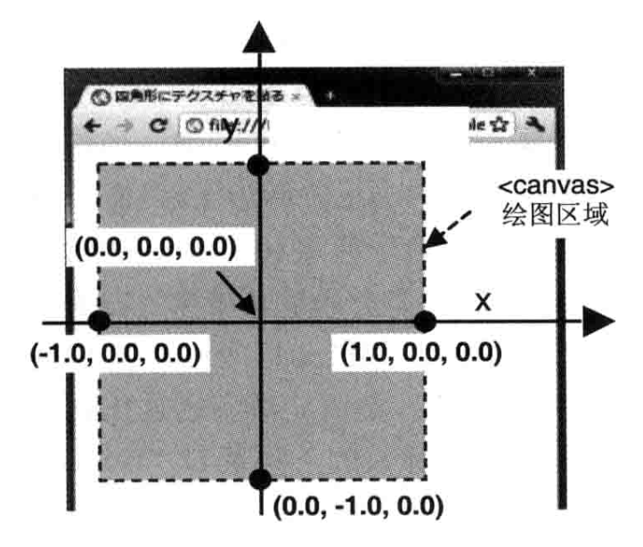

# 概述

## 构成

WebGL由 html，javascript，GLSL ES构成

# 入门

WebGL使用`canvas`来绘图，坐标以canvas左上为(0,0)，x轴想有增加，y轴向下增加。

## WebGL来清空canvas

```javascript
var canvas = document.getElementById('example');
var gl = getWebGLContext(canvas);

//设置清空canvas的颜色
gl.clearColor(0.0, 0.0, 0.0, 1.0);

//用上面的颜色清空canvas
gl.clear(gl.COLOR_BUFFER_BIT);
```

`gl.clear()`继承自openGL，他基于多种缓冲区模型，清空绘图区就是清除颜色缓冲区。`gl.COLOR_BUFFER_BIT`就是清除颜色缓冲区。`gl.DEPTH_BUFFER_BIT`深度缓冲区。`gl.STENCIL_BUFFER_BIT`模版缓冲区(很少用到)。

缓冲区名称 | 默认值                  | 相关函数
:---- | :------------------- | :-------------------------------------
颜色缓存区 | (0.0, 0.0, 0.0, 0.0) | gl.clearColor(red, green, blue, alpha)
深度缓存区 | 1.0                  | gl.clearDepth(depth)
模版缓存区 | 0                    | gl.clearStencil(s)

## 绘制一个点

绘制一个原点(0.0, 0.0, 0.0)，因为WebGL处理的是三维图形，所有需要指定三维坐标。(0.0, 0.0, 0.0)表示canvas的中心。 WebGL绘图需要使用着色器，有两种着色器:

1. 顶点着色器：用于描述顶点特性的程序。顶点是指而为或三位空间的中的一个点。
2. 片元着色器：进行逐片元处理过程如光照的程序。片元是一个WebGL术语，你可以将器理解为像素(图像的单元)

## 初始化着色器

绘图流程:回去canvas->获取webgl绘图上下文->初始化着色器->设置canvas背景色->清楚canvas->绘图.

初始化:initShaders()对字符串形色的着色器,进行初始化.定义在`cuon.util.js`

参数`initShaders(gl, VSHADER_SOURCE, FSHADER_SOURCE)`成功返回true,否则false:
- gl:指定渲染上下文
- vshader:指定顶点着色器程序代码(字符串)
- fshader:指定片元着色器程序代码(字符串)

初始化之前顶点和片元都是空白的,着色器运行在WebGL系统中而不是js中.

**WebGL包括运行在浏览器的JavaScript和运行在WebGL同的着色器这两个**

画出一个点需要三项信息:位置(0.0, 0.0, 0.0),尺寸(10.0),颜色(片元着色器制定颜色(1.0, 0.0, 0.0, 1.0)).

## 顶点着色器

```javascript
'void main() {\n' +
'  gl_Position = vec4(0.0, 0.0, 0.0, 1.0);\n' + // Set the vertex coordinates of the point
'  gl_PointSize = 10.0;\n' +                    // Set the point size
'}\n';
```
`gl_Position`和`gl_PointSize`是内置变量,gl_Position必须赋值,gl_PointSize是点的尺寸(像素值)

这里的语法是GLSL ES语法,他是强类型语言.赋值时必须使用正确的类型,例如:`gl_PointSize:float=10`会报错,因为10在GLSL ES是整数.

`gl_Position = vec4(0.0, 0.0, 0.0, 1.0)`前三个参数用来确定定点位置,这4个参数组成的矢量叫做 **齐次坐标**,他可以提高处理三维数据的速度.虽然这个坐标是四维的,但是如果第4个分量是1.0,那么表示"前三个分量表示坐标"

## 片元着色器

```javascript
var FSHADER_SOURCE =
  'void main() {\n' +
  '  gl_FragColor = vec4(1.0, 0.0, 0.0, 1.0);\n' + // Set the point color
  '}\n';
```
gl_FragColor是片元着色器唯一变量.颜色值RGBA.

## 绘图操作
首先清空绘图区域.

gl.drawArrays(gl.POINTS, 0, 1)是一个强大的函数.用来回执各种图形.

参数:
- mode:制定绘制方式,接受以下常量:gl.POINTS,gl.LINES,gl.LINE_STRIP,gl.LINE_LOOP,gl.TRIANGLES,gl.TRIANGLE_STRIP,gl.TRIANGLE_FAN
- first:制定从哪个顶点开始画(整数)
- count:制定回执需要多少个顶点(整数)

## 坐标系


## attribute

讲顶点信息从JavaScript传给顶点着色器,有两种方式:attribute变量和uniform变量.attribute传输与顶点相关的数据,uniform传递与顶点无关的数据.

attribute是一种GLSL ES变量,只有顶点着色器可以使用它.

步骤:
1. 顶点着色器生命attribute变量
2. 赋值给gl_Position
3. 想attribute传递数据

```javascript
var VSHADER_SOURCE =
  'attribute vec4 a_Position;\n' + // attribute variable
  'void main() {\n' +
  '  gl_Position = a_Position;\n' +
  '  gl_PointSize = 10.0;\n' +
  '}\n';
```
```javascript
// Get the storage location of a_Position
var a_Position = gl.getAttribLocation(gl.program, 'a_Position');
// Pass vertex position to attribute variable
gl.vertexAttrib3f(a_Position, 0.0, 0.0, 0.0);
```

**attribute** 是一个存储界定符,表示接下来的变量是一个attribute变量,attribute变量必须声明为全局变量.数据将会从着色器传给变量.格式为<存储界定符> <类型> <变量名>;

## 获取获取attribute变量的存储位置

初始化着色器后.
