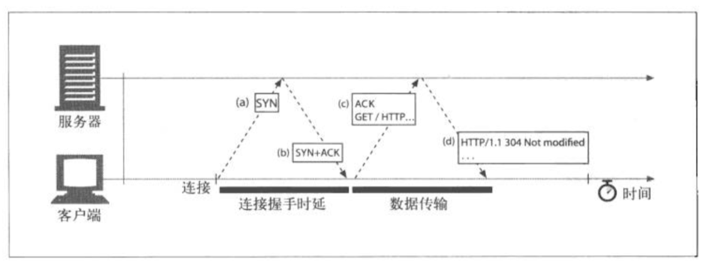
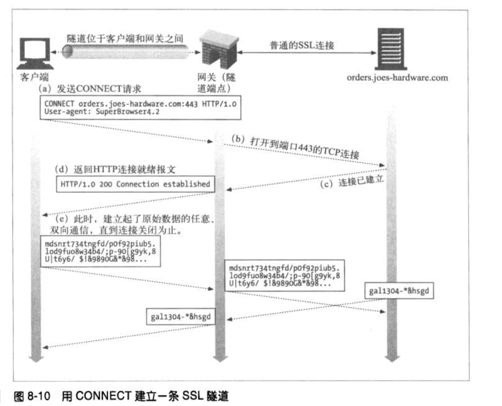

# HTTP 权威指南

# 概述

客户端向服务器发起请求,服务器会去查找对应的对象,并且把`对象、对象的类型、大小`返回给客户端。

## 资源

资源类型:文本、html、word、pdf等等。

### 媒体类型

服务器会将资源类型 MIME 返回给客户端,客户端根据 MIME 来执行下一步操作。[常见类型](http://www.w3school.com.cn/media/media_mimeref.asp):

- text/html
- text/plain
- image/jpeg
- image/gif
- video/quicktime
- application/vnd.ms-powerpoint

## URI

每个资源都有一个名字:统一**资源标识符** URI。URI 有两种形式: URL、URN。

URL:统一**资源定位符**。例如: `http://www.baidu.com/root/index.html` 第一部分`http://`说明访问资源使用的协议,第二部分`/www.baidu.com`说明资源所在的服务器地址,第三部分`/root/index.html`说明的位置。

URN:统一**资源名**,根据名称来标识资源,目前处于实验阶段

## 事务

HTTP 事务有一条请求命令和一条响应结果组成

### 命令(HTTP请求方法)

常见方法:
- GET: 从服务器向客户端发送命名资源
- PUT: 将客户端数据存储到服务器中一个命名的资源中去
- DELETE: 从服务器删除命名资源
- POST: 将客户端数据发送到服务器网关应用
- HEAD: 仅发送命名资源响应中的HTTP首部

### 状态码

每条 HTTP 响应都会带有一个状态码,是三位数字,告知客户端是否成功,或者是否需要采取其他行动。常见码：
- 200: OK 文档正确返回
- 302: redirect 到其他地方去获取资源
- 404: not found 无法找到这个资源

伴随着状态码后面,还会跟着一个原因短语。例如：
- 200 OK
- 200 Success
- 200 All‘s cool，dude

## 报文

HTTP 报文有一行一行简单的字符串组成。报文都是纯文本，不是二进制代码。报文包括三部分：

**起始行**：在请求报文中说明要做什么，在响应报文中说明出现什么情况

**首部字段**：起始行后面有零个或多个首部字段，每个字段包含一个名字和一个值，名称后面跟随`:`然后是值。首部以一个空行结束`\n`,每一个首部字段最后都要添加`\n`

**主体**：空行之后就是可选的报文主题


```
GET / HTTP/1.1\r\n
Accept: text/*\r\n
\r\n
hello world
```

`Content-Length`表示响应主体的长度

## 连接基于 TCP/IP

## 协议版本

目前主要是HTTP/1.1 

HTTP-NG(HTTP/2.0)关注性能的大幅优化但是1998年就停止了研究

## Web 的结构组件

- 代理: 位于客户端和服务器之间的 HTTP 中间实体
- 缓存: HTTP 的仓库,使常用页面的副本可以保存在里客户端更近的地方
- 网关: 连接其他应用程序的特殊 Web 服务器
- 隧道: 对 HTTP 通信报文进行盲转发的特殊代理
- Agent 代理: 发起自动 HTTP 请求的半智能 Web 客户端

### 代理

出于安全考虑通常将代理作为转发所有 Web 流量的可信任中间节点使用。代理还可以对请求和响应进行过滤

### 缓存

Web 缓存（web cache）或者代理缓存（proxy cache）。是一种特殊的 HTTP 代理服务器。经过代理传送的常用文档复制保存起来，客户端从附近缓存下载文档会比从不远程 Web 服务器下载快的多。HTTP 定义了很多功能使得缓存更加高效

### 网关

网关是一种特殊的服务器，作为其他服务器的中间实体使用。通常用于将 HTTP 流量转换成其他的协议。

例如 HTTP/FTP 网关会通过 HTTP 请求接受对 FTP URI的请求,但通过 FTP 协议来获取文档.得到的文档会被封装成一条 HTTP 报文,发送给客户端.

`客户端<--HTTP--> HTTP/FTP <--FTP-->FTP 服务器`

### 隧道

没明白原理

### Agent 代理

代表用户发起请求的客户端程序,常见的时 Web 浏览器。还有一些例如：网络蜘蛛、Web 机器人

# URL 与资源

格式:`方案://服务器位置/路径` 方案通常是协议例如 http、ftp、rtsp 等。url 的格式也会随着使用的方案不同而不同，大部分 url 方案的语法如下：
`<scheme>://<user>:<password>@<host>:<port>/<path>;<params>?<query>#<frag>`

- scheme: 访问服务器时使用的协议, 无默认值
- user: 使用特定 scheme 访问资源时需要的用户名 默认匿名
- password: 用户名后面可能包含密码,使用`:`分隔
- host: 资源宿主服务器的主机名或 ip 地址
- port: 每个 schem 都有端口号
- path: 服务器上资源的本地名,使用`/`与前面的 URL 组件分隔开
- params: 某些方案会用这个组件来制定输入参数,参数为`键值对`
- query: 某些方案会传递这个参数来激活应用功能程序,用`?`与前面分隔
- frag: 片段,一小片或一部分资源的名字,引用对象时,不会讲 frag 字段传递给服务器,他是在客户端内部使用的.通过`#`分隔。服务器只处理整个对象，而不是片段，客户端不能将片段传递给服务器。浏览器从服务器获得了整个资源之后，会根据片段来显示你感兴趣的那部分资源

## URL 快捷方式

URL 有两种方式：绝对的和相对的

相对 URL 只是 URL的片段或一小部分。处理 URL 的应用程序要能够在相对和绝对 URL 之间进行切换。

处理相对 URL 的第一步就是找到基础 URL。基础 URL 是作为相对 URL的参考点使用的。可以来自几个不同的地方：
- 在资源中显示的提供：HTML 中的 BASE 标签
- 封装资源的基础 URL： 使用该资源所属资源的 URL 作为基础

## URL 字符

URL 传输过程不可丢失信息，并且 URL 可能二进制数据, 那么需要转义,转义格式:一个`%`跟着两个表示字符的 ASCII 码的十六进制数

## 未来展望

URL 表示的是实际的地址,而不是准确的名字。当资源被移走了，URL 就失效了

URN 用于使得无论资源移动到何处，都可以通过 URN 来访问到

# HTTP 报文

请求报文
```
method url version
headers
body
```
响应报文
```
version status reason-phrase
headers
body
```
## 首部

- 通用首部: 可以出现在请求和响应头中
- 请求首部: 只出现在请求头中
- 响应首部: 提供更多响应的信息
- 实体首部: 描述主体长度和内容,或者资源自身
- 扩展首部: 规范中没有定义的新首部

首部名称`:`后面跟随一个可选的空格,在跟上字段值,最后一个是 CRLF

### 首部延续行

首部行分为多行可以提高可读性,多出来的每行前至少要有一个空格或制表符(tab)

### 方法

GET 和 HEAD 不会改变服务器的数据, 他们是安全方法.

HEAD 方法服务器只返回首部,通过首部可以知道资源的类型,资源是否存在,被修改过等.

PUT 在服务器上创建新的资源或者替换原有的资源

POST 把数据发送到服务器.

TRACE 客户端的请求可能穿过防火墙,代理,网关等, trace 请求会在目的服务器发起一个会还诊断,服务器弹回一条 trace 响应,并且在响应主体中,携带它接收到的原始请求报文,客户端可以判断原始报文是否被毁坏或修改过

OPTIONS 请求服务告知其支持的功能

DELETE 删除资源

### 扩展方法

## 状态码

5大类:

### 100~199 信息状态码

### 200~299 成功状态码

- 200 OK: 请求没有问题,并且实体的主体包含了请求的资源
- 201 Created: 用于创建服务器对象的请求(比如: PUT),响应的实体部分中应该包含各种引用以创建资源的URL,Location 首部包含的则是具体的引用
- 202 Accepted: 请求已被接受,但服务器还未对其执行任何动作
- 203 
- 204 No Content: 响应报文不包含主体,主要用于在浏览器不转为显示新文档的情况下,对其进行更新
- 205 Reset Content: 告知浏览器清除当前页面中所有的 HTML 元素
- 206 Partial Content: 成功执行了一部分或范围请求

### 300~399 重定向

告知客户端使用替代位置来访问资源,有一个可选的 Location 头来告诉客户端到哪里找该资源。比如客户端请求头`If-Modified-Since`那么服务器就要,如果该资源没有被修改过,那么服务器应该发送304状态码,而不是文档类容。

- 300 Multiple Choices: 客户端请求一个实际指向多个资源的 URL 时,返回这个状态码,服务器会返回一个选项列表,客户端来选择使用哪一项,服务器可以使用 Location 头包含首先 URL
- 301 Moved Permanently: 请求的 URL 已被移除, Location 头应当包含该资源现在的位置
- 302 Found: 与301类似,当时客户端应该使用 Location 首部给出的 URL 来临时定位资源
- 303 See Other: 告知客户端应该使用另一个 URL 来获取资源.新的 URL 为 Location 头

### 400~499 客户端错误码

- 400 Bad Request: 客户端发送了一个错误的请求
- 401 Unauthorized: 需要认证
- 403 Forbidden: 请求被服务器拒绝
- 404 Not Found: 资源的 URL 找不到
- 405 Method Not Allowed: 请求方带有的 URL 不支持该方法
- 406 Not Acceptable:客户端可以指定参数来说明愿意接收什么类型的实体,如果服务器没有相匹配的资源
- 407
- 408 Request Timeout: 客户端请求所花的时间太长,服务器返回此码来关闭连接

### 500~509 服务器错误码

## 首部

首部和方法配合,共同决定了客户端和服务器端能做什么事情。

### 通用首部

- Connection: 允许客户端和服务器指定与请求和响应链接有关的选项
- Data: 提供日期和时间标志,说明报文是什么时间创建的
- MIME-Version: 各处发送端使用的 MIME 版本
- Trailer: 如果报文采用了分块传输编码方式,就可以用这个首部列出位于报文 trailer 部分的首部集合
- Transfer-Encoding: 告知接收端为了抱枕报文的可靠传输,对报文采用了什么编码方式
- Update: 给出了发送端可能想要"升级"使用的新版本或协议
- Via: 显示了报文经过的中间节点(代理、网关)
- Cache-Control: 用于岁报文传送缓存指示
- Pragma: 另一种随报文春松指示的方式,但并不专用于缓存

### 请求首部

- Client-IP: 提供了运行客户端的机器的 IP 地址
- From: 提供了客户端的 E-mail 地址
- Host: 给出了接受请求的服务器的主机名和端口号
- Referer: 提供了包含当前请求URI 的文档的 URL
- UA-Color: 提供了与客户端显示器的显示颜色有关的信息
- UA-CPU: 给出了客户端 CPU 的类型或制造商
- UA-Disp: 提供了与客户端显示器能力有关的信息
- UA-OS: 给出了运行在客户端机器上的操作系统名称和版本
- UA-Pixels: 提供了客户端显示器的像素信息
- User-Agent: 将发起请求的应用程序名称告知服务器

#### Accept首部

- Accept: 告诉服务器能够发送哪些媒体类型
- Accept-Charset: 告诉服务器能够发送哪些字符集
- Accept-Encoding: 告诉服务器发送哪些编码方式
- Accept-Language: 告诉服务器能够发送哪些语言
- TE: 告诉服务器可以使用哪些扩展传输编码

#### 条件请求首部

有时候客户端希望为请求加上一些限制.

- Expect: 允许客户端列出某请求所要求的服务器行为
- If-Match: 如果实体标记与文档当前的实体标记相匹配,就获取这份文档
- If-Modified-Since: 除非在某个指定的日期之后资源被修改过,否则就限制这个请求
- If-None-Match: 如果提供的实体标记与当前文档的实体标记不符合,就获取这个文档
- IF-Range: 允许对文档的某个范围进行条件请求
- IF-Unmodified-Since: 除非在某个日期之后资源没有被修改过,否则就限制这个请求
- Range: 如果服务器支持方位请求,就请求资源的指定范围

#### 安全请求首部

HTTP 支持一种简单的机制,可以对请求进行质询和响应认证.这种机制要求客户端在获取特定的资源之前,先对自身进行认证
- Authorization: 包含了客户端提供给服务器,以便对其自身进行认证的数据
- Cookie: 客户端用它向服务器传送一个令牌,**他不是真正的安全首部**,但确实包含了安全功能
- Cookie2: 用来说明请求客户端支持的 cookie 版本

#### 代理请求首部

- Max-Forward: 在通往源服务器的路径上,将请求转发给其他代理或网关的最大次数
- Proxy-Authorization: 与 Authorization 首部相同,但是它用于与代理进行认证时使用
- Proxy-Connection: 与 Connection 首部相同,但是是与代理服务器建立连接时使用

### 响应首部

- Age: 从最初创建开始响应持续时间
- Public: 服务器为其资源支持的请求方法列表
- Retry-After: 如果资源不可用的话,再此日期或时间重试
- Server: 服务器应用程序软件的名称和版本
- Title: 对 HTML 文档来说,就是 HTML 文档的资源端给出的标题
- Warning: 比原因短语中更详细的警告报文

#### 协商首部

- Accept-Range: 对于资源来说,服务器可接受的范围类型
- Vary: 服务器查看的其他首部的列表,可能会使响应发生变化,也就是说,这是一个首部列表,服务器会根据这些首部的内容挑选出最适合的资源版本发送给客户端

#### 安全响应首部

- Proxy-Authenticate: 来自代理的客户端的质询列表
- Set-Cookie: 不是真正的安全首部,但隐含安全功能,可以在客户端设置一令牌,以便服务器对客户端进行标识
- Set-Cookie2: 与 Set-Cookie 类似
- WWW-Authenticate: 来自服务器的对客户端的质询列表

### 实体首部

- Allow: 列出可以对此实体执行的请求方法
- Location: 告知客户端实体实际上位于和保护,用于将接受端定向到资源的 URL 上去(可能是新的 URL)

#### 内容首部

- Content-Base: 解析主体中的相对 URL 时使用的基础 URL
- Content-Encoding: 对主体执行的任意编码方式
- Content-Language: 理解主体时最适宜使用的自然语言
- Content-Length: 主体长度或尺寸
- Content-Location: 资源实际所处的位置
- Content-MD5: 主体的 MD5 校验和
- Content-Range: 在整个资源中此实体标识的字节范围
- Content-Type: 这个主体的对象类型

#### 实体缓存首部

- Etag: 与次实体相关的实体标记
- Expires: 实体不在有效,要从原始的远端再次获取词实体的日期和时间
- Last-Modified: 这个实体最后一次被修改的日期和时间


# 连接管理

- HTTP 如何使用 TCP 连接的
- TCP 连接的时延、瓶颈以及存在的障碍
- HTTP 的优化，包括并行连接、keep-alive（持久连接）和管道连接
- 管道连接时应该以及不应该做的事情

## TCP 连接

HTTP--->`[TSL|SSL](HTTPS)`--->TCP--->IP

TCP 数据被 IP 分成多个小块

IP 分组: IP 分组首部(20字节)+TCP 段首部(20字节)+TCP 数据块

### TCP 可靠数据管道

在任意时刻计算机都可以有几条 TCP 连接处于打开状态, TCP 是通过端口号来保持所有这些连接的真确运行.

源 ip, 源 port, 目的 ip, 目的 port, 他们唯一确定一个 TCP 连接

### TCP 性能考虑

HTTP 的性能主要就是 TCP 性能

#### HTTP 事务的时延

客户端解析 URL 确定 IP 和 PORT, 查询 DNS, 打开 TCP 连接,发送请求,接受响应

#### 性能聚焦区域

常见 TCP 时延:
- TCP 建立握手
- TCP 慢启动拥塞控制
- 数据聚集的 Nagle 算法
- 用于捎带确认的 TCP 延迟确认算法
- TIME_WAIT 时延和端口耗尽

#### TCP 连接的握手时延

建立新的 TCP 连接时,TCP 软件之间会交换一系列的 IP 分组,对连接的有关参数进行沟通,如果只用来传送少量数据,这些交换过程就会严重降低 HTTP 的性能

客户端先发送 SYN, 服务器端返回 SYN+ACK,客户端再向服务器端发送一条确认信息 这段时间为握手时延



#### 延迟确认

#### TCP 慢启动

TCP 连接期初会限制连接的最大速度,如果数据传输成功,会随时间提高传输速度.所以如果使用已经提高了传输速度的 TCP 连接,传输数据会很快.HTTP 中有一些可以重用现存连接的工具

## HTTP连接的处理

### 串行事务时延

如果一个页面有三张图片,那么客户端需要发起4次 HTTP 事务来显示此页面.时延会加重.

### 并行连接

HTTP 客户端允许打开多条连接,并行的执行多个 HTTP 事务

缺点:打开连接需要耗费大量内存

### 持久连接

当一个 HTTP 事务处理结束后,后面可能还会发起很多请求,如果保持前面的 TCP 连接不关闭, 这样复用该链接以降低握手时延,并且已经建立的 TCP 连接可以跳过慢启动过程

#### 持久和并行连接

#### Keep-Alive 操作

客户端发送 Connection:Keep-Alive,如果服务器没有返回Connection:Keep-Alive说明服务器不支持该操作

#### HTTP/1.1持久连接

HTTP/1.1逐渐停止了对 keep-alive 连接的支持,用一种名为 pesistent Connection 的改进设计取代了他. HTTP/1.1的持久连接默认是打开的,除非显示添加`Connection:close`.

## 管道化连接

HTTP/1.1允许在持久连接上可选的使用`请求管道`,在响应到达之前可以将多条请求放入队列.当第一条请求通过网络流向服务器时,第二条和第三条也可以开始发送了.

限制:
- 如果客户端无法确认连接是否是持久的,就不应该使用管道
- 必须按照相同的顺序返回 HTTP 响应,HTTP 报文没有序列号标签,因此如果客户端收到的响应失序了,就没有办法将其与请求匹配起来了


# HTTP 结构

HTTP 服务器、代理、缓存、网关、机器人应用程序。

# Web 服务器

## Web 服务器的实现

Web 服务器处理 HTTP 和 TCP 连接。管理 Web 服务器提供的资源，以及对 Web 服务器的配置、控制及扩展方面的管理

## 实际的 Web 服务器会做些什么

- 建立连接：接受客户端连接，或者关闭连接
- 接受请求：从网路中读取一条 HTTP 请求报文
- 处理请求：对请求报文进行解释，并采取行动
- 访问资源：访问报文中指定的资源
- 构建响应：创建带有正确首部的 HTTP 响应报文
- 发送响应
- 记录事务处理过程：将于已完成事务有关的内容记录在一个日志文件中

### 连接的输入输出处理结构

- 单线程服务器
- 多进程和多线程
- 复用 IO:监听所有连接上的活动,当连接发生状态变化时,就处理
- 复用的多线程:利用多核 CPU

### 资源映射

一台机器上部署了多个 Web 服务器,及时请求的 URL 相同,也会应为 Host 不同而区分开来。所以可以部署多台虚拟主机，使用不同的 docroot。

如果 URL 解析为一个目录,服务器可以拒绝访问,或者列出目录,或者扫描目录返回一个目录内容为 HTML 的页面

还可以对资源做访问控制

### 构建响应

Content-Type 首部, Content-Length 首部,主体内容

#### 重定向

- 永久删除的资源
- 临时删除的资源
- URL 增强: 利用重定向来重写 URL, 往往用于嵌入上下文
- 负载均衡:将请求发送到负载不大的服务器上去
- 服务器关联:将客户端重定向到包含客户端信息的服务器上去
- 规范目录名称:有些客户端请求的 URI 不是一个带有尾部斜线的目录名时,大多数 Web 服务器都会将客户端重定向到一个加了斜线的 URI 上,这样相对链接就可以正常工作

### 发送响应

对于非持久连接,当发送完成报文时应当关闭连接;对于持久连接,要正确的计算 Content-length, 否则客户端无法知道响应在什么地方结束

### 日志记录

# 代理

## Web 的中间实体

代理服务器是代表客户端完成事务处理的中间人。如果么有代理，那么客户端就要直接与 HTTP 服务器进行对话。
代理服务器既是客户端又是服务器

### 私有和公共代理

私有代理为某一些客户端专用，公共为所有客户端使用

### 代理和网关的对比

严格来说代理连接的是两个或多个使用相同协议的应用程序。网关连接的是使用不同协议的端点，网关负责转换协议。

## 为什么使用代理

可以改善安全性，提高性能，监视所有 HTTP 流量。常用方式：
- 儿童过滤器：只允许查看教育内容等
- 文档访问控制（某些 web服务器只接受来自代理服务器的连接）
- 安全防火墙：限制哪些应用层协议可以流入流出一个组织
- Web 缓存：将常用文档缓存下来，减少网络通信。客户端访问附件 Web 缓存上对象。
- 反向代理：代理可以假扮 Web 服务器。他们被称为代替物或者反向代理的代理接收发送给 Web 服务器的真实请求，但与 Web 服务器不同额是，他们可以发起与其他服务器的通信，以便按需定位所请求的内容。
- 内容路由器：根据流量状况和内容类型将请求导向特定的 Web 服务器
- 转换器：发送给客户端之前对主体进行转码，甚至文档翻译等

> 缓存代理服务器可以符合找到离客户端最近的服务器,重定向还是什么?

## 代理会去往何处

### 代理服务器的部署

**出口代理**

可以将代理固定在本地网络的出口点上,以便控制本期网络与外网之间的流量

**访问(入口)代理**

代理常被放在 ISP 访问点上,用以处理客户的聚合请求,ISP 使用缓存代理来存储常用的文档的副本,以提高用户的下载速度

**反向代理**

通常会部署在网络边缘,在 Web 服务器之前,作为替代物使用.他们可以处理所有传送给 Web 服务器的请求，并只在必要时向 Web 服务器请求资源。方向代理可以提高 Web 服务器的安全性，后者快速的 Web 服务器缓存放在较慢的服务器之前，以提高性能。反向代理通常会直接冒用 Web 服务器的名字和 IP 地址，这样所有的请求就会被发送给代理而不是服务器了

### 代理的层次结构

通过`代理层级结构(proxy hierarchy)`将代理级联起来

`客户端--代理1--代理2--代理3--服务器`

代理可以根据不同情况,将报文转发给下一级代理

动态选择代理的例子:
- 负载均衡: 上一级代理根据下一级代理的负载情况来选择下一级代理
- 协议/类型路由: 代理可能会根据 URI 将报文发送到不同的代理或服务器上去

### 代理如何获取流量的

- 修改客户端: 为客户端配置代理服务器
- 修改网络: 在客户端不知情的情况下拦截网络流量
- 修改 DNS 的命名空间: 反向代理会假扮 Web 服务器的名字和 IP 地址,这样所有流量都会流量反向代理服务器
- 修改 Web 服务器: Web 服务器向客户端发送一条 HTTP 重定向,将客户端重定向到一个代理上去

## 客户端代理配置

### 手工配置

### 客户端代理配置: PAC 文件

PAC 文件是一个小型的 js 程序,可以在运行过程中计算代理设置。浏览器会从指定 URI 中下载 PAC 文件，并用 js 计算代理服务器。

### 客户端代理配置：WPAD

用 WPAD 找到 PAC 的 URI，下载 PAC 文件，

## 与代理请求有关的棘手问题

### 代理 URI 和服务器 URI 的不同

服务器 URI 只需要包含（没有协议，主机、端口）`GET /index.html HTTP/1.1`

代理 URI 必须包含完整 URI `GET http://www.t.com/index.html HTTP/1.1`

基于代理的网关需要知道 URI 的协议才能连接到其他协议资源上去.

如果客户端不知道正在与代理连接, 那么他还是会发送部分 URI

### 代理服务器既可以处理代理请求,又可以处理服务器请求

代理服务器接受到部分 URI 时应该能够根据 Host 还原绝对 URI

### 转发过程中对 URI 的修改

## 追踪报文

### Via 首部

没经过一个节点就要在 Via 中添加当前节点信息,例如:`Via:proxy-1.test.com, proxy-2.test.com`

如果请求经过了 A,B,C;那么响应就会经过C,B,A;

### Trace方法

用户可以跟踪经代理链传输的请求报文,观察报文经过了哪些代理,以及如何修改报文

## 代理认证

如果每个代理都要认证时就无法工作了,需要升级 HTTP, 指定每一个代理的认证

# 缓存

- 减少冗余数据传输
- 缓解贷款瓶颈
- 降低对原始服务器的要求
- 降低距离时延

## 瞬间拥塞

突然有大量的请求来范文一个 web 文档时,缓存就可以提高服务器稳定性

## 命中与未命中

缓存过期问题.为了有效的验证缓存是否过期, HTTP 定义了一些特殊的请求,不用从服务器上获取整个对象,就可以快读检测出文档是否是最新的

**字节命中率**

## 缓存拓扑结构

私有和公有缓存

### 代理缓存的层次结构

一级缓存未命中时,到二级缓存中寻找,再到服务器中查询

一级缓存靠近客户端,一般使用廉价的缓存.更高层次中使用更强大的缓存

### 网状缓存、内容路由以及对等缓存

有些网络结构会构建复杂的网状缓存,而不是层次缓存结构。

## 缓存的处理步骤

1. 接收 缓存从网络读取抵达的请求报文
2. 解析 缓存对报文进行解析，提取出 URL 和各种首部
3. 查询 缓存查询是否有本期副本可用，如果没有就获取一个副本，并保存到本地
4. 新鲜度检测 缓存查看副本是否足够新鲜（新鲜度限值），如果不是，查询服务器是否有更新
5. 创建响应
6. 发送
7. 日志

## 保持副本的新鲜

不同的数据失效时间是不同的，要指定详细的规则保证缓存数据与服务器数据一致

### 文档过期

通过 Cache-Control（使用相对时间 max-age 秒单位） 和 Expires（使用绝对时间） 首部来告诉客户端文档过期日期

### 服务器再验证
### 用条件方法进行再验证

## 控制缓存的能力

响应报文 Cache-Control 值：
- no-store：禁止缓存对响应对象复制
- no-cache：响应内容可以存储在本地缓存区中，但是必须与服务器进行新鲜度再验证之后才可以使用
- max-age：过期时间
- s-maxage:仅适用于共享缓存
- must-reavalidate：再没有跟原始服务器进行再验证的情况下，不能提供这个对象的陈旧副本

请求报文 Cache-Control ·好像没啥用·


# 集成点: 网关、隧道和中继

HTTP 上可以捎回其他的协议内容,这样就可以绕过防火墙

- 在 HTTP 和其他协议及应用程序之间起到借口作用的网关
- 允许不同类型的 Web 应用程序互相通信的应用程序接口
- 允许用户在 HTTP 连接山发送非 HTTP 流量的隧道
- 作为一种简化的 HTTP 代理,一次将数据转发一跳的中继

## 网关

网关可以作为某种翻译器使用,他抽象出一种能够到达资源的方法,网关是资源和应用程序之间的粘合剂.客户端可以请求网关处理某条请求,网关可以提供一条响应。网关可以向数据库发送查询语句，或者生成动态的内容等等。

有些网关自动将 HTTP 流量转换为其他协议，这样客户端无需了解其他协议就可以与应用程序交互了

## 协议网关

### `HTTP/*` 服务Web 网关

请求流入原始服务器时，服务端 Web 网关会将客户端 HTTP 协议转换为其他协议

例如：网关收到一条对 FTP 资源的 HTTP 请求`ftp://ftp.test.com/test.txt`网关会打开一条到原始服务器的 FTP 端口的 FTP 连接，通过 FTP 获取对象。

### 服务端安全网关 HTTP/HTTPS

网关会对所有输入的 Web 请求进行加密。客户端可以使用普通的 HTTP 浏览 Web 的内容，但是网关会自动加密用户的对话

### 客户端安全加速器网关 HTTPS/HTTP

HTTPS/HTTP网关越来越流行，他们接受安全的 HTTPS 流量，机密成 HTTP 请求发送给服务器

## 资源网关

网关，应用程序服务器，会把目标服务器和网关在一个服务器中实现。应用程序服务器时服务端网关，与客户端通过 HTTP 进行通信，并与服务端的应用程序相连

接受到 URI 时，网关通过 API 将其发送给后面的应用程序，然后向获取的数据以 HTTP 返回给客户端

CGI 通用网关接口

## 应该程序接口和 Web 服务

HTTP 可以作为一种连接应该程序的基础软件来使用.例如介乎 HTTP POSTde RPC

## 隧道

Web 隧道,可以通过 HTTP 应该程序访问使用非 HTTP 协议的应用程序。他允许用户通过 HTTP 发送非 HTTP 流量，这样就可以在 HTTP 上捎带其他协议数据了，这类流量可以有效的穿过防火墙

### 用 CONNECT 方法建立 HTTP 隧道



CONNECT 请求
```
CONNECT home.test.com:443 HTTP/1.1
User-agent: Mozilla/4.0
```

CONNECT 响应
```
HTTP/1.1 200 Connection Established
Proxy-agent: Netscape-Proxy/1.1
```

### SSL 隧道与 HTTP/HTTPS

通过 HTTP 传输 SSL 流量

HTTP/HTTPS 客户端到网关是 HTTP 不安全

### 隧道认证

### 隧道的安全性考虑

恶意用户可以用隧道打开 Telnet 会话,或用隧道绕过公司的 E-mail 扫描器来发送 E-mail

网关应当职位特定的端口打开隧道,比如 HTTPS 的443端口


# 识别、认证与安全

# 客户端识别与 cookie 机制

## cookie

会话 cookie 和持久 cookie

服务器返回一个 cookie 来唯一确定当前的用户,用户带着 cookie 表明自己的身份

# 基本认证机制

# 摘要认证

用户发送密码摘要例如 MD5,和用户名.但是摘要信息还是会被截获,所以服务器可以向客户端发送一个随机数(nonce),客户端在计算摘要之前要先将这个随机数令牌附加到密码上去.随机数会经常变化可能是毫秒,或者每次认证都变化

# 安全 HTTP

## HTTPS

使用HTTPS时,所有的 HTTP 请求和响应数据在发送到网络之前都要进行加密。HTTPS 在 HTTP 下提供了一个传输级的密码安全层，可以使用 SSL 或者 TSL

HTTP--->(TSL|SSL)--->TCP--->IP

### 数字加密

### 对称加密

每个对话都需要先共享秘钥,切不同对话秘钥不同,

### 非对称假面

所有人使用一个公开的秘钥,但解码秘钥只有一个人拥有

#### RSA

#### 混合加密系统和会话加密

非对称加密算法可能会很慢,一般是使用公开的加密秘钥建立起安全通信,然后在安全通道上产生并发送临时的随机对称秘钥,通过更快的对称加密技术对其余的数据进行加密

### 数字签名

加密系统还可以使用签名来说明是谁编写的报文,同时证明报文未被篡改过。

数字签名通常是使用非对称加密产生的，因为只有所有者知道其私有秘钥，所以可以将作者的私有秘钥当做一种指纹使用

签名附加在报文的末尾，然后发送出去

## 数字证书

证书内容：
- 对象的名称（人、服务器、组织等）
- 过期时间
- 证书发布者（由谁为证书担保）
- 来自证书发布者的数字签名
- 对象公开的秘钥
- ...

### 用数字证书对服务器进行认证

通过 HTTPS 建立一个安全的 Web 事务之后,现代的浏览器都会自动获取所连接服务器的数字证书.数字证书包含很多信息,例如: web 站点的名称和主机名,公开的秘钥,证书颁发机构。如果证书颁发机构是很有权威的公共签名机构，浏览器可能已经知道其公开秘钥了，否则浏览器警告用户

## HTTPS 细节介绍

HTTPS 将 HTTP 协议与一组强大的对称，非对称和基于证书的加密技术结合在一起

### 概述

SSL 是二进制协议,其流量承载在另一个端口443上

### 建立安全传输

HTTPS 中客户端首先打开一条到服务器443端口的连接,一旦建立TCP连接,客户端和服务器就会初始化 SSL 层.对加密参数进行沟通,交换秘钥.握手完成之后, SSL 初始化就完成了,客户端就可以把请求报文发送给安全层了,安全层在发送给 TCP 之前,对报文进行加密

### SSL 握手
在发送加密 HTTP 报文之前,客户端和服务器要进行一次 SSL 握手,在这个握手过程中:
1. 交换协议版本号
2. 选择一个两端都了解的密码
3. 对两端身份进行认证
4. 生成临时会话秘钥,以便加密信道

### 服务器证书

客户端一般不适用证书,服务器使用证书

## HTTPS 客户端实例

# 实体、编码和国际化

## Content-Length

表示实体的大小，如果是压缩的实体，那么就是压缩后的大小。

如果没有显示提供 Content-Length，那么缓存不会保存该对象。

对于持久连接来说，更是不可缺少，否则无法知道实体的结束位置，数据会错乱

## 实体摘要

验证实体完整性,正确性

## 媒体类型和字符集

`Content-Type: text/html; charset=utf-8`

### 多媒体类型

MIME 中的 multipart(多部分),包含多个报文,他们何在一起作为单一的复杂报文发送,每一部分都是独立的,有个字的描述其内容的集;不同的部分之间用分界字符串连接在一起

### 多部分表格提交

`Content-Type: multipart/formdata; boundary=[boundarystring]`

### 多部分返回响应

响应中也会包含多个部分,每个部分也用 boundary 连接,每个部分也都有自己的描述

## 内容编码

Content-Encoding 的值:
- gzip
- compress: 实体采用 Unix 的文件压缩程序
- deflate: 使用 zlib 的格式压缩
- identity: 默认值,没有压缩

gzip 效率最高,使用最广泛

### Accept-Encoding

客户端接受的编码方式

## 传输编码和分块编码

这个很少接触到

# 国际化

## 多语言字符编码

Accept-Encoding;Content-Type;

## 语言标记与 HTTP

Content-Language

# 内容发布与分发

# Web 主机托管

通过 IP, 端口号, Host 区分虚拟主机

## 使网站更可靠

### 镜像集群

所有几点内容一致,有一个主节点

HTTP 重定向和 DNS 重定向

### 内容分发网络 CDN

对特定内容进行分发的专门网路,网络中的节点可以 Web 服务器,反向代理或缓存

### CDN中的反向代理缓存

反向代理和镜像服务器的区别在于,反向代理不会保存原始服务器的所有副本,他们只保存客户端请求的那部分内容.有些反向代理会主动去保存热点内容

# 重定向与负载均衡

## 为什么要重定向

- 可靠的 HTTP 事务
- 最小化时延
- 节约网络带宽

Web 内容通常分布在很多地方。客户端可以访问较近的资源。重定向和负载均衡是共存的，大多数重定向都包含了某些形式的负载均衡。

### 重定向到何处

客户端发送 HTTP 请求,从客户端来说:服务器,代理,缓存和网关都是服务器。重定向可以用于服务器,代理,缓存和网关。

### 重定向协议

重定向目标是尽快将 HTTP 请求发送到可用的 Web 服务器上去。

## 通用的重定向协议

### HTTP 重定向

服务器将重定向报文发送给客户端，告诉客户端去其他地方试试。有些服务器使用重定向来做负载均衡。HTTP 重定向的有点是，知道客户端 IP，所以更有可能做出合理的重定向

HTTP 重定向头需要保安 Location 首部

### DNS 重定向

同一个域名有不同的 IP 地址, DNS 服务器解析出 IP 地址后需要选择一个合适的 IP 给客户端

DNS 重定向算法:
- 负载均衡: DNS 服务器跟踪 Web 服务器的负载,来讲最轻的 Web 服务器地址放在列表最前面
- 邻接路由算法: Web 服务器集群在地理上分散时, DNS 服务器尝试将用户导向最近的服务器
- 故障屏蔽算法:  DNS 服务器监视网络状况,绕过服务终端或故障的地方

### 任播寻址(实验性)

地理上分散的服务器拥有相同的 IP 地址,

### IP MAC 转发

### IP 地址转发

## 代理的重定向

## 缓存重定向

## 超文本缓存重定向


