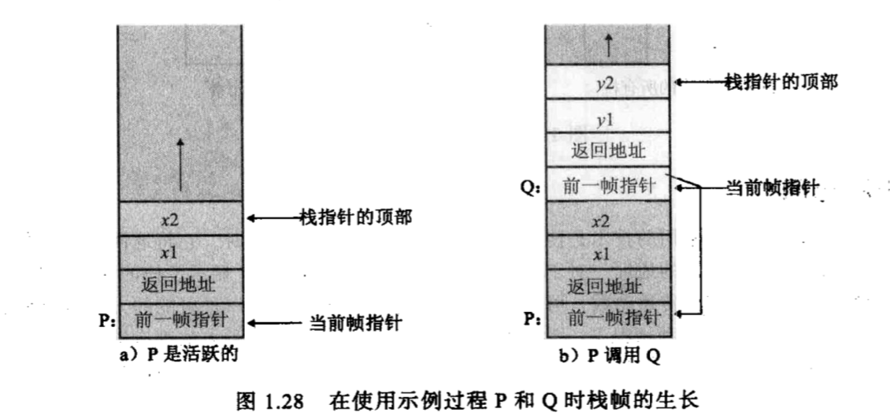
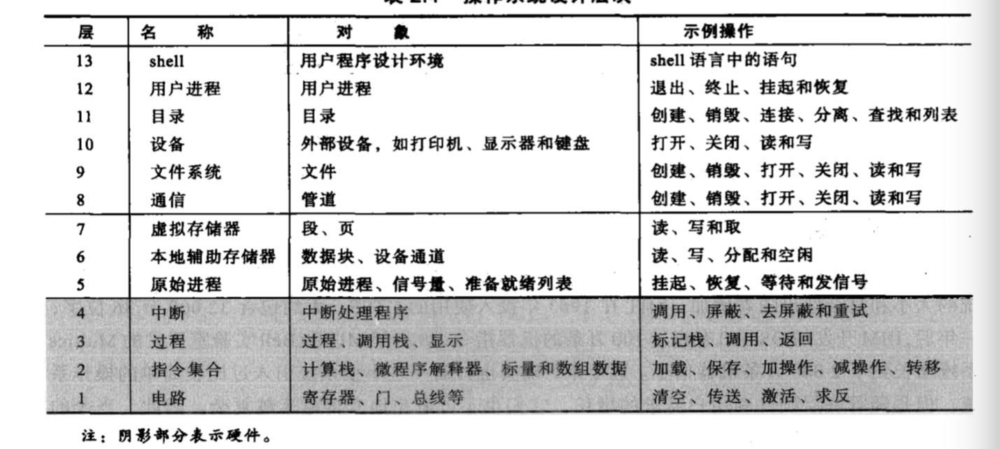
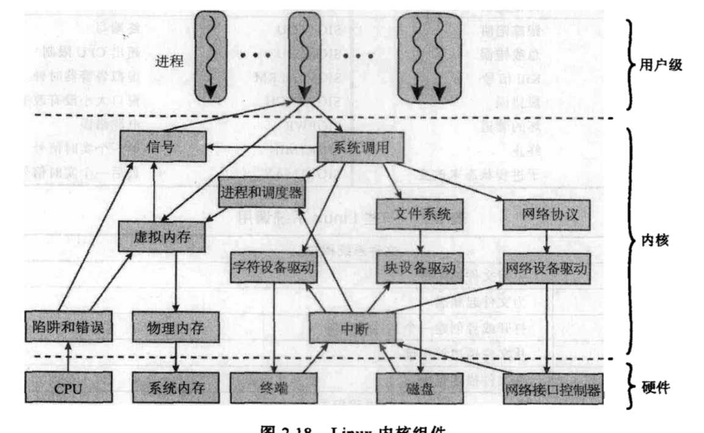

# 操作系统精髓与设计原理

# 计算机系统概述

## 基本构成

CPU,内存,I/O,总线

## 处理器寄存器

- 用户可见寄存器:可以把变量保存在寄存器中
- 控制和状态寄存器:主要被具有特权的操作系统程序使用,以控制程序的执行

### 用户可见寄存器

- 数据寄存器:可以存放该数据,但是存放浮点数和整数议案是不同的数据寄存器
- 地址寄存器:数据或指令的内存地址,存放完整或部分地址
    - 变址寄存器:通过给一个基值加一个索引来获得有效地址
    - **段指针**:对于分段寻址,存储器被换分成段,一个存储器引用由一个特定段号和段内的偏移量组成.需要一个寄存器保存段的基地址(起始地址).可能有多个这样的寄存器,例如一个用于操作系统,一个用于正在执行的应用程序
    - **栈指针**:**如果对用户可见的栈进行寻址,则应该有一个专门的寄存器指向栈顶**,这样就可以使用不包含地址的指令,如push何pop

### 控制和状态寄存器

处理器上一些寄存器对用户不可见,其中一部分可在内核态下被某些机器指令所访问

- 程序计数器(PC):包含将取指令的地址
- 指令寄存器(IR):包含最近取得执行内容

处理器还包括程序状态字寄存器(一个或一组寄存器).PSW**主要包含条件码位**和其他状态信息,如**中断允许/禁止和内核/用户态**

**条件码**是处理器硬件位操作结果设置的位,算术运算可能产生证书,负数,零或者溢出,除了结果自身存储在一个寄存器或存储器中之外,算术执行之后还会设置一个条件码.条件码可作为条件分支运算的一部分.**条件码位被收集到一个或多个寄存器中,他们构成控制寄存器的一部分,机器指令允许隐式访问读取这些位,但是不能显式的修改.因为他们是为了记录指令的执行结果的**

具有多种类型中断的处理器,通常有一组中断寄存器,每一个指向一个中断处理例程

## 指令的执行

一个单一的指令需要的处理称为**一个指令周期**

### 取指令和执行指令

处理器从存储器取一条指令-->成熟计数器保存下一次要取得指令地址

取到的指令放在指令寄存器(IR).指令对应的操作:

- 处理器-存储器:数据在处理器和存储器之间传递
- 处理器-I/O:处理器和I/O之间出具传递
- 数据处理:执行算术或逻辑操作
- 控制:某些指令可以改变执行顺序

### I/O函数 

DMA

## 中断

利用中断功能,处理器可以在I/O的执行过程中执行其他指令

I/O设备完成时,发送中断请求信号.处理器暂停当前程序的处理,转去处理特定的I/O设备,这个程序是中断处理程序.中断请求响应后,处理器恢复原先的执行

中断处理程序是操作系统的一部分,它确定总段的性质,并执行所需的操作

### 中断处理

I/O产生中断-->处理器结束当前指令的执行-->处理器发送中断应答-->处理器将PSW和PC亚茹控制栈-->根据中断,处理器加载新的PC值-->保存剩余的处理状态信息-->处理中断-->恢复处理状态信息-->恢复老的PSW和PC值

### 多个中断

两种方法:

处理中断时,禁止再发生中断.在中断处理程序完成后,在恢复用户程序之前再允许中断

中断优先级,允许高优先级打断低优先级中断处理程序的运行

## 存储器的层次结构

## 高速缓存

处理器和内存之间提供容量小但是速度快的储存器:**高速缓存**

处理器在读取储存器数据时先检查数据是否在高速缓存中,不在则先读取到高速缓存中,然后从高速缓存传递给处理器

**存储器可以看成由块组成,每个块由K个字,高速缓存中每个槽包含K个字,每个槽对应于一个块,并且有一个标签,用于识别对应当前储存的哪一个块**

如果内存中要读取的字地址不在高速缓存中,那么包含改地址的块将会被装入高速缓存.

### 高速缓存的设计

高速缓存与内存间数据交换单位(块)大小

装载时,装载到哪一个槽,如何替换其他槽的替换算法(通常是**最近最少使用算法**)

## I/O通信技术

**可编程I/O 中断驱动I/O 直接内存存取(DMA)**

### 可编程I/O

I/O模块执行请求的动作并设置I/O状态寄存器中相应的位,它并不进一步通知处理器,尤其是它不中断处理器.但是需要处理器不断的检查I/O模块的状态.**非常低效**

### 中断驱动I/O

I/O完成时发送中断请求

### DMA

DMA和处理器对总线的访问控制,有不同的方法.

## 过程控制

在内存中为栈保留一块连续的单元.大多数时候块中只有一部分填充着栈元素,剩余部分供栈增长使用

- 栈指针:包含栈顶地址,如果往栈中push或pop那么指针-1或+1
- 栈底:
- 栈界限:栈顶

**现代系统一般使用高地址表示栈底**

## 过程调用和返回

管理过程和返回最常用的技术是使用栈.当处理器执行一个调用时,它将返回地址放在栈中.当执行一个返回时,它使用栈顶的地址

过程调用时,栈中不仅保存返回地址,嗨保存传递给被调用过程的参数.被调用过程从栈中访问这些参数,在返回前,返回参数也可以放在栈中返回地址的下面.

为一次过程保存的整个参数集合,包括返回地址,称作**栈帧**

P过程有局部变量x1,x2;调用Q过程,Q局部变量y1,y2

存储在每一栈帧的第一项指向前一帧的指针,如果参数的数量与长度是可变,就需要用到该指针.第二项是相应于该栈帧的过程的返回点.最后在栈帧的顶部为局部变量分配空间.局部变量可用于参数传递.

CAll Q(y1)

执行上面调用时,会为Q创建一个新的栈帧.这包含一个到P的栈帧的指针,到P的返回值以及Q的两个局部变量,其中一个被初始化为由P传递的参数.另一个局部变量y2是由Q在计算过程中使用的局部变量

## 可重入过程

程序代码的一个副本同一时间内可以被多个用户共享使用;重要特征:程序代码不能修改其自身,每个用户的局部数据必须单独保存.可重入的过程可以被中断,中断结束时仍能正确执行

可重入过程必须有一个永久不变的部分和一个临时部分.过程的每个执行体成为**激活**(javascript函数调用会有一个激活对象),将执行永久部分的代码,但拥有自己的局部变量和参数的副本.**与特定的激活相关联的临时部分称作激活记录**

可重入过程最方便的方法是使用栈.当调用一个可重入过程时,该过程的激活记录保存在栈中.这样激活记录就成为过程调用所创建的栈帧的一部分

# 操作系统概述

- 程序开发
- 程序运行:如调度,装载程序
- I/O设备访问
- 文件访问控制
- 系统访问
- 错误检测和响应
- 记账:统计各种资源信息

## 内存管理

- 进程隔离
- 自动分配和管理:程序应该根据需在存储层次间动态第分配,分配对程序员是透明的,因此程序员无需关心与存储限制有关的问题,操作系统有效第实现分配问题,可以仅在需要时才给作业分配存储空间
- 支持模块化程序:程序员应该能够定义程序模块,并且动态的创建,销毁,动态的改变模块大小
- 保护和访问控制
- 长期存储

操作系统使用虚拟存储器和文件系统来实现这些需求,文件系统实现长期存储

虚拟存储器机制允许程序从逻辑的角度访问存储器,不用考虑无力内存上可用的空间数量,从而能够满足多进程.

由于处理器在很多进程之间切换时,很难把他们紧密的压入内存中,因此引进了**分页系统**.分页系统中,进程由许多固定大小的块组成,这些块称为**页**,程序通过**虚地址**访问字,虚地址由**页号**和页中的**偏移量**组成.进程中的每一页都可放置在内存中的任何地方,分页系统提供给了程序使用的虚地址和内存中的实地址的动态映射

**有了动态映射硬件,下一逻辑步骤是消除一个进程的所有页同时驻留在内存中的要求,一个进程的所有页都保存在磁盘上,当进程执行时,一部分页在内存中,如果需要的页不在内存中,存储管理硬可以检测到,然后安排装载进内存.这个配置称为虚拟内存**

处理器硬件和操作系统一起提供给用户**虚拟处理器**的概念,而虚拟处理器有对虚拟存储器的访问权.这个存储器可以使一个线性地址空间,也可以是段的集合,而段是可变长度的连续地址块.无论哪种情况,程序设计语言的指令都可以访问虚拟存储器区域中的程序和数据.**可以通过给每一个进程一个唯一的不重叠的虚拟存储器空间来实现进程的隔离;通过使用两个虚拟存储器空间的一部分重叠来实现内存共享**

## 系统结构

## 现代操作系统特征

### 堆成多处理(SMP)

- 有多个处理器
- 这些处理器共享一个内存和I/O设备,他们通过总线或其他内部连接方式连接
- 所有处理器都可以执行相同的功能

## UNIX

## LINUX

linux的结构是一个模块的集合,他们可以根据需要加载和卸载,这些相对独立的模块称作可加载模块.实际上**一个模块就是内核在运行时可以链接或断开的一个对象文件**

模块的两个特征:
- 动态链接:当内核在内存中并正在运行时,内核模块可以被加载和链接到内核.模块也可以在任何时刻被断开链接,从内存移除
- 可堆栈模块:模块按层次排列,当被高层客户模块访问时,他们作为库,当被底层模块访问时,他们作为客户

动态链接简化了配置任务,节省了内核所占的内存空间.用户程序可以通过insmod和rmmod来加载卸载内核模块,内核自身监视对于特定函数的需求,并可以根据需求加载和卸载模块

可堆栈模块的两个好处:
- 对一组相抵的模块的相同代码,可以移入一个模块,减少重复
- 内核可以确保所需要的模块都在,避免卸载被依赖的模块,当加载时,还会加载依赖的模块

### 内核组件

# 进程

