# 数据库系统概论（第四版）

1~3 数据库基本概念，4~8 三种重要数据库模型，9 数据库设计控制，10 数据库设计

# #

## 目录

=================基础===================

### 一 绪论

数据模型的组成要素，最主要的数据模型，数据库系统三级模式结构，数据库系统的主要组成部分

### 二 关系数据库

关系数据库概念：关系模型、关系代数

### 三 数据库标准语言

介绍sql语句，定义、查询、更新三部分

### 四 数据库安全性

全面讲解数据库系统安全性的技术和方法，着重讲解SQL存取控制功能

### 五 数据库完整性

实体完整性、参照完整性、用户定义完整性。完整性约束的定义方法、完整性检查机制、违约处理。

==============设计应用开发===============

### 六 关系数据理论（略）

讲解关系规范式理论

### 七 数据库设计

数据库设计步骤和方法，各阶段的目标，方法，应注意的事项

### 八 数据库编程

应用系统可以使用多种方式来访问和管理数据库

=================系统===================

### 九 关系查询与查询优化

查询处理，查询优化基本概念

### 十 数据库恢复技术

事务的基本概念，事务的性质

### 十一 并发控制

并发控制可能造成数据不一致的问题，并发控制的基本概念和最常用的封锁技术

### 十二 数据库管理系统（数据内部实现技术）

阐述DBMS基本功能，系统结构及主要的实现技术

=================新技术==================（选择看）

### 十三 数据库技术新发展

### 十四 分布式数据库系统

### 十五 对象关系数据库系统

### 十六 XML数据库

### 十七 数据仓库和练级分析处理

## 绪论

数据、数据库、数据库管理系统、数据库系统是4个基本概念

### 数据

数据不仅是数字，种类很多：文本、图形、图像、音频、视屏...。

具体定义为：描述事物的符号成为数据。描述事物的符号可以是文字、图形..。他们可以经过数字化存入计算机。

数据的表现形式不能表达其内容，需要经过解释，数据和关于数据的解释是不可分的。例如90，可以表示成绩，体重，长度...

### 数据库

是存放数据的仓库，只是这个仓库在计算机的存储设备上，数据按照一定格式存放。

数据库是长期存储在计算机内、有组织的、可共享的大量数据的集合。数据库中的数据 **按照一定的数据模型`组织、描述和存储`**。具有`较小的冗余度`、`较高的数据独立性`和`易扩展性`，并`可为各种用户共享`。

### 数据库管理系统

如何科学的组织和存储数据，如何高效的获取和维护数据就是数据库管理系统的任务。

数据库管理系统位于用户和操作系统之间的一层数据管理软件。主要功能如下：

#### 数据定义功能

数据定义语言（Data Definition Language,DDL），用户通过他可以方便的对数据库中的数据对象进行定义。

#### 数据组织、存储、管理

DBMS要`分类组织、存储、管理各种数据`,包括数据字典、用户数据、数据的存取路径等。要确定以何种`文件结构`和`存取方式`在存储级上组织这些数据,如何`实现数据之间的联系`。数据组织和存储的基本目标是提高存储空间利用率和方便存储，提供多种存取方法（如索引查找、Hash查找、顺序查找）等来提高存取效率。

#### 数据操纵功能

DBMS提供数据操作语言DML。用户可以使用DML操作数据，实现对数据的基本操作，如查询，插入，删除，修改等

#### 数据库事务管理和运行管理

数据库在建立、运用和维护时有DBMS统一管理、统一控制，保证数据的完整性、安全性、多用户对数据的并发使用及发生故障后的恢复

#### 数据库的建立和维护功能

包括：数据库初`始数据的输入、转换功能`，数据库的`转储、恢复功能`，数据库的`重组织功能`和`性能监视、分析功能`，这些功能通常由一些使用程序或管理工具完成

#### 其他功能

包括：DBMS与`网络中其他软件系统的通信功能`，一个DBMS与另一个DBMS或文件系统的`数据转换功能`，`异构数据库之间的互访和互操作功能`等

### 数据库系统

数据库系统指在计算机系统中引入数据库后的系统，一般指数据库、数据库管理系统（以及相关工具）、应用系统、数据库管理员构成。数据库的建立和维护还需专门的人员来完成，这些人是数据库管理员（DBA）

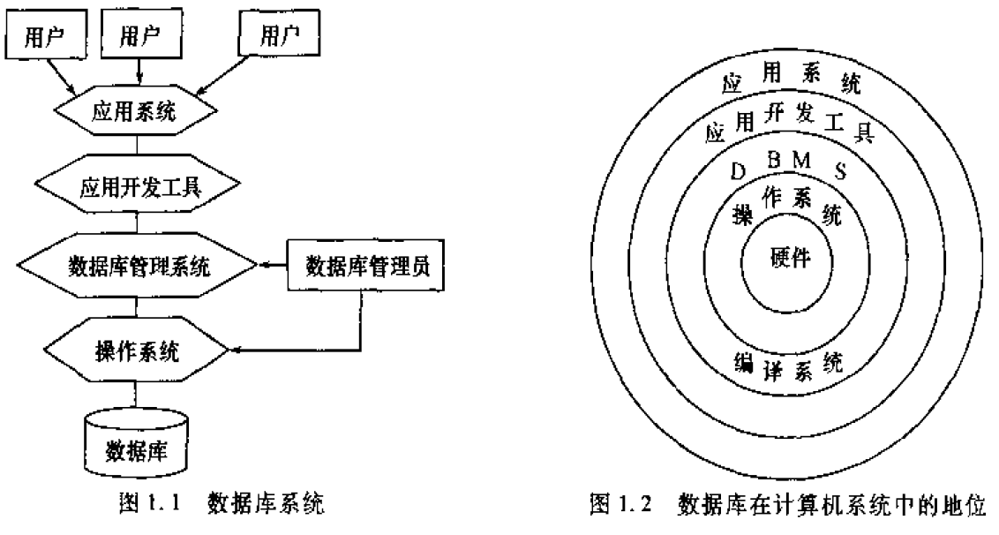

### 数据模型

模型，例如一张地图、飞机。**模型是对现实世界中某个对象特征的模拟和抽象。**

现实世界的人、物、活动、概念等用数据模型这个工具来抽象、表示和处理。

数据模型也是一种模型，他是现实世界数据特征的抽象。通俗的讲数据模型就是现实世界的模拟。

现有的数据库系统均是基于某种数据模型，**数据模型是数据库系统的核心和基础。**

数据模型：能比较真实的模拟现实世界、容易为人所理解、便于在计算机上实现。

如同在建筑设计和施工的不同阶段需要不同的图纸一样，开始实施数据库应用系统中也需要使用不同的数据模型：概念模型、逻辑模型、物理模型

**概念模型**

也称做信息模型、他是按用户的观点来对数据和信息建模，主要用于数据库设计

**逻辑模型**

包括：层次模型、网状模型、关系模型、面向对象模型、对象关系模型。它是按计算机系统的观点对数据建模，主要用于DBMS实现

**物理模型**

对数据最底层的抽象，描述数据在系统内部的表示方式和存取方法，在磁盘或 磁带上磁带上的存储方式和存取方法。物理模型的具体实现是DBMS的任务，数据库设计人员要了解和选择物理模型，一般用户则不必考虑物理级的细节

各种机器上实现的DBMS软件都是基于某种数据模型或者说支持某种数据模型。

人们首先将现实世界抽象为信息世界--》在把信息世界转换为机器世界。信息世界不依赖于具体的计算机系统，也不是某一个DBMS支持的数据模型，而是概念级别的模型。然后再把概念模型转换为计算机上某一DBMS支持的数据模型。

#### 数据模型组成要素

**数据结构**

数据结构描述数据库组成的对象以及对象的联系。数据结构描述的内容有两类：

- `对象的类型、内容、性质`，例如网状模型中的数据项、记录，关系模型中的域、属性、关系。
- `数据之间联系有关的对象`，例如网状模型中的系型

数据结构是刻画数据模型性质最重要的方面，所以通常用数据结构来命名数据模型，例如关系模型、网状模型、层次模型。

**数据操作**

数据操作值对数据库中各种对象（型）的实例（值）允许执行的操作的集合，包括操作及操作规则。 数据库主要有查询和更行两类操作

**数据的完整性约束条件**

数据的完整性约束是一组完整性规则。完整性规则是给定的数据模型中数据及其联系所具有的制约和依存规则，用以限定符合数据模型的数据库状态以及状态的变化，以保证数据的正确、有效、相容。

### 概念模型

概念模型应当有较强的语义表达能力，能够方便、直接的表达应用中的各种语义只是，还应当简单、清晰、易于用户理解。

信息世界的两个基本概念：

- `实体`：客观存在并可相互区别的事物称为实体，例如：一个学生
- `属性`：实体具有的某一特性称为属性，例如：（学号，姓名，性别，入学时间）
- `码(key)`：唯一标识实体的属性集称为码，例如，学生的学号
- `域`：属性的取值范围称为该属性的域，例如：性别的域(男，女)
- `实体型(Entity Type)`：具有相同属性的实体必然具有相同的特征和性质。用实体名机器属性名集合来抽象和刻画同类实体，称为实体型。例如：学生(学号，姓名，性别，入学时间)

**实体之间的联系** 1:1、1：n、n：n。

#### 概念模型的一种表示方法：实体-联系

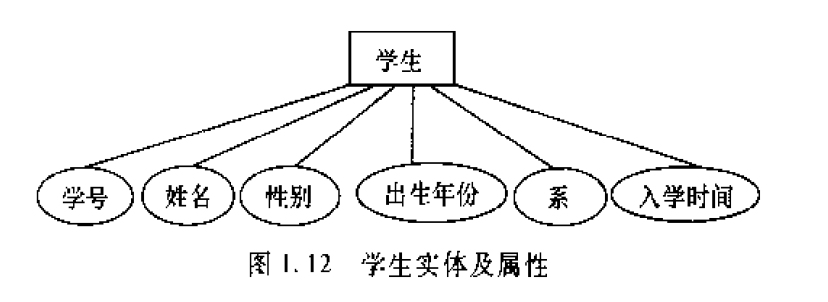

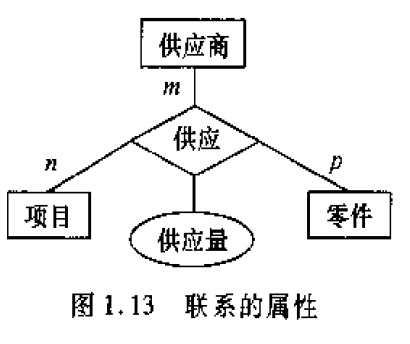

### 常用数据模型

- 层次模型
- 网状模型
- 关系模型
- 面向对象模型
- 对象关系模型 层次模型和网状模型统称为非关系模型，现在基本不用非关系模型。

#### 层次模型

层次模型以树形结构表示实体以及实体之间的联系。

关系表示方法 邻接法

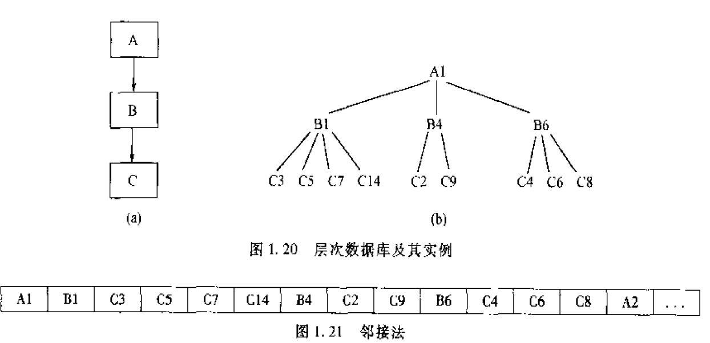

链接法，有两种：兄弟链接、层次链接

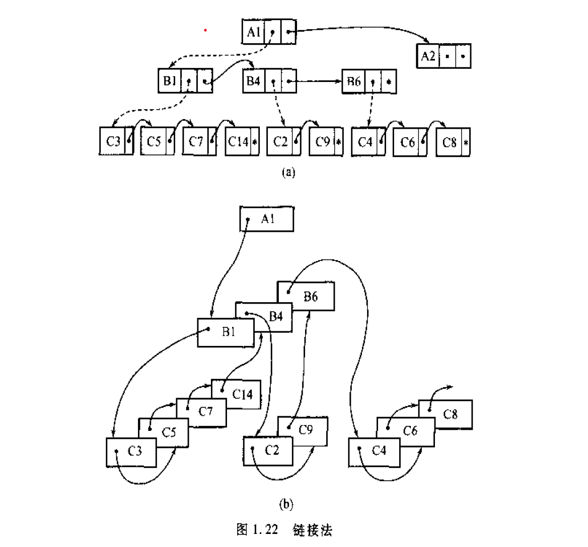

#### 关系模型

**数据结构**

- `关系`：一个关系通常对应一张表
- `元组`：表中的一行为一个元组
- `属性`：表中的一列为一个属性
- `码`：码键。表中的某个属性组，可以唯一确定一个元组
- `域`：属性的取值范围
- `分量`：元组中的一个属性值
- `关系模式`：对关系的描述，例如：关系名（属性1，属性2，属性3，...,属性n）

**数据操作和完整性约束**

主要操作为查询、插入、删除、更新。完整性约束三大类：实体完整性、参照完整性、用户定义完整性。数据操作为集合操作，操作对象和操作结果都是关系，即若干元组的集合。

**关系模型的存储结构**

关系模型中实体以及实体的联系都用表来表示。有的DBMS一个表对应一个文件，有的对应多个文件，自己设计表、索引等存储结构

### 数据库系统结构

数据库系统的结构可以有不同层次和不同角度

从数据库管理系统角度看，数据库系统通常采用三级模式结构

从用户角度看，数据库系统结构分为，单用户、主从式、分布式、客户/服务、浏览器/应用服务器/数据库服务器。这是`数据库系统外部体系结构`

#### 数据库系统模式概念

数据模型中有型(type)和值(value)概念。型指一类数据的结构和属性的说明，值是型的一个具体赋值。例如型 （学号，姓名，性别） 值（001，张三，男）

**模式(Schema)** 是数据库中全体数据的逻辑结构和特征的描述，她仅仅涉及到型的描述，不涉及具体的值。模式的一个具体值称为模式的一个实例(Instance)，同一个模式可以有多个实例。

例如：学生选课数据库模式中，2010年为一个实例，2011年一个实例

#### 数据库系统的三级模式：外模式、模式、内模式

多个外模式，一个模式，一个内模式

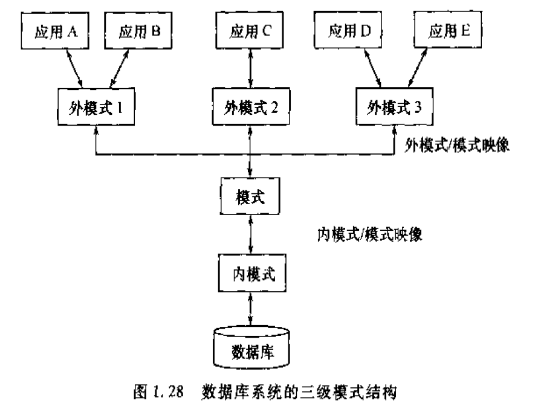

**外模式** 也称子模式或者用户模式，外模式是模式的子集，`他是数据库用户能够看见和使用的局部数据的逻辑结构和特征的描述`。他是保证数据库安全的一个有力措施

**模式** 也称逻辑模式，是数据库中全体数据的逻辑结构和特征的描述，`是所有用户的公共视图`。他是数据库模式的中间层，既不涉及数据的物理存储细节和硬件环境，也与具体的应用程序，开发工具和高级程序设计语言（C，COBOL，FORTRAN）无关

**内模式** 也称存储模式。一个数据库只有一个内模式，他是`数据的物理结构和存储方式的描述`，是数据在数据库内部的表示方式，例如记录的存储方式是堆存储、按照某个属性值升降序存储、按照属性值聚簇存储；索引按照什么方式组织，B+树还是Hash；数据是否压缩，是否加密；数据的存储记录结构有何规定，如定长结构或变长结构，一个记录能不能跨物理页存储等等。

## 关系数据库

### 关系数据结构及形式化定义

关系模型的3个要素：数据结构、关系操作集合、关系完整性约束。

#### 关系

关系模型的数据结构非常简单，只包含单一的数据结构-`关系`.

`从用户角度看`,关系模型中的数据结构是一张扁平的二维表。

关系模型中实体和实体间的各种联系均用单一的结构类型类表示。关系模型建立在集合代数的基础之上，从集合论角度描述关系数据结构的定义：域、笛卡尔积、关系

**域**

域是一组具有相同数据类型的值的集合。例如，自然数、整数，{0，1}、大于100的正整数

**笛卡尔积**

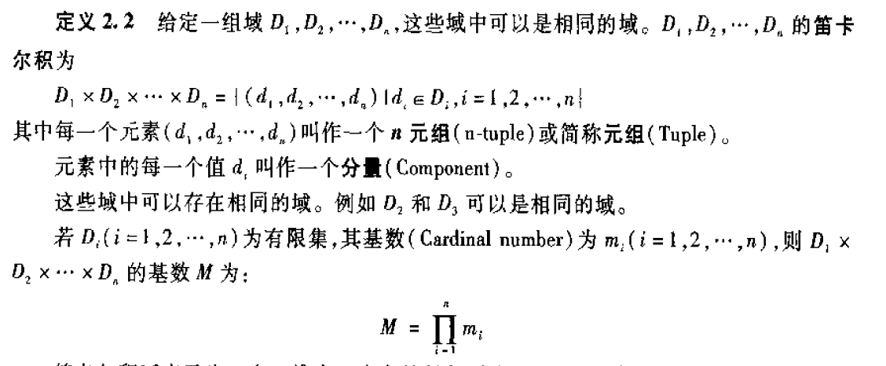

笛卡尔积可表示一个二维表。表中每一行对应一个元组，表中每一列的值来自一个域。

例如：

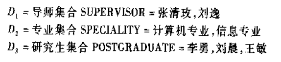

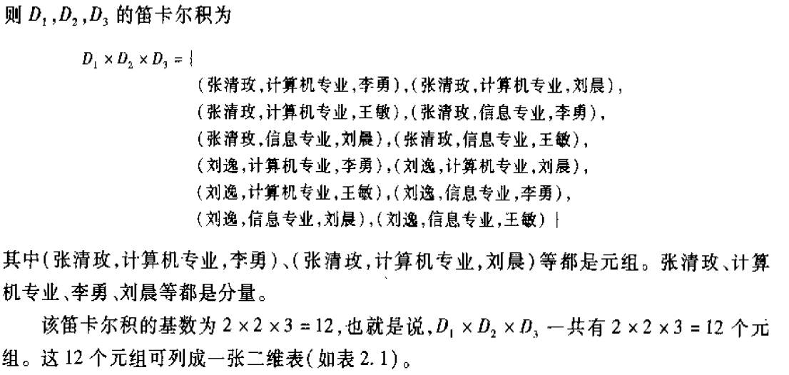

**关系**

关系是笛卡尔积的有限子集，所以关系也是一个二维表，表的每行对应一个元组，表的每列对应一个域。由于域可以相同，为了加以区分，必须对每列起一个名字，称为属性。

如果关系中的某一`属性组`的值能够唯一地标识一个元组，那么该属性称为`候选码`

如果有多个候选码，选择其中一个为`主码`。候选码的所有属性称为`主属性`。最简单情况下候选码只包含一个属性。

极端情况所有属性为候选码，称为`全码`。

关系可以有三种类型：基本关系(又叫基本表或基表)、查询表、视图表。

- 基本表是实际存在的表，它是实际存储数据的逻辑表示
- 查询表是查询结果对应的表
- 视图表是由基表或者其他视图表导出的表，是虚表，不对应实际存储的数据。

关系有6条性质

- 列是同质的，就是每一列中的分量（元组中的一个属性值）是统一类型的数据，来自同一个域
- 不同列可以来自同一个域，其中的每一列为一个属性，属性要给予不同属性名
- 列的顺序无所谓
- 任意两个元组的候选码不能相同
- 行的顺序无所谓
- 分量必须取原子值，就是每一个分量必须是不可分的数据项

关系模型要求关系必须是规范化的，即关系必须满足一定的规范条件。规范化的关系成为范式（第一、二、三、四、五范式）

#### 关系模式

关系数据库中要区分型和值。关系模式是型，关系是值。关系模式是对关系的描述。

### 关系操作

#### 基本关系操作

关系模型中常用操作包括`查询(Query)`和`插入(Insert)、删除(Delete)、修改(Update)`两大部分。

查询是操作中最主要部分。可以分为：`选择（Select）、投影(Project)、连接(Join)、除(Divide)、并（Union）、差(Except)、交(Intersection)、笛卡尔积`等

其中`选择、投影、并、差、笛卡尔积`是5中基本操作，其他操作可以由基本操作来定义和导出，就像乘法可以用加法来定义和导出一样。

关系操作的特点是集合操作方式，即操作的对象和结果都是集合

### 关系的完整性

实体完整性、参照完整性、用户定义的完整性。实体完整性、参照完整性被称为关系的两个不变性，应该有关系系统支持。用户定义的完整性是应用领域要遵循的约束条件，体现具体领域中的语义约束。

#### 实体完整性

若属性（一个或一组属性）A是基本关系的主属性，则A不能取空值。

#### 参照完整性

定义一：设F是基本关系R的一个或一组属性，**但不是R的码**(就是不能唯一标识R的一个元组)。K是基本关系 **S的主码**。如果F和K相对应，那么F是R的`外码`。R为参照关系，S为被参照关系。

显然K和F必须定义在同一个域（属性的取值范围称为该属性的域）上。

定义二：R中F上的值必须为：空值或者等于S中某个元组的主码值

#### 用户定义完整性

用户自定义例如：某个属性取值在10~25之间的整数

### 关系代数

关系代数一种抽象的查询语言，它用关系的运算来表达查询。

任何一种运算都是将一定的运算符作用于一定的运算对象上，得到预期的结果。所以运算对象、运算符、运算结果是运算三大要素。

关系代数的运算对象是关系，运算结果也是关系。运算符主要包括4类：集合运算符、专门的关系运算符、算数比较符、逻辑运算符。

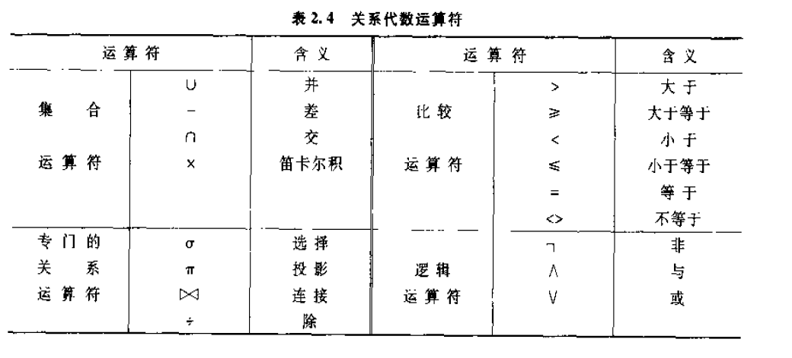

#### 传统集合运算

关系A和B都有n个属性，且相应属性取自同一个域，t是关系中的一个元组，运算结果为关系C

**并(Union)**

A υ B = C 具有n个属性 C中的元组既属于A也属于B

**差(Except)**

A - B = C 具有n个属性 C中元组属于A不属于B

**交(Intersection)**

A ∩ B = C 具有n个属性 C中元组属于A也属于B

**笛卡尔积**

A有n个属性,a个元组，B有m个属性，b个元组，运算之后有n+m个属性，包含a*b个元组

#### 专门的关系运算

包括选择、投影、连接、除等运算。

**选择(Select)**

又称为限制，在关系R中选择满足条件的元组

**投影(Projection)**

是从关系R中选择若干列属性组成新的关系，**是从列的角度进行的运算**

**连接(Join)**

他是从连个关系的笛卡尔积中选取属性间满足一定条件的元组

连接运算中最为重要和常见的两种连接：`等值连接、自然连接`

**等值连接**

他是从关系R和S的笛卡尔积中选取M,N属性值相等的那些元组

**自然连接**

是特殊的等值连接，它要求两个关系中进行比较的分量必须是相同的属性组，并且在结果中把重复的属性列去掉。一般连接是从行角度进行，自然连接不仅从行，还要取消重复的列。

**外链接**

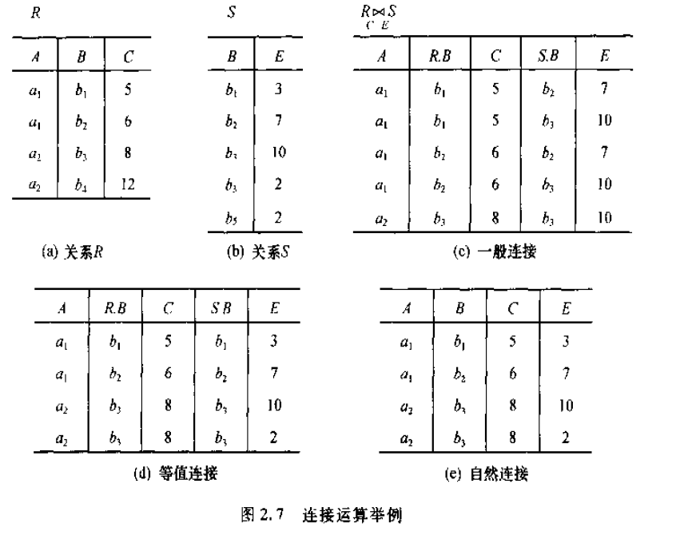

R和S连个关系进行自然连接时，R中的某些元组可能在S中不存在公共属性上值相等的元组，从而造成R中的这些元组被舍弃了，同样S中的某些元组也能被舍弃,例如上面R中第4个元组，S中第5个元组。

把舍弃的元组也保存在结果关系中，而在其他属性上填空值，那么叫做`外链接`，如果只把左边R的元组保留叫做`左外连接`，如果只把右边S中元组保留叫做`右外连接`。

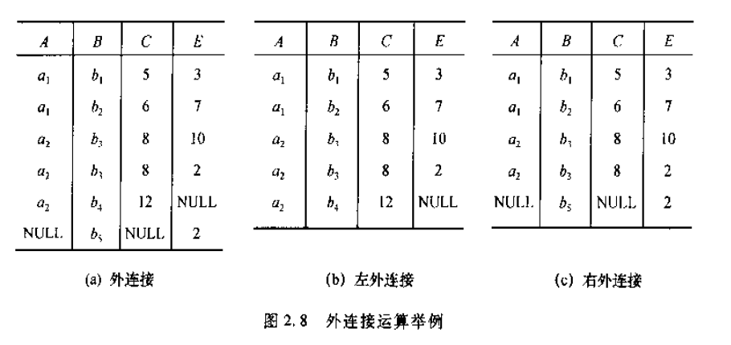

**除运算**（没看懂）

给定关系R(X,Y),S(Y,Z),其中X、Y、Z为属性组。R中的Y和S中的Y可以有不同的属性名，但必须出自相同的域集。

## 关系数据库标准语言SQL(Structured Query Language)

SQL是关系数据库的标准语言，集数据查询、数据操作、数据定义、数据控制功能于一体

### SQL基本概念

支持SQL的RDBMS同样支持数据库三级模式，外模式对应视图(View)和部分基本表(Base Table)，模式对应基本表，内模式对应存储文件(Stored File)

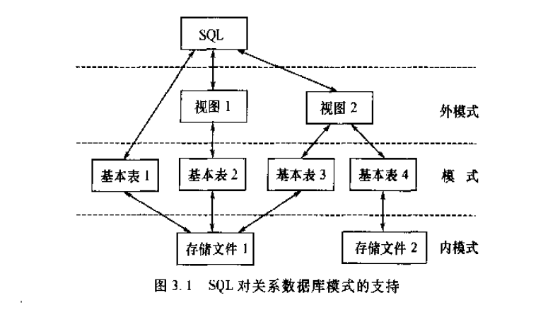

用户可用SQL对基本表和视图进行查询或其他操作，基本表和视图一样都是关系。

**基本表** 是本身独立存在的表，在SQL中一个关系就是一个基本表，一个或多个基本表对应一个存储文件，一个表可以有若干索引，索引页存放在存储文件中。

**视图** 是从一个或几个基本表导出的表，`它本身不独立存储在数据库中，数据库只存放视图的定义而不存放视图对应的数据`,这些数据仍存放在基本表中，视图概念上与基本表相同，用户可以在视图上再定义视图。

### 数据定义

关系数据库支持三级模式结构，其模式、外模式、内模式中的基本对象有表、视图、索引。因此SQL的数据定义功能包括模式定义、表定义、视图定义、索引定义

- 模式 Create|Drop Schema
- 表 Create|Drop|Alter Table
- 视图 Create|Drop View
- 索引 Create|Drop Index

SQL通常不支持模式定义修改，视图定义修改，索引定义修改，只能删除后重建。

#### 模式的定义与删除

CREATE SCHEMA <模式名> AUTHORIZATION <用户名>

如果没有指定模式名，那么模式名默认为用户名。

调用此命令必须拥有DBA授予的CRAETE SCHEMA权限

例如 CREATE SCHEMA "S-T" AUTHORIZATION WANG;

定义模式实际是定义了一个命名空间，在这个空间中可以进一步定义数据库对象，例如表、视图、索引等，用户可以在创建模式的同时在这个模式中进一步创建基本表、视图、定义授权

> CREATE SCHEMA <模式名> AUTHORIZATION <用户名> [<表定义语句> | <视图定义语句> | <授权定义语句>]

`DROP SCHEMA <模式名> [RESTRICT|CASCADE]`

CASCADE表示同时删除模式下的所有数据库对象

RESTRICT表示如果模式下定义了数据库对象（如表、视图等），不允许删除模式

#### 基本表的定义、删除、修改

##### 定义基本表

```
CREATE TABLE <TABLE_NAME> (
    <COLUMN_NAME_1> <DATA_TYPE> [列级完整性约束条件]，
    <COLUMN_NAME_2> <DATA_TYPE> [列级完整性约束条件]，
    ...
    [表级完整性约束]
    )；
例如
CREATE TABLE STUDENT
(
    SNO CHAR(9) PRIMARY KEY,//列级完整性约束SNO为主码
    SNAME CHAR(20) UNIQUE,//SNAME取唯一值
    );

CREATE TABLE COURSE
(
    CNO CHAR(4) PRIMARY KEY,
    CNAME CHAR(40),
    CPNO CHAR(4),
    CREDIT SMALLINT,
    FOREIGN KEY CPNO REFERENCES COUESE(CNO)
    //表级完整性，CPNO是外码，被参照表是COURSE,被参照列是CNO
    );
这里表明参照表和被参照表可以是同一个表

CREATE TABLE SC
(
    SNO CHAR(7),
    CNO CHAR(7),
    GRADE SMALLINT,
    PRIMARY KEY (SNO,CNO)，//主码由两个属性构成，必须作为表级完整性约束定义
    FOREIGN KEY SNO REFERENCES STUDENT(SNO),//表级约束SNO是外码，被参照表是STUDENT
    FOREIGN KEY CNO REFERENCES COURSE(CNO)//表级约束CNO是外码，被参照表是COURSE
    );
```

##### 数据类型

SQL中用数据类型来表示域，常见类型:CHAR、VARCHAR、INT、SMALLINT、NUMBERIC、REAL、DOUBLE、FLOAT、DATA、TIME。

##### 模式与表

每一个基本表都属于某一个模式，一个模式包含多个基本表。 定义表的时候有三种方式指定其所属模式：

- 表名前加模式名 例如：CREATE TABLE "S-T".Student(...)
- 创建模式时同时创建表
- 设置所属模式，这样创建表时，表名中不需要给出模式名

当创建表时若没有指定模式，那么系统根据搜索路径来确定所属的模式。

搜索路径一般为一组模式列表，RDBMS会使用模式列表第一个模式作为数据库模式名，若找不到模式名，则报错

##### 修改基本表

```
ALTER TABLE <表名>
(
    [ADD <新列明> <数据类型> [完整性约束]]
    [DROP <完整性约束> ]
    [ALTER COLUMN <列名> <数据类型>]
    )
```

##### 删除基本表

`DROP TABLE <表明> [RESTRICT|CASCADE]`

RESTRICT表示要删除的表不能被其他的表约束引用(如 CHECK、FOREIGN KEY等)，不能有视图、触发器、存储过程、函数等。

CASCADE 表示将有关联的全部删除

#### 索引的建立、删除

建立索引是加快查询速度的有效手段。用户可以根据实际情况，在基本表上建立一个或多个索引，来提供多种存取路径，加快查询速度。

系统在存取数据时会自动的选择合适的索引作为存取路径，用户不必也不能显示的选择索引

##### 建立索引

`CREATE [UNIQUE] [CLUSTER] INDEX <索引名> ON <表名> (<列名> [<次序>][,<列名>[<次序>]]...)`

索引可以建立在一列或者多列上，`次序`为索引的排列次序，可选ASC(升序)或者DESC(降序)，默认为ASC。

UNIQUE表示此索引的每一个索引值只对应唯一的记录

CLUSTER表示建立的索引是聚簇索引。聚簇索引指索引项的顺序与表中记录的物理顺序一致的索引组织。

**在最经常查询的列上建立聚簇索引可以提高查询效率。显然一个表上只能建立一个聚簇索引，建立聚簇索引后，该列上的数据更新，往往导致记录的物理顺序的变更，代价较大，所以经常更新的列不不宜建立聚簇索引**

##### 删除索引

**索引一旦建立，就由系统使用和维护他，不需要用户干预。建立索引是为了减少查询操作的时间，但如果数据增删改频繁，系统会话费许多时间来维护索引，从而降低查询效率。所以需要删除一些不必要的索引**

RDBMS的索引一般采用B+树、HASH索引。B+树具有动态平衡的有点，HASH具有快速查找的特点。索引是关系数据库的内部实现技术，属于内模式范畴

用户创建索引的时候可以定义索引是唯一索引、非唯一索引、聚簇索引。至于索引采用B+树还是HASH索引具体有RDBMS来决定。

### 数据查询

#### 选择表中的若干列

```
SELECT [ALL|DISTINCT] <目标表达式> [,<目标表达式>]...
FROM <表明或者视图> [,<表名或者视图>]...
[WHERE <条件表达式>]
[GROUP BY <列名1> [HAVING <>]]
[ORDER BY <列名2> [ASE|DESC]]
```

整个语句表示从FROM子句指定的基本表或者视图中找出满足条件的元组，在按SELECT子句的目标表达式选出元组的属性值形成结果

GROUP BY将结果按照<列名1>的值进行分组，该属性值相等的元组为一个组通常会在每组中作用聚集函数，如果GROUP BY带有HAVING子句，则只有满足指定条件的组才会输出

ORDER BY按照指定列的值以升序或者降序排列

SELECT语句可以完成简单的单表查询，也可以完成复杂的连接查询和嵌套查询

```
查询学生表，学名，学号
SELECT sname，sno FROM student；
查询学生表，所有列
SELECT * FROM student；
查询经过计算的值
SELECT sname，2020-sage FROM student；
查询结果的系名全部小写
SELECT sname，LOWER(sdept) FROM student；
```

#### 选择表中的若干元组

**删除重复的行**

投影到指定列之后，某些行可能变成相同的行了，通过DISTINCT取消他们 `SELECT DISTINCT sno FROM student；`

**查询满足条件的元组**

条件通过WHERE子句实现

常用查询条件

- 比较：=，>，<，>=，<=，!=，!>，!<，NOT + 上述运算符
- 确定范围：BETWEEN AND ， NOT BETWEEN AND
- 确定集合：IN ，NOT IN
- 字符匹配：LIKE，NOT LIKE
- 空值：IS NULL，IS NOT NULL
- 多重条件：AND，OR，NOT

**如果数据量较小的话，索引不一定加快查询速度，数据库可能还是全表扫描。这由查询优化器按照某些规则或估计执行代价来做出选择**

字符串匹配：

- % 表示任意长度字符串，例如a%b表示以a开头b结尾的字符串
- _ 表示任意单个字符，a_b表示a开头b结尾的任意长度为3的任意字符串

**一个汉字占连个字符的位置匹配一个汉字用`__` , 而不是`_`**

##### 聚集函数

SQL提供了许多聚集函数

- COUNT([DISTINCT|ALL] `*`)统计元组个数
- COUNT([DISTINCT|ALL] <列名>) 统计列中值得个数
- SUM([DISTINCT|ALL] <列名>) 计算一个列值得总和（必须是数值类型）
- AVG([DISTINCT|ALL] <列名>) 计算一列的平均值（必须为数值类型）
- MAX([DISTINCT|ALL] <列名>)求一列的最大值
- MIN([DISTINCT|ALL] <列名>)求一列的最小值

DISTINCT表示取消指定列中重复的行，默认为ALL

##### GROUP BY

将查询结果按某一列或者多列的值分组，值相等为一组。

**对查询分组是为了细化聚集函数的作用对象，如果为对查询结果分组，聚集函数将作用于整个查询结果，分组后将作用于每个组**

##### ORDER BY

按照某一列排序

#### 连接查询

上面都是针对一个表进行查询，若一个查询同时涉及两个以上成为连接查询。他是关系数据库最主要的查询，`包括：等值连接，自然连接，非等值连接，自身连接，外链接，复合条件连接查询等。`

**等值与非等值**

连接查询的WHERE子句用来连接两个表的条件成为`连接条件`，一般格式为：`[<表名1>.]<列名1> <比较运算符> [<表名2>.]<列名2>`

其中比较运算符主要有=,>,<,>=,<=,!=等

连接谓词还可以是`[<表名1>.]<列名1> BETWEEN [<表名2>.]<列名2> AND [<表名2>.]<列名3>`

当连接谓词为=时成为`等值连接`，其他为`非等值连接`

列名成为连接字段，连接字段必须是可比的，名称可以不同

**自身连接**

自身连接查询，通常对一个表设置两个别名。

**外链接**

```
SELECT STUDENT.sno,sname,sage
FROM STUDENT LEFT OUT JOIN SC ON(STUDENT.sno=SC.sno)
//也可以使用USING来去掉结果中重复的值
FROM STUDENT LEFT OUT JOIN SC USING(sno)
//右外链接使用RIGHT OUT JOIN
```

**复合条件连接**

上面连接查询,WHERE子句只有一个条件，如果有多个条件称为复合条件连接

```
SELECT STUDENT.sno,sname
FROM STUDENT,SC
WHERE STUDENT.sno=SC.sno AND SC.cno=2 AND SC.grade>90;

这个查询的优化可以：先从SC中挑选出cno=2 并且 grade>90的元组 ，再与STUDENT满足条件的元组进行连接得到最终结果
```

> 连接查询可以两个以上的的表进行连接

#### 嵌套查询

SQL中SELECT-FROM-WHERE称为一个查询块，将查询快放在另一个WHERE子句或者HAVING子句的查询称为`嵌套查询`

SQL允许多层嵌套查询。**但是子查询不可以使用ORDER BY,ORDER BY只能用于最终结果排序**

**带有IN的子查询**

嵌套查询中，子查询往往是一个集合，`IN`是最常用的谓词

**带有比较运算符的子查询**

带有比较运算符的子查询是指父查询与子查询之间用比较运算符进行连接，当确切知道内层查询返回的是单值时可以用`=,>,<,>=,<=,!=`等

**带有ANY(SOME)、ALL谓词的子查询**

子查询返回值为单值时可以用比较运算符，返回多值时要用ANY、ALL,使用ANY或ALL时，需要同时使用比较运算符：

- > ANY 大于子集某个值

- < ANY 小于子集某个值

- > ALL 大于子集所有值

- < ALL 小于子集所有值

- > = ANY 大于等于子集某个值

- <= ANY 小于等于子集某个值

- > = ALL 大于等于子集所有值

- <= ALL 小于等于子集所有值

- = ANY 等于子集中某个值

- = ALL 等于子集中所有制（通产更没有意思）

- != ANY 不等于子集某个值

- != ALL 不等于子集任何一个值

**带有EXISTS子查询**

带有EXISTS子查询不返回任何数据，只返回true或false ，如果子查询返回空则是false。

#### 集合查询

SELECT语句的查询结果为集合，所以多个SELECT语句结果可以进行集合操作，主要为并`（Union）、差(Except)、交(Intersection)`

```
SELECT SNO
FROM SC
WHERE CNO=1
UNION|INTERSECT|EXCEPT
SELECT SNO
FROM SC
WHERE CNO>0
```

### 数据更新

#### 插入数据

SQL插入语句INSERT通常有两种方式，一种是插入元组，一种是插入子查询

```
INSERT INTO table_name [(<属性名1>，<属性名2>，<属性名3>...)]
VALUES (value1,value2,value3...);
//
INSERT INTO table_name [(<属性名1>，<属性名2>，<属性名3>...)]
子查询
```

#### 修改数据

条件可以是子查询

```
UPFATE table_name
SET <列名>=<表达式> [，<列名>=<表达式>]
[WHERE <条件>]
```

#### 删除数据

条件可以是子查询

```
DELETE
FROM table_name
[WHERE <条件>]
```

### 视图

视图是从一个或多个基本表(或者视图)导出的表。数据库中只存放视图的定义。如果基本表有变动那么视图查询的数据也会发生变化。视图类似于一个窗口，透过它可以只看到用户关心的数据。

#### 视图定义

**建立视图**

```
CREATE VIEW <视图名> [(<列名> [,<列名>]...)]
AS <子查询>
[WITH CHECK OPTION]
```

子查询可以是任意的复杂的SELECT语句，**但是不允许有ORDER BY、DISTINCT**

WITH CHECK OPTION 表示对视图进行UPDATE,INSERT,DELETE操作时要保证更新、插入、删除时元组要满足视图定义的子查询

视图的列名，如果没有指定那么，列名为子查询的所有列名

有些情况不许指定列名

- 某个目标列不是单纯的属性名，而是聚集函数或者表达式
- 多表连接时选出了几个同名的列
- 需要在视图中为某个列启用一个新的名字

例如：

```
CREATE VIEW v_student
AS
SELECT sno,sname,sapge
FROM student
WHERE sdept='is'
这里v_student的列名为sno,sname,sapge
```

**CREATE VIEW的时候只是创建视图的定义，并不执行其中的SELECT语句**，只有对视图查询是，才会从基本表中查询数据

```
CREATE VIEW v_student
AS
SELECT sno,sname,sage
FROM student
WHERE sdept='is'
WITH CHECK OPTION
```

如果在视图上的插入、修改、删除，RDBMS都会自动带上sdept='is'条件

```
CREATE VIEW V_student(sno，sname，sbirth)
AS
SELECT sno,sname,2010-sage
FROM student
```

sbirth是虚拟列，它不是实际存在于基本表中。这个视图叫`带表达式的视图`

**视图查询与基本表查询一样，视图的更新、插入、删除最终是转化为基本表的操作**

## 数据库安全性

安全性包含两方面：数据安全性，数据完整性

### 数据库安全性控制

#### 用户标识和鉴别

由系统提供一定的方式让用户标识自己的名字或身份

#### 存取控制

数据库安全的最终要的一点就是给有资格的用户访问数据库的权限，同时令所有未被授权的人员无法接近数据

**定义用户权限，并将用户的权限等级到数据字典中**

用户对某一数据对象的操作权力称为权限。某个用户应该具有什么权限是管理问题和策略问题而不是技术问题。DBMS保证这些决定的执行，所以DBMS必须提供适当的语言定义用户权限，这些定义编译后存放在数据字典中，被称为安全规则或授权规则

**合法权限检查**

每当用户发起存取数据库的操作后，DBMS查找数据字典，根据安全规则进行合法权限检查，

#### 授权与回收

```
GRANT <权限> [,<权限>]...
ON <对象类型>  <对象名> [，<对象类型> <对象名>]
TO <用户> [，<用户>]
[WITH GRANT OPTION]
```

例如

```
GRNAT SELECT
ON TALBE STUDENT
TO U1

GRANT SELECT
ON TABLE SC
TO PUBLIC

GRANT ALL PRIVILEGES
ON TABLE STUDENT ,SC
TO U2,U3
```

取消授权

```
REVOKE <权限> [,<权限>]...
ON <对象类型> <对象名> [,<对象类型> <对象名>]...
FROM <用户> [，<用户>] [CASCADE|RESTRICT]
```

#### 数据库角色

数据库角色是被命名的一组与数据库操作相关的权限，角色是权限的集合。给一组相同权限的用户创建一个角色，可以简化授权过程

```
//创建角色
CREATE ROLE <角色名>
//给角色授权
GRANT <权限> [,<权限>]...
ON <对象类型>  <对象名> [，<对象类型> <对象名>]
TO <角色> [，<角色>]
//收回角色权限
REVOKE <权限> [,<权限>]...
ON <对象类型> <对象名> [,<对象类型> <对象名>]...
FROM <角色> [，<角色>]
```

**角色授予其他角色或者用户**

```
GRANT <角色> [,<角色>]...
ON <对象类型>  <对象名> [，<对象类型> <对象名>]
TO <角色> [，<用户>]
```

例如

```
CREATE ROLE R1

GRANT SELECT,UPDATE,INSERT
ON TABLE T1
TO R1

GRANT R1
TO U1,U2,U3

REVOKE R1
FROM U1
```

### 视图机制

还可以为不同的用户定义不同的视图，把数据对象限制在一定的范围内，也就是通过视图机制将要保密的数据对无权存取的用户隐藏起来。

### 数据加密

## 数据库完整性

数据库完整性是指数据的正确性和相容性，与安全性是不同的概念

数据库的完整性是为了防止数据库中存在不符合语义的数据，也就是防止数据库存在不正确的数据

为了完整性，DBMS必须：

**提供定义完整性约束的机制**

完整性约束条件也称完整性规则，是数据库中数据必须满足的语义约束条件

**提供完整性检查方法**

DBMS中检查数据是否满足完整性约束条件的机制成为完整性检查，`一般在INSERT,UPDATE,DELETE语句执行后检查`，`也可以在事务提交时检查`。

**违约处理**

DBMS若发现用户的操作违背了完整性约束条件，才去一定的动作，拒绝执行，或者级联执行其他操作

### 实体完整性

关系模型的实体完整性在CREATE TABLE中用PRIMARY KEY定义。对于单属性构成的码有两种说明方法，一种是定义为列级约束条件，另一种是定义为表级约束条件

```
CREATE TABLE STUDENT
(
    SNO CHAR(9) PRIMARY KEY,//列级完整性约束SNO为主码
    SNAME CHAR(20) UNIQUE,//SNAME取唯一值
    );

CREATE TABLE SC
(
    SNO CHAR(7),
    CNO CHAR(7),
    GRADE SMALLINT,
    PRIMARY KEY (SNO,CNO)，//主码由两个属性构成，必须作为表级完整性约束定义
```

#### 实体完整性检查与违约处理

用PRIMARY KEY短语定义了关系的主码后，每当用户程序对基本表插入一条记录或对主码更新操作时，RDBMS就会检查完整性：

- 主码值是否唯一
- 检查主码的各个属性是否为空

**检查主码值是否唯一的一种方法是进行全表扫描，这里非常耗时，所以RDBMS的核心一般在主码上自动建立一个索引**

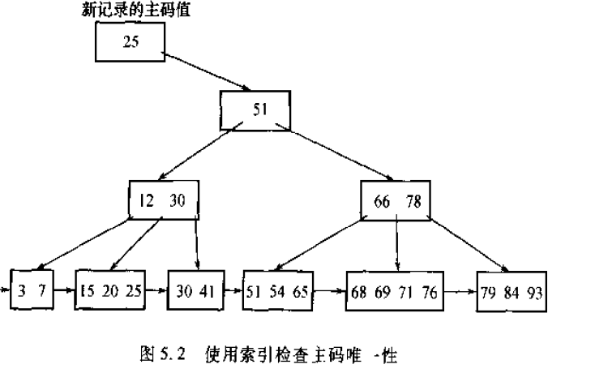

利用B+树只需查找3个节点就可以知道主码值是否存在

### 参照完整性

关系魔心的参照完整性在CREATE TABLE 中使用FOREIGN KEY短语定义哪些为外码，用REFERENCES短语指明这些外码参照哪些表的主码

```
CREATE TABLE SC
(
    SNO CHAR(7),
    CNO CHAR(7),
    GRADE SMALLINT,
    PRIMARY KEY (SNO,CNO)，//主码由两个属性构成，必须作为表级完整性约束定义
    FOREIGN KEY SNO REFERENCES STUDENT(SNO),//表级约束SNO是外码，被参照表是STUDENT
    FOREIGN KEY CNO REFERENCES COURSE(CNO)//表级约束CNO是外码，被参照表是COURSE
    );
```

#### 参照完整性检查和违约处理

有几种情况会破坏参照完整性，

例如，对表sc和student有四种破坏情况

- sc表中增加一个元组，该元组的sc.sno属性值在student中找不到一个元组的sno与sc.sno相等
- 修改sc的一个元组，修改后的sc.sno值在student.sno中找不到
- student删除一个元组，sc.sno的值等于被删除元组student.sno的值
- 修改student.sno,导致sc中某些元组的sc.sno值，在student.sno中找不到

**处理方式**

- 拒绝执行（NO ACTION）,这是默认操作
- 级联(CASCADE),删除被参照表中所有相关的元组
- 社为空(SET NULL),将被参照表的值设为空

```
CREATE TABLE SC
(
    SNO CHAR(7),
    CNO CHAR(7),
    GRADE SMALLINT,
    PRIMARY KEY (SNO,CNO)，//主码由两个属性构成，必须作为表级完整性约束定义
    FOREIGN KEY SNO REFERENCES STUDENT(SNO)//表级约束SNO是外码，被参照表是STUDENT
        ON DELETE CASCADE
        ON UPDATE CASCADE,
    FOREIGN KEY CNO REFERENCES COURSE(CNO)//表级约束CNO是外码，被参照表是COURSE
        ON DELETE NO ACTION
        ON UPDATE CASCADE,
    );
```

### 用户定义完整性

CREATE TABLE 时可以根据应用要求，定义属性上的约束条件，即属性值限制：

- 列值非空（NOT NULL）
- 列值唯一 (UNIQUE)
- 检查列值是否满足一个布尔表达式(CHECK短语)

```
CREATE TABLE SC
(
    SNO CHAR(7) NOT NULL,
    CNO CHAR(7) UNIQUE,
    SEX CHAR(2) CHECK(SEX IN ('男','女'))
    )
```

#### 属性上的约束条件和违约处理

往表中插入元组或修改属性值时RDBMS会检查属性上的约束条件是否满足，不满足则拒绝

#### 元祖上的约束条件定义

与属性约束条件定义类似

```
CREATE TABLE SC
(
    SNO CHAR(7) NOT NULL,
    CNO CHAR(7) UNIQUE,
    SEX CHAR(2) CHECK(SEX IN ('男','女'))，
    SNAME CHAR(20),
    CHECK (SEX='女' OR SNAME NOT LIKE 'Ms.%')
    )
```

#### 完整性约束命名子句

SQL提供CONSTRAINT子句，来对完整性约束进行命名 `CONSTRAINT <完整性约束条件名称> [PRIMARY KEY 短语 | FOREIGN KEY 短语 | CHECK 短语]`

```
CREATE TABLE SC
(
    SNO NUMERIC(6)
        CONSTRAINT C1 CHECK (SNO BETWEEN 1000 AND 10000),
    SNAME CHAR(20)
        CONSTRAINT C2 NOT NULL,
    SAGE NUMERIC(3)
        CONSTRAINT CHECK (SAGE<30),
    CONSTRAINT PKEY PRIMARY KEY(SNO),
    )


CREATE TABLE AD
(
    ENO NUMERIC(4) PRIMARY KEY,
    ENAME CHAR(10),
    JOB CHAR(8),
    SAL NUMERIC(7,2),
    DEDUCT NUMERIC(7,2),
    CONSTRAINT C1 CHECK(SAL+DEDUCT>=3000)
    )
```

#### 修改完整性限制

修改可以使用 ALTER TABLE 先删除约束在新建

```
ALTER TABLE SC
DROP CONSTRAINT C1

ALTER TABLE SC
ADD CONSTRAINT C1 CHECK (SNO BETWEEN 2000 AND 8000)
```

### 触发器

触发器(Trigger)使用户定义在关系表上的一类有事件驱动的特殊过程，一旦定义，任何用户对标的增删改操作均有服务期自动激活相应的触发器，在DBMS核心层进行集中的完整性控制，触发器类似于约束，但是比约束更加灵活

#### 定义触发器

```
CRAETE TRIGGER <触发器名>
BEFORE|AFTER <触发事件> ON <表名>
FOR EACH|ROW|STATEMENT
[WHEN <触发条件>]
<触发动作体>
```

- 只有表创建者才可以在表上创建触发器，并且一个表上只能创建数量有限的触发器
- 触发器名可以包含模式，也可以不包含。统一模式下触发器名必须唯一，并且触发器名和表名必须在统一模式下
- 表名：这个表发生变化时，将激活定义在该表山的相应触发条件的触发器
- 触发事件可以是INSERT,DELETE,UPDATE,也可以是时间的组合INSERT OR UPDATE。UPDATE后面还可以有OF<触发列>，进一步指明修改哪些列触发激活
- 触发类型：分为行级（EACH ROW），语句级(EACH STATEMENT)。行表示任何一行更新时就会执行一次，1000行同时更新那就会执行1000次，语句表示只执行一次。
- 触发条件：只有触发条件为真时执行，如果不写触发条件，则触发体在激活后立即执行
- 触发动作体：可以是一个匿名PL/SQL过程快，也可以是对已创建存储过程的调用。可以通过NEW,OLD获取新旧值

```
CREATE TRIGGER IN_UP
BEFORE INSERT OR UPDATE ON SC
FOR EACH ROW
AS BEGIN
    IF (NEW.SNO=='1') AND (NEW.SAL<4000) THEN
        NEW.SAL=4000;
    END IF
    IF (NEW.SAL>5000) THEN
    INSERT INTO LOGO VALUES('ERROR',NEW.SAL)
END
```

#### 激活触发器

触发器的执行，是由触发事件激活的。先执行BEFORE在执行AFTER,都是BEFOR或者AFTER则先创建的先执行

# 设计与应用开发篇

## 数据库物理设计

物理设计遵循两个个规则

- 确定数据库的物理结构，在关系数据库中主要为存取方法和存储结构
- 对物理结构进行评价，评价重点是时间和空间利用率

### 关系模式存取方法选择

存取方法是快速存取数据库中数据的技术。数据库管理系统一般提供多种存取方法，常用有三类第一类是索引方法，目前主要是B+树索引；第二类是聚簇方法；第三类是HASH方法

#### 索引存取方法选择

根据实际情况确定哪些属性列建立索引、哪些属性列建立组合索引，哪些属性要设计唯一索引

- 如果一个(或一组)属性经常在查询条件中出现，则考虑在这个(或这组)属性上建立索引(组合索引)
- 如果一个属性经常作为做大值和最小值等聚集函数的参数，则考虑在这个属性上建立索引
- 如果一个（或一则）属性经常在连接操作的连接条件中出现，则考虑在这个（或这组）属性建立索引

#### 聚簇方法的选择

为了提高`某个属性或者属性组`的`查询速度`，把这个属性或者这些属性（成为聚簇码）上具有相同值得元组集中存在在连续的物理块成为聚簇

聚簇功能可大大加快聚簇码的查询速度，一个表只能建立一个聚簇，一个数据库可以建立多个聚簇

- 对经常在一起进行连接操作的关系可以建立聚簇
- 如果一个关系的一组属性经常出现在相等的比较条件中，则该单个关系可以建立聚簇
- 如果一个关系的一个或一组属性上的值重复率很高，则次单个关系可以建立聚簇

检查聚簇中的关系，取消不必要的关系

- 从聚簇中删除经常进行全表扫描的关系
- 删除更新操作远多于连接操作的关系

**聚簇只能提高某系应用的性能，而且建立和维护聚簇开销相当大，对已有关系建立聚簇，将导致元组移动物理位置，并导致关系上原有索引无效，必须重建。当一个元组的聚簇码值改变时，该元组的物理位置也要移动，聚簇码值应当相对稳定，以减少维护开销**

**因此，当通过聚簇码进行访问或者链接是关系的主要应用，与聚簇码无关的其他访问很少或者时次要，这是可以使用聚簇。尤其当SQL语句中包含于聚簇码有关的ORDER BY,GROUP BY UNION,DISTINCT等子句或短语是，使用聚簇特别有力，可以省去对结果的排序，否则会适得其反**

#### HASH存取方法的选择

有些数据库提供了HASH存取方法，规则如下：

如果一个关系的属性主要出现在等值连接条件或主要出现在相等比较选择条件中，满足一下条件之一，则可以选择HASH存取

- 一个关系的大小可预知，而且不变
- 如果关系的大小改变，而且数据库管理系统提供了动态HASH存取方法

### 确定数据库的存储结构

确定数据的存放位置和存放结构需要综合考虑：存取时间、存储空间利用率、维护代价

**确定数据的存放位置**

为了提高性能，应根据情况将数据的易变部分与稳定部分、经常存取部分和存取频率低部分分开存放

例如：将表和索引存放不同的磁盘上，将较大的表放在两个磁盘上，以加快存取速度，这在多用户环境下特别有效；还可以将日志文件与数据库对象放在不同的磁盘上，以改进系统的性能

**确定系统配置**

RDBMS一般提供一些系统变量、存储分配参数。可以设置这些参数来提高系统性能

例如：同时使用数据库的用户数，同时打开数据库对象数，内存分配参数，缓冲区分配参数（缓冲区个数、长度），存储分配参数，物理块的大小，物理块装填因子，时间片大小，数据库大小，锁的数目

## 数据库编程

### 游标

SQL是面向集合的，一条SQL可以产生或处理多条记录。而主语言（C,C++,JAVA...）是面向记录的，一个主变量只能存放一条记录，所以使用主变量并不能完全满足SQL向应用程序数据数据的要求，为此嵌入式SQL引入游标的概念。游标是系统为用户开设的一个数据缓冲区，存放SQL语句的执行结果，每个游标区都有一个名字，用户可以通过游标一一获取记录，并赋给主变量，交由主语言一一处理（这里例如python fetchone fetchall）

### 存储过程

#### PL/SQL的块结构

基本SQL是高度非过程化的语言，PL/SQL是对SQL的扩展，可以借助高级语言的控制功能实现过程化

**变量常量定义**

变量名 数据类型 [ [NOT NULL]:=初始表达式]

变量名 数据类型 [ [NOT NULL]初值表达式]

**常量的定义类似于变量定义**

常量名 数据类型 CONSTANT:=常量表达式

**赋值语句**

常量名:=表达式

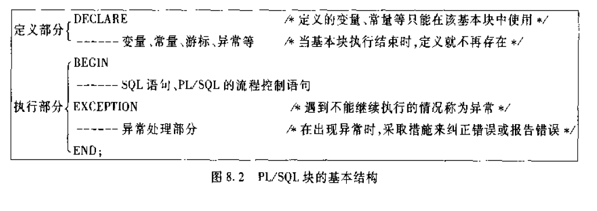

#### 控制结构

**条件控制**

```
IF condition THEN
    statement;
ELSE IF condition
    statement;
ELSE
    statement;
END IF
```

**循环**

```
LOOP
    statement;
END LOOP

WHILE condition LOOP
    statement;
END LOOP

FOR count IN [REVERSE] bound1 ... LOOP
    statement;
END LOOP
count初始值为bound1 递增 REVERSE 表示count初始值bound2 递减

count自动加1或减一
```

#### 存储过程

PL/SQL有两种类型，命名块和匿名块，上面的是匿名块。匿名块每次执行都要进行编译，他不能被存储到数据库中，也不能在其他PL/SQL块中调用。`存储过程和函数是命名块`，他们被编译后保存到数据库中，可以被反复调用，运行速度较快

**优点**

- 存储过程不想SQL那样在操作请求时才进行语法分析，运行效率高
- 降低了客户与服务之间的通信量。客户只需通过网络发送存储过程的名字和参数
- 当用户规则发生变化时，只需要修改存储过程，不需要修改其他应用

#### 存储过程用户接口

**创建存储过程**

```
CRAETE PROCEDURE 过程名（[参数1，参数2....]）
AS
<PL/SQL块>;

CREATE PROCEDURE TRANSFER(inaccount INT,outaccout INT,amount INT)
AS DECLARE
    total_de FLOAT;
BEGIN
    SELECT total TOTO total_de FROM ACCOUNT WHERE ACCOUNTNUM=outaccount;
    IF total_de IS NULL THEN    
        ROLLBACK;
        RETURN;
    END IF
    IF total_de < amount THEN
        ROLLBACK;
        RETURN;
    END IF
    UPDATE account SET total=total-amount WHERE ACCOUNTNUM=outaccount
    COMMIT
END
```

可以使用ALTER PROCEDURE修改存储过程`ALTER PROCEDURE 过程名1 RENAME TO 过程名2；`

**执行存储过程**

CALL/PERFORM PROCEDURE 过程名([参数1，参数2....])

**删除存储过程**

DROP PROCEDURE 过程名();

**游标**

如果PL/SQL中SELECT只返回一条记录，可以将该结果保存到变量中。

# 系统篇

## 关系查询处理和查询优化

首先介绍查询处理步骤，然后介绍查询优化技术。查询优化一般分为代数优化和物理优化。代数是指关系代数表达式的优化；物理是指存取路径和底层操作算法的选择

### 关系数据库系统的查询处理

查询处理的任务就是将用户提交的查询语句转换为高效的执行计划

#### 查询处理步骤

分为4个步骤：查询分析、查询检查、查询优化、查询执行

##### 查询分析

对查询语句进行扫描、词法分析、语法分析。判断查询语句是否符合SQL语法规则

##### 查询检查

根据数据字典对合法的查询语句尽心语义检查，检查语句中的数据库对象，如属性、关系名，书否存在且有效。还要根据数据字典中的用户权限和完整性约束定义对用户存取权限进行检查。检查通过后将SQL查询语句转换为邓建的关系代数表达式。RDBMS一般都用查询树，也称语法分析树，来表示扩展的关系代数表达式，这个过程要把数据库的对象的外部名转换为内部表示。

##### 查询优化

每个查询会有许多可供选择的执行策略和操作算法，查询优化就是选择一个高效的查询处理策略。

查询优化有多种方法。一般分为代数优化和物理优化。关系代数表达式的优化。即按照一定的规则，改变关系代数表达式的操作次序和组合；物理优化指存取路径和底层操作算法的选择，选择的依据可以是基于规则，也可以是基于代价的，也可以是基于语义的时间。

实际的查询优化都综合运用了这些优化技术

##### 查询执行

依据优化器得到的执行策略生成查询计划，由代码生层器生成执行这个查询计划的代码

#### 实现查询操作的算法示例

介绍选择操作和连接操作的实现算法，即算法思想。每一种操作有多种执行这个操作的算法，这里仅仅介绍最主要的几个算法

##### 选择操作的实现

**简单的全表扫描**

对查询的基本表顺序扫描，逐一检查每个元组是否满足选择条件，对于小的表简单有效。大表非常耗时

**索引（散列）扫描方法**

如果选择条件的属性上有索引（例如B+树索引或Hash索引），可以用索引扫描方法。通过索引先找到满足条件的元组主码或元组指针，再通过元组指针直接在查询的基本表中找到元祖

**连接操作的实现**

`连接操作是查询中处理最耗时的操作之一`，这里只讨论等值连接或自然连接最常用实现算法

例如：`SELECT * FROM STUDENT,SC WHERE STUDENT.SNO=SC.SNO`

```
1\. 嵌套循环方法:最简单可行的方法。对外城循环的每一个元组检查内层循环中的每一个元组并检查这两个元组在连接属性上是否相等。若满足连接条件，则串接后作为结果输出
2\. 排序-合并方法，步骤：
    1\. 如果连接的表没有排好序，首先对student表和sc表连接属性sno排序
    2\. 去student表中的第一个sno，一次扫描sc表中具有相同sno的元组，把他们连接起来
    3\. 当扫描到sno不相同的第一个sc元组时，返回student表扫描它的下一个元组，在扫描sc表中具有相同sno的元组将它们连接起来
```

**索引连接方法**

1. 在sc上sno属性建立索引
2. 对student中每一个元组有sno值通过sc的索引查找相应的sc元组
3. 把这些sc元组和student元组连接起来

**Hash连接方法**

把连接属性作为hash码，同一个hash函数把R和S中的元组散列到同一个hash文件中。第一步，划分阶段，对包含较少元组的表R进行一遍处理，把R的元组按hash函数分散到hash表的桶中，第二部，试探阶段，对另一个表S进行一遍处理，把S的元组散列到适当的hash桶中，并把元组和桶中所有来自R并与之匹配的元组连接起来

## 数据库恢复技术

### 事务的基本概念

事务：用户定义的一个数据库操作序列，这些操作要么全做，要么全不做，是一个可分割的工作单位。

```
BEGIN TRANSACTION
COMMIT | ROLLBACK
COMMIT表示提交，ROLLBACK表示回滚，即事务过程中的所有操作都撤销
```

#### 事务的特性

原子性、一致性、隔离性、持续性

- 原子性：事务是数据库的逻辑工作单位，事务中的操作，要么全部执行，要么全部不执行
- 一致性；事务执行的结果必须是使数据库从一个状态变道另一个状态
- 隔离性：一个事务的执行不能被其他事务干扰
- 持续性：即一个事务的提交，他对数据库的改变时永久性的

## 并发控制

当多个用户并发的存取数据库时，就会产生多个事务同时存取同一数据的情况。若不对并发操作加以控制，可能会存取和存储不正确的数据，破坏事务的一致性和数据库的一致性。所以数据库管理系统必须提供并发控制机制。并发控制机制是衡量一个数据库管理系统性能的重要标志之一

### 并发控制概述

事务是并发控制的基本单位，常见情景

**丢失修改**

两个事务t1、t2读入同一数据，t2提交的数据破坏了t1提交的结果，导致t1的修改被丢失

**不可重复读**

t1读取数据后，t2执行了更新操作，使t1无法再现前一次的读取结果

1. t1读取某一数据后，t2对其作了修改，当t1再次读取数据时，得到与前一次不同的值
2. t1按一定条件从数据库中读取某些数据记录后，t2删除了其中部分记录，t1再次按相同条件读取数据时，发现少了一些数据
3. t1按一定条件从数据库中读取某些数据记录后，t2插入了部分记录，t1再次按相同条件读取数据时，发现多了一些数据

**读脏数据**

t1修改某一数据后，并将其写回磁盘，t2读取统一数据后，t1由于某些原因被撤销，t1修改的数据恢复原值，t2读的数据与数据库中数据不一致

### 封锁

封锁是实现并发控制的一个非常重要的技术。封锁就是事务t在对某个数据对象，例如表、记录等操作之前，先向系统发出请求，对其加锁。在事务t释放锁之前，其他事务不能更新此数据。确切的说控制由锁的类型决定。基本的锁有`排它锁`和`共享锁`

**排它锁**：又称为写锁，若事务T对数据对象A上加上X锁，则只允许T读写和修改A，其他任何事务都不能再对A加任何类型的锁，知道T释放A上的锁。这就保证其他事务不能再读取和修改A

**共享锁**：又称为读锁。若事务T对数据对象A加上S锁，则事务T可以读A但不能修改A，其他事务只能再对A加S锁。而不能加X锁，直到T释放A上S锁。这就保证其他事务可以读A但不能对A做任何修改

### 活锁和死锁

和操作系统一样，封锁的方法可能引起活锁和死锁等问题

#### 活锁

如果事务t1封锁了数据R，t2又请求封锁R，于是t2等待。t3也请求封锁R，当t1释放R上的锁之后，系统首先批准了t3的请求，t2仍然等待。然后t4先获得请求，t2继续等待，这样一直持续，t2一直得不到封锁批准。

#### 死锁

如果事务t1封锁了数据R1，t2封锁了数据R2，然后t1又请求封锁R2，t1等待t2释放R2上的锁。接着t2又请求R1上的锁，t2等待t1释放R1上的锁。这样一直等待。

##### 死锁的预防

**一次封锁法**

一次封锁法 要求每个事务一次将所有要用的数据全部加锁，否则不嗯给你继续执行。**缺点**：1.一次封锁所有数据，扩大了封锁的范围，从而降低系统的并发度。2.数据库中的数据是不断变化的，原来不要求封锁的数据，在执行过程中可能会变成封锁对象。因此很难精确到每个事务索要封锁的数据对象，为此只能扩大封锁范围，将事务中可能用到的数据全部封锁。这样进一步降低了系统的并发性

**顺序封锁法**

顺序封锁就是预先对数据对象规定一个封锁的顺序，所有的事务都按这个顺序实行封锁。**缺点**：1.数据库中的数据对象极多，并且随着数据的插入、删除等操作二不断变化，要维护这样的资源的封锁顺序非常困难。2.事务的封锁请求可以随着事务的执行而动态的决定，很难实现确定每一个事务的封锁哪些对象，因此也就很难按规定的顺序去施加封锁

##### 死锁的诊断与解除

数据库系统中诊断死锁的方法与操作系统类似，一般使用`超时法`或`事务的等待图法`

**超时法**

如果一个事务等待的时间超过了规定的时限，就人为发生了死锁。超时法时限简单。**缺点**：1.事务可能因为其他原因使得等待时间超过了时限，导致系统误判。2.若时间设置太长死锁发生后不能及时发现。

**等待突发**

事务等待图是一个有向图G=(T,U)，T为结点的集合，每个结点表示正在运行的事务，U为边的集合，每条边表示事务等待的情况，若t1等待t2，则t1，t2之间有一条有向边。事务等待图动态的反应了事务的等待情况。并发控制系统周期性（比如每隔几秒）的生成事务等待图。

### 并发调度的可串行性

DBMS对并发事务不同的调度可能会产生不同的结果。

#### 可串行化的调度

定义：多个事务的并发执行是正确的，当且仅当其结果与按某一次序串行地执行这些事务时的结果相同，称这种调度策略为可串行化调度

**可串行性** 是并发事务正确调度的准则。按这个规定，**一个给定的并发调度，当且仅当它是可串行化的，才认为是正确调度**

#### 冲突可串行化调度

具有什么样性质的调度是可串行化调度？如何判断调度室可串行化调度？

冲突指不同的事务对同一个数据的读写操作和写写操作

一个调度Sc在保证冲入操作的次序不变的情况下，通过交换两个事务的不冲突操作的次序得到另一个调度sc'，如果sc'是串行的，称调度Sc为冲突可串行化的地调度

### 两段锁协议

为了保证并发调度的正确性，DBMS的并发控制机制必须提供一定的手段来保证调度是可串行化的。目前DBMS主要采用两段锁（Two-Phase Locking，简称2PL）协议的方法实现并发调度的可串行性，从而保证调度的正确性。

在运用封锁方法时，对数据对象加锁时需要约定一些规则，例如何时申请封锁、持锁时间、何时释放锁等。这些规则为`封锁协议`。约定不同的规则，就形成了各种不同的封锁协议。两段锁是最常用的协议。

两段锁协议是指所有事物必须分两个阶段对数据加锁和解锁

- 在对任何数据进行读、写操作之前，首先要申请并获得对该数据的封锁
- 在释放一个锁之后，事务不再申请和获得任何其他锁

两段的含义：事务分为两个阶段，一：获得封锁，也称扩展阶段，此阶段，事务可以申请获得任何数据项上的任何类型的锁，但是不能释放任何锁。二：释放封锁，也称收缩阶段。在这阶段，事务可以释放任何数据项上的任何类型的锁，但是不能再申请任何锁

> 事务准守两段锁协议是可串行化的充分条件，而不是必要条件。也就是说可串行化的并发调度不一定遵守两段锁协议。

### 封锁的粒度

封锁对象的大小成为封锁粒度。封锁对象可以是逻辑单元，也可以是物理单元。以关系数据库为例，封锁对象可以是这样一些逻辑单元：属性值、属性值的集合、元组、关系、索引项、整个索引直至整个数据库；也可以是一些物理单元：页（数据页或索引页）、物理记录等

封锁粒度与系统的并发度和并发控制的开销密切相关。直观的看，粒度越大，数据库能够封锁的数据单元就越少，并发度越小，系统开销也越小；反之，封锁粒度越大，并发度较高，但系统开销也越大

如果一个系统中同时支持多种封锁粒度供不同的事务选择是比较理想的，这种封锁方法称为`多粒度封锁`。选择粒度，应该考虑封锁开销和并发度两个因素。一般需要处理大量元组的事务可以以关系为粒度，处理多个关系的大量元组的事务可以使用数据库为粒度；对于一个处理少量元组的用户事务，以元组为封锁粒度就比较合适了

#### 多粒度封锁

首先定义多粒度树。根节点为整个数据库，表示最大粒度。叶节点表示最小数据粒度。例如：数据库->关系->元组；数据库->数据分区->数据文件->数据记录。

多粒度封锁协议允许多粒度树种的每个结点被独立的加锁。对一个结点的加锁意味着这个结点的后裔结点也被加上同样类型的锁。因此，多粒度封锁中分为：显示封锁和隐式封锁

**显示封锁** ：是应事务的要求直接加到数据对象上的封锁；**隐式封锁**：是该数据对象没有独立加锁，是由于其上级结点加锁而是该数据对象加上了锁

#### 意向锁

意向锁的含义是如果对一个结点加意向锁，则说明你该节点的下层结点正在被加锁；对任意一结点加锁时必须先对它的上级加意向锁

**IS锁**：如果一个数据对象加IS锁，表示它的后裔结点拟加S锁

**IX锁**：如果对一个数据对象加IX锁，表示它的后裔结点拟加X锁

**SIX锁**：如果对一个数据对象加SIX锁，表示对它先加S锁，再加IX锁。

## 数据库管理系统

### DBMS基本功能

- 数据定义和创建
- 数据组织、存储和管理
- 数据存取
- 数据库失误管理和运行管理
- 数据库的简历和维护
- 其他功能

### DBMS的进程结构和多线索机制

实际应用中，DBMS以及应用程序都必须通过某个具体的操作系统环境。应用程序通过DBMS，DBMS通过OS，与数据库中的数据打交道。根据三者的关系，一般有下述四种进程组织方案

#### N方案：DBMS与应用程序相融合的方案

这种方案中，N个DB用户仅需N个进程，DBMS作为应用程序的子程序被连入应用程序中，成为应用程序的一部分，因此此方案也成为连入方案

N方案最明显的特点是能用子程序调用方式把控制迅速直接的传给DBMS，而减少应用程序的运行时间。与后面几种方案相比，N方案调用一次DBMS至少省掉两次进程的那个的切换开销。而在大多数操作系统中进程的切换通常是很浪费时间，大约需要数千条指令。

但是N方案中DBMS的代码段无法共享，导致内存中保留了DBMS代码的许多副本。随着DBMS功能的日益增强，DBMS的代码会不断扩大，导致系统性能下降。

因此N方案只适合用户较少的小型DBMS

#### 2N方案：一个DBMS进程对应一个用户进程

每个用户进程都有一个DBMS进程为之服务，这种DBMS进程称为影子（Shadow）进程，这个方案中，N个用户就要N个DBMS进程，总共2N个进程，所以叫2N方案

这种情况下，DBMS各个活跃进程都是独立运行的，因此用户进程月shadow进程之间以及各个shadow进程互相访问都需要通信

系统的全局管理数据驻留在SGA中，各DBMS进程依靠操作系统提供的封锁源于（信号量）实现同步或实现对SGA的互斥访问。因此DBMS的这种进程组织方式使进程间总的通信开销上升很多

次方案中，操作系统的负担加重了，主要表现为时间和空间。空间上：虽然各个DBMS进程的代码段可以共享，但数据段和栈段的空间还是各自的，再加上N个shadow进程分配进程块等诸多内部空间，因此2N方案对内存的需要也很大。时间方面：由于进程数据过多，许多CPU时间会白白浪费在进程切换这种昂贵的工作上。颠簸及进程切换的高额开销使系统性能严重下降。

因此2N方案也不适合多用户环境

#### N+1：一个DBMS进程对应所有用户进程

进程结构的另一种方式是整个DBMS使用一个进程，该进程的行为类似于服务器。多个用户向server发起数据库服务。server要用自己的机制来调度这些申请，以支持多任务的数据库系统。由于N各用户仅需要一个DBMS进程，因此称这种结构为N+1，这是SGA已经不再需要了

由于要设计自己的多任务处理机制和调度算法，是的N+1方案整体上优于2N方案。server要处理所有用户的申请，如果调度策略不当或不能使数据库进程获得较高的优先权，这种方案将导致瓶颈

另外，N+1方案中药用到操作系统级的消息机制以实现多进程向单进程以及单进程向多进程的数据传送。而操作系统的消息往返一次的开销是几千条指令

#### N+M：M个DBMS进程对应N个用户进程

一般M<N

此方案中，DBMS进程不负责多任务调度，同时每个用户进程也不固定对应某个DBMS进程。用户的数据库请求将会被动态的分配给某个DBMS进程来处理

DBMS进程的分配有分配程序完成。分配程序可以是一个单独的后台进程，也可以将其打码连入用户程序。分配程序通过SGA管理用户的数据库请求队列，分配某个DBMS进程服务于某个用户进程。分派程序还检测真个DBMS的运行状况并根据用户请求队列的情况动态增减DBMS进程的个数。如果用户的进程增加，则DBMS进程的个数也动态的增多，但是一般M<N

这种方案的思想是：用户进程可能并不总是同时提出数据库请求，一个用户一个DBMS进程的方案太浪费了

这个方案虽然提高了内存资源的使用率，但是没有克服2N方案中，分配程序给系统增加开销并可能成为瓶颈，而且DBMS的进程动态增减开销也很大

#### 多线索DBMS的概念

数据库中线索的概念来源于操作系统的线程

##### 线程概念

随着操作多处理器系统以及并行计算技术的发展，进程概念被进一步细化为任务与线程的概念。

unix核心中最关键的概念是进程。进程既是资源分配的最小单位也是运行的最小单位。与一个进程相联系的资源有进程虚拟空间、进程控制块、数据段、正文段、堆栈段、共享内存、程序计数器、状态寄存器、通用寄存器。进程建立和切换的开销很大，核心维护每一个进程的虚拟空间开销也很大。进程概念在处理微粒度问题（一个问题可划分为多个工作量很小的并行计算单位）时显得很吃力，不能给你充分发挥多机的有点

将进程的概念一分为二：task是申请资源的最小单位，而Thread是调度和运行的最小单位。一个task中可以有多个Thread，这些Thread共享Task的所有资源，共同完成一个任务。一个Thread只能存在于某个task中。

##### 多线索概念

数据库系统的线索概念借鉴了操作系统的线程概念：整个DBMS可以看做一个task，当有一个用户申请数据库服务时，task至少分配一个Thread为之服务，多个Thread并行工作，共享资源。

一般来说DBMS中的线索是DBMS的一个执行流，它服务于整个DBMS系统或DBMS中的某个用户；DBMS服务器响应客户请求是通过为每个用户创建线索来完成的。DBMS的各个线索能在逻辑上并行执行；他们共存于一个进程中，共享DBMS的所有资源，如数据库缓冲区、cpu时间片；线索是DBMS的调度单位，服务器进程能按一定的调度算法调度用户请求，由于调度优化是由数据服务器执行，因此会比操作系统直接调度效率高的多

多线索机制可减少每个用户需要的系统资源，如内存要求，从而可以增加并发用户数，提高服务器的运行效率，更好的支持OLTP应用

##### 线索与进程的比较

- 线索比进程占用较少的资源
- 线索调度灵活，可控制性强
- 线索切换开销较小
- 线索间通信简便

## 分布式数据库系统

### 概述
分布式数据库由一组数据组成，这些数据物理上分布在计算机网络的不同结点，逻辑上属于同一个系统。每个结点具有具有自治性，结点之间协作性。

#### 特点

**数据独立性**

数据独立性是数据库技术追求的主要目标之一。在集中式数据库系统中，数据独立性包括两个方面：数据的逻辑独立性和数据的物理独立性。

分布式数据库系统中，独立性还包括数据分布透明性


**集中于自治相结合的控制结构**

数据库是多用户共享的资源。集中式数据库系统中，为了保证数据库的安全性和完整性，对共享数据库的控制是集中的，并有DBA负责监督和维护系统的正常运行。分布式数据库系统中，数据的共享分为两个层次：
- 局部共享：即在局部数据库中存储局部场地上各用户的共享数据，这些数据是本场地用户常用的
- 全局共享：各个场地也存储其他场地的用户共享的数据，支持系统的全局应用

因此控制机制也分为两个层次：集中和自治

**适当的增加数据冗余度**

`集中式数据库系统尽量减少数据的冗余度是系统目标之一，冗余不仅浪费空间，而且容易造成数据副本之间的不一致性，为了保证数据的一致性，系统要付出一定的维护代价`

分布式数据库系统中希望增加一些必要的冗余数据，在不同的场地存储多个副本。具体原因
- 提高系统的可靠性、可用性：当某一场地发现故障时，系统可以对另一个场地上的相同副本进行操作，不会因一处故障而造成整个系统的瘫痪
- 提高系统性能：系统可以选择用户最近的数据副本进行操作，减少通行代价，改善整个系统的性能

**全局的一致性、可串行性和可恢复性**

分布式数据库系统中各局部数据库应满足集中式的数据库一致性、并发事务的可串行性和可恢复性。除此之外海英保证数据库的全局一致性、全局并发事务的可串行性和系统的全局可恢复性


### 分布式数据库的体系结构

#### 分布式数据系统的模式结构

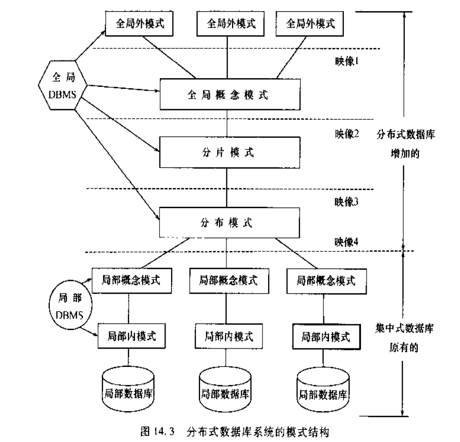

**全局外模式**：他们是全局应用的用户视图，是全局概念模式的子集

**全局概念模式**：它定义分布式数据库中数据的整体逻辑结构，使得数据如同没有分布一样。全局概念模式中所用的数据模型应阿盖易于向其他模式印象，通常采用关系模型。这样，全局概念模式包括一组全局关系的定义。

**分片模式**：每一个全局关系可以分为若干不想交的部分，每一个部分称为一个片段。分片模式定义片段以及全局关系到片段的映像。这种映像是一对多的，一个全局关系对应多个片段

**分布模式**：片段是全局关系的逻辑部分。

### 分布式事务
一个事务，分成多个场地的子事务。要么全部提交，要么全部回退。
