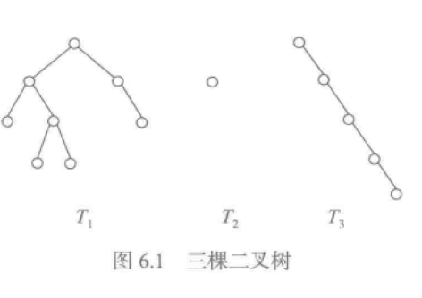
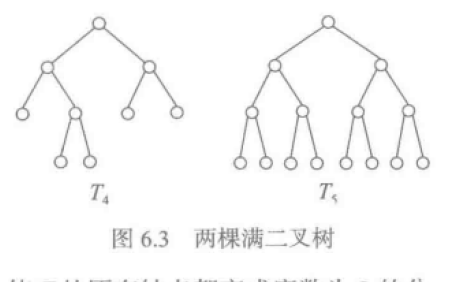
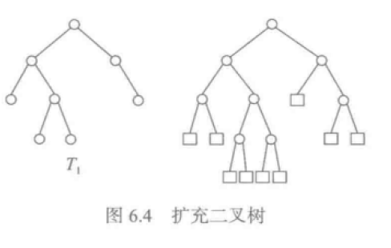
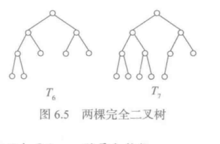
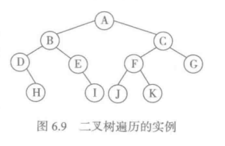

# 数据结构与算法：python描述 [北京大学出版社]

# 目录

# 1 绪论

# 2 抽象数据类型和python类

# 3 线性表

# 4 字符串

# 5 栈和队列

# 6 二叉树和树

# 7 图

# 8 字典和集合

# 9 排序

# 1 绪论

## 1.3 算法和算法分析

算法的性质:

- 有穷性:算法由有限多条命令或语句构成
- 能行性:算法中的命令必须是可执行的
- 确定性:对于给定的输入,通过一系列操作,产生问题的解
- 终止性:算法要么求出解,要么支出问题无解
- 输入/输出:有明确定义的输入和输出

算法的描述:

- 自然语言
- 伪代码
- 类似某种编程语言的形式描述算法

算法设计与分析:算法设计中一些常见的通用想法可以成为算法设计模式.常见模式为:

- 枚举法:枚举问题的各种可能,从中选出有用信息或者问题的解.利用计算机速度优势,结局简单问题十分有效
- 贪心法:根据问题尽可能做出部分的解,并基于部分解逐步扩充到完整解
- 分治法:把问题分解为相对简单的子问题,分别求解.最后组合子问题解得到原问题的解
- 回溯法(搜索法):分步骤求解问题.如果一个方向无法得到答案,就后退到前一步,在选另一条路走
- 动态规划法:一些复杂情况下,问题很难直接求解.因此需要在前面的步骤中积累信息.后续步骤根据已知信息,动态选择已知的最好求解路径
- 分支限界法:可以看做搜索的一种改良方法.如果搜索过程中可以得到一些信息,从而确定某种可能的选择实际并不真正有用,就可以及早删除该路径

### 1.3.2算法的代价及其度量

算法常见时间复杂度O(1),O(n),O(nlogn),O(n**2),O(n**3),O(2**n)

求斐波那契第n位值:

```python
def fib(n):
    if n<2:
        return 1
    else:
        return fib(n-1)+fib(n-2)
# 这里的时间复杂度大致为为Fn-1何Fn-2之和,也就是按n的指数增长,当n较大时,计算需要很长时间

def fib(n):
    f1=f2=1
    for i in range(1,n):
        f1,f2=f2,f2+f1
    return f2
# 这里是执行n-1次,时间复杂度是线性关系,非常快
```

**python中递归有深度限制,而且递归很慢**

有的算法占用时间少,有的算法占用空间少

### 1.3.3 算法分析(基本循环程序)

只考虑算法的时间复杂度,考虑最基本的循环程序,其中只有有序组合,条件分支和循环结构.分析这种算法只需几条基本计算规则:

1. 基本操作,认为时间复杂度为O(1).如果是函数调用,应该将其时间复杂度带入,参与整体时间复杂度的计算
2. 加法规则(顺序复合).如果算法(或所考虑的算法片段)是两个部分(或多个部分)的顺序复合,其时间复杂度是两部分(或多部分之和)`T(n)=T1(n)+T2(n)=O(T1(n))+O(T2(n))=O(max(T1(n),T2(n)))`最后取时间复杂度最大的一个
3. 乘法规则(循环结构).如果算法(或者所考虑的算法片段)是一个循环.循环体将执行T1(n)次,每次执行需要T2(n)时间,那么时间复杂度:`T(n)=T1(n)*T2(n)=O(T1(n))*O(T2(n))=O(T1(n)*T2(n))`
4. 取最大规则.如果算法是条件分支,应该选择最大那个`T(n)=O(max(T1(n),T2(n)))`

### 1.3.4 python程序计算代价(复杂度)

**时间开销**,python中很多基本操作不是常量时间.

- 基本算术是常量,逻辑运算也是常量
- 组合对象的操作有些事常量时间,有些不是.

  - 复制和切片是O(n)
  - list和tuple的元素访问和复制,是常量时间
  - dict操作比较复杂

- 字符串中许多操作不是常量时间

- 创建对象也要付出空间和时间.通常是线性时间,依赖于元素个数

- 构造西结构,例如list,set等.构造新的空结构是常量时间,而构造包含n个元素的结构,至少需要O(n)时间

- 一些list操作的效率:元素访问和修改时常量时间操作,但是一般的加入和删除元素操作都是O(n)时间操作

- 字典dict操作效率:主要操作是添加键值对.最坏情况是O(n),单平均是O(1)

```python
import time
def test1(n):
    lst=[]
    for i in range(n*10000):
        lst=lst+[i]
    return lst

def test2(n):
    lst=[]
    for i in range(n*10000):
        lst.append(i)
    return lst

def test3(n):
    return [i for i in range(n*10000)]

def test4(n):
    return list(range(10000))

start=time.time()
test1(10)
print('test1:{time}'.format(time=time.time()-start))

start=time.time()
test2(10)
print('test2:{time}'.format(time=time.time()-start))

start=time.time()
test3(10)
print('test3:{time}'.format(time=time.time()-start))

start=time.time()
test4(10)
print('test4:{time}'.format(time=time.time()-start))

mering:$ time python test2
test1:18.2594280243
test2:0.00935983657837
test3:0.00486898422241
test4:0.00018310546875

real    0m18.300s
user    0m18.127s
sys    0m0.138s
```

## 1.4 数据结构

越复杂的数据结构处理起来也就可能越复杂

### 1.4.1 数据结构及其分类

- 集合结构:元素之间没有需要关注的明确关系,也就是关系R是空集.这样的数据结构也就是其元素的集合,只是把一组数据元素包装成为一个整体
- 序列结构:其数据元素之间有明确的先后关系(顺序关系).存在一个排位在最前的元素,除了最后的元素外,每一个元素都有一个后继元素.例如环形结构,p型结构
- 层次结构:其数据元素分属于一些不同的层次,一个上层元素可以关联着一个或多个下层元素,关系R形成一种明确的层次性,只从上层到下层(通常也允许跨层次)
- 树形结构:层次结构中最简单的一种关系是树形结构,只有一个最上层元素,称为根元素.
- 图结构:数据元素之间可以有任意复杂的相互关系.

**实际上所有数据结构都可以看作是特殊的图结构**

# 2 抽象数据结构和Python类

# 3 线性表

希望表的所有操作不要超过O(n)

两种结构:

- 在连续内存当中存放数据,顺表表
- 元素通过链接构造,链接表

## 3.2 顺序表的实现

表中的元素在内存中顺序存放,首元素放在第一个位置,其余元素顺序存放,他们之间的关系可以通过物理位置来表示

### 3.2.1 基本实现方式

最常见方式,元素类型相同,可以通过位置和元素大小(index*size)来计算出内存访问地址.存取操作都是O(1).

如果元素大小不一致,则无法使用(index_size).这时候可以将元素的引用按照顺序存储(顺序表存放指针),元素的实际数据放在其他地方._*这样的结构也称为索引结构__

- 尾部添加数据简单O(1)
- 头部或中间插入数据,需要重新改变其他数据元素的物理位置,时间复杂度可能很高(第一位插入),最坏为O(n)
- 尾部删除数据O(1)
- 其他位置删除数据,与插入一样,需要改变剩余元素的位置,最坏为O(n)

#### 两种基本实现方式

表的信息放在元素头部,与元素一起连续存放;表对象只保存整个表有关信息,容量,个数,实际元素存放在另一个独立的元素存储区对象里,通过链接与基本表关联

显然第二种方式在当前分配内存不够的情况下,重新申请一块内存,并把原有的指针替换为新的指针,非常方便.

### 3.2.4 Python的list

list和tuple采用顺序表的实现技术,tuple是不变的表,不能改变其内部状态

#### list的基本实现技术

- 基于先表的高效访问和更新,时间复杂度O(1)
- 允许任意加入元素
- 要求容纳任意多的元素,就必须能够更换元素存储区,也就是 **实现方案二**

list的append时间复杂度O(1)

python中:建立空表时(或者很小的表时),系统分配一块能够容纳8个元素的存储区;在执行插入操作(insert或者append)时,如果元素区满,就换一块4倍打的存储区.如果表很大时,系统将改变策略,换存储区容量加倍,这里默认值是5000

#### 一些主要操作的性质

list中insert和delete时都要移动元素O(n).当插入元素时如果需要换存储区,就在换存储区的过程中将元素插入. 常用操作时间复杂度

- len()是O(1),因为list保存了len信息
- 元素访问和复制,尾部插入删除都是O(1)
- 一般位置的元素加入,切片,切片删除,表拼接都是O(n)
- pop默认从尾部删除O(1),从其他位置pop是O(n)
- reverse顺序倒置O(n) - clear直接换存储区O(1),不能真正释放元素占用的存储区

## 3.3 连接表

### 3.3.2 单链表

只保存下一个元素的连接,通过首元素出发可以找到任意一个元素.标的尾部元素的下一个元素设置None就可以标识.

#### 链表基本操作

- 创建空链表
- 删除链表:python中只是把表头的指针赋值为None
- 判断是否为空:表头指针是否为None

首部插入,删除元素都是O(1).其他地方插入,删除平均O(n),因为要找到该元素位置

#### 链表操作的复杂度

- 创建空表,删除表,判断空表,首部元素删除,首部加入元素:O(1)
- 尾部加入元素,指定位置加入元素,尾部删除元素,定位删除元素:O(n)
- 求表的长度是O(n),**优化方式是记录表的长度**

### 3.3.3 单链表的实现

```python
# 遍历链表
def elements(self):
    p=self._head
    while p is not None:
        yield p.elem
        p=p.next
for x in list.elements():
    print(x)
# 查找所有符合的元素
def filter(self, pred):
    p=self._head
    while p is not None:
        if pred(p.elem):
            yield p.elem
        p=p.next
```

## 3.4 链表的变形和操作

从单链表的缺点触发:尾部加入元素操作效率低;可以在表中引用最后一个结点,这样就可以做到O(1)

### 3.4.2 循环单链表

尾部指针指向首元素

### 3.4.3 双链表

如果维护量表的长度,再通过位置指定插入或删除就可提高速度,因为可以判断出从头开始扫描还是从尾部开始扫描

### 3.4.4 两个链表的操作

#### 链表反转reverse

双向链表操作简单,只需修改表头和表尾的指针O(1).

对于单链表,如果一直操作找到最后一个元素,来改变连接,需要O(n**2),这个方法也叫搬动元素;还有一种是改变元素的指针O(n).

单链表的首部插入删除都是O(1),所以通过把元素从首位一个一个取出,在做连接就是O(n)

#### 链表排序

list对象通过sorted函数进行排序:list.sort()或者sorted(list)

链表也存在数据,需要排序

##### 单链表排序

- 操作过程中维护一个排好序的列片段,初始只包含一个元素,可以是任何一个元素
- 每次从尚未处理的元素中去一个元素,将其插入已经排序片段中的正确位置,保持插入后的序列片段任然是正确排序的
- 当所有元素插入了排序片段时,排序完成

# 4 字符串

## 4.1 字符街,字符串,字符串操作

讨论字符串级其数据结构及字符串处理,首先要确定.字符集就是有穷的一组字符构成的集合.在实际工作中人们经常考虑的计算机领域广泛使用的某种标准字符集,例如ascii字符集或者Unicode字符集.实际上完全可以用任意一个数据元素集合作为字符集

基于字符串处理的需要,要求字符集上有一种确定的关系,称为字符序,也就是字符集里的字符上定义的一种顺序.因此,对这里的任意两个字符,他们或者相等,或者在某一个字符的前后.即<,=,>三种关系之一成立

字符串可以看做一类特殊的线性表,表中元素取自选定的字符集.从这个角度看,字符串结构就是一类特殊的线性表.而字符串通常作为一个整体来使用和操作,考虑以多个字符串对象的操作

### 4.1.1 字符串相关概念

- 字符串长度
- 字符在字符串中的微知
- 字符串相等.字符串的相等基于字符集里字符的定义,如果对应位置的字符相等,就是字符串相等
- 字典序:字典序是字符串上的一种序关系,基于字符集定义,就是两个字符串比较大小
- 字符串拼接:s1+s2+...+sn
- 子串关系:s1 in s
- 前缀和后缀
- 其他运算:s的n次幂,连续n个s拼接

### 4.1.2 字符串抽象数据类型

有些语言定义是字符串为可变数据类型,python字符串是不可变类型,顺序表存储

## 4.2 字符串的实现

字符串是字符的线性序列.可以采用顺序表和链接表.如果需要动态改变字符串大小需要使用连接表.

字符串结构设计要考虑的问题

- 字符串内容的存储.顺序存储需要连续存储区,极长的字符串可能带来问题.链接存储,需要额外的内存存储链接信息
- 字符串结束的表示.不同字符串长度不同,如果采用连续表示方式,由于存储的是二进制编码,计算机无法判断字符串的结束:可以用一个专门的数据域存放长度信息,例如表头;用一个特殊的编码表示字符串结束,需要保证该编码不代表任何字符

字符串替换需要考虑的问题:

- 子串可能在S中出现多次
- 完成一个替换后,应该从当前位置继续往下
- 无法预知子串的个数,也就无法提前知道替换后字符串的长度

因为无法知道结果字符串的长度,因此替换过程可能分成多步执行

```python
s="[asdfasf"
for i in range(100000):
    m=s.replace('[','',1)#速度很慢
s="[asdfasdf"
for i in range(100000):
    m=s[1:]# 速度更快

s="[sdfasdf//asdfasdfasdf]"
for i in range(100000):
    s.find('//')
    m=s[:8]+s[10:]
for i in range(100000):
    m=s.replace('//','',1)# 如果没有指定替换数目,反倒快一些
```

### 4.2.3 Python的字符串

python字符串采用顺序表形式,表头除了记录字符串长度外,还记录了一些解释器用于管理对象的信息,他们是为系统内部操作服务的

#### str操作

- 获取str信息,例如表长,检查串的内容是否都是数字等
- 基于已有str对象构造新的str对象,包括切片,构造小写/大写复制,各种格式化等
- count计算子串出现次数,endwith检查后缀,startswith检查前缀,find/index检查子串位置

str构造操作的实现

- 读取字符是O(1)
- 其他操作都需要扫描全表.因此都是O(n)

replace操作的方式,因为子串出现次数不确定,所以有两种方式:一种是先匹配,算出子串出现的次数(和位置),基于这一数据可以算出代换结果串的大小;另一种是构造新串的过程中动态调整大小

## 4.3 字符串匹配(子串查找)

### 字符串匹配的问题

实际应用中模式匹配的规模(n和m)可能非常大,而且有严苛的时间要求.具体的应用场景也有许多变幻.例如:

- 需要检索的文本可能很大,经常需要一个模式串在其中反复检索
- 网络搜索需要处理数以万计的网页,对付来源于世界各地的发生频率极高的千奇百怪的检所需求
- 防病毒软件要在合理的时间内检查数以十万计的文件,而且需要同时处理一大批病毒特征串
- 运行在服务器上的邮件过滤程序,需要在很短的时间内扫描数以万计的邮件和附件,用已知的或特定的一组模式串在其中匹配,模式串的集合还经常变化

**高效的串匹配算法变得越来越总要,目前有几个集中关注字符串匹配问题的国际学术会议.总而言之,字符串匹配是在理论和实际中都非常重要的计算问题**

### 4.3.2 串匹配和朴素匹配算法

需要考虑问题的内在性质来设计高效的算法.

#### 串匹配算法

做字符串匹配的基础就是逐个比较字符.从串匹配的角度看,两个字符比较就是相等与不同的结论

如果从目标的某个位置i开始,模式串里的每个字符都与目标串里的对应字符相同,就是找到了一个匹配.**匹配算法设计的关键两点:1怎样选择开始比较的字符对;2发现不匹配后,下一步怎么做.** 对这两点的不同处理策略,就形成了不同的串匹配算法

#### 朴素的串匹配算法

1从左到右逐个字符匹配;2发现不匹配时,转去考虑目标串里的下一个位置是否与模式匹配 这个算法的时间复杂度最坏为O(m*n)m为模式串长度,n为目标字符串长度

#### 无回溯串匹配法(KMP算法)

时间复杂度O(m+n),因为n>=m所以O(n)

利用之前匹配的结果,并且需要对模式先进行预处理


状态0的匹配进行到字符c时失败,此前有两次匹配成功,可知目标串前两个字符与模式串前两个字符相同.由于模式串前两个字符不同,与b匹配的目标串不可能与a匹配,所以朴素1的匹配一定失败.

状态2前4个字符都匹配,最后匹配c时失败,由于模式串第一个a与其后bc不同,用a匹配字符串里的bc一定失败.跳过这两个匹配点.另一方面模式串下表为3的字符也是a,她在状态2匹配成功,首字符a不必重做这一匹配

##### 问题分析

这种策略的关键是如何移到下一位,也就是在匹配之前,通过对模式本身的分析,解决好匹配失败时应该怎样前移

```python
import re
s="[asdfasd safdad sadfa] asdf sdfa"
for i in range(1,10000):
    l=s.split()#很快
    l=re.split('[ \[\]]',s)# 慢了一倍多

# re.split的速度
#real    0m0.185s
#user    0m0.169s
#sys    0m0.011s

# s.split的速度
#real    0m0.075s
#user    0m0.061s
#sys    0m0.009s
```

## 4.4 字符串匹配问题

在实际中人们需要查找可能不是某个特定的字符串,而是具有某种形式的字符串.例如:

- 找出一个文本中所有双引号的词语
- 找出图书馆中书名包括"数据结构"和"算法"两个词的数据
- 找出一个Python程序里所有三个参数的函数定义函数名
- 找出网页文件里所有行为href="..."的段
- 找出DNA片段中所有以某碱基段开始以另一个碱基段借宿的片段
- 找出计算机可执行文件中的某种片段模式(例如检查病毒),以一种形式的片段开始到另一片段的结束,其中出现了某些片段

上面检查需求有共性:他们只牵涉字符串的表现形式,并不牵涉其意义

### 模式,字符串和串匹配(串检索)

模式:一个模式描述了一些字符串.前面的字符串匹配只是模式的一个特例:模式的形式是普通的字符串;每个模式描述的字符串集合都是单元素集合,其中只包含这个字符串本身.对于一般的模式,都需要回答三个问题:模式形式是什么,描述的字符串集合如何确定,怎样做匹配.显然判断是否匹配是一个计算问题

考虑字符串集合的描述和匹配时,需要考虑两个问题:

- 为了描述字符串集合,需要一种严格的描述方式.这种方式能够描述很多有用的字符串集合.一种系统化的描述方式,就是一种描述串模式的原因
- 如何高效实现所希望的检查(匹配)

模式描述语言功能更强,可以描述的更多更复杂的模式,但相应的匹配算法的复杂性也可能变高

**模式语言复杂以后,或许可以做出复杂性的匹配算法,但是可能使得语言失去意义,模式匹配问题变成不可计算问题**

### 正则表达式

一种非常有意义和实用价值的模式语言成为正则表达式

## 4.5 Python正则表达式

re包提供正则表达式宝座

### 4.5.2 基本情况

#### 原始字符串

原始字符串是在Python里书写字符串文字量的一种形式,这种文字量的值和普通文字量的值一样,就是str类型的字符串对象

原始字符串只有一点特殊,就是`\`不作为转义符

python中映入原始字符串只是为了使一些字符串文字量书写简单,例如`r'C:\windows\python\test`,如果使用普通文字量`C:\\windows\\python\\test`,如果想匹配`\`,需要使用`\\\\`来匹配

#### 元字符(特殊字符)

`. ^ $ * + ? \ | ( ) { } [ ]`14个re规定的特殊字符

### 4.5.3 主要操作

- 生成正则表达式 re.compile(pattern,flag=0)
- 检索:re.search(pattern,string,flag=0),找到就返回一个match类型对象,否则None
- 匹配:re.match(pattern,string,flag=0),减产是否存在于pattern匹配的前缀,匹配返回match类型对象,否则None
- 分割:re.split(pattern,string,maxsplit=0,flag=0)以pattern作为分隔符,maxsplit表示最大分个数,0表示处理完整个string
- 找到匹配串:re.findall(pattern,string,flag=0),返回一个列表,列表中元素,按顺序

### 4.5.4 正则表达式的构造

#### 字符组

`[...]`与括号中列出的字符序中的任意一个字符匹配

可以使用区间形式,例如`[24ad-fs-z] [0-9a-zA-Z]`

`[^...]`与括号中的不匹配

`.` 匹配任意字符

为了方便re采用转义串的形式定义一些常用字符组:

- `\d`:等价于[0-9]
- `\D`:等价于[^0-9]
- `\s`:匹配所有空白字符,等价于`[ \t\v\n\f\r]`
- `\S`:匹配所有非空白字符,等价于`[^ \t\v\n\f\r]`
- `\w`:匹配所有字母数字,等价于`[0-9a-zA-Z]`
- `\W`:匹配所有非字母数字,等价于`[^0-9a-zA-Z]`

#### 重复

`a*`要求a重复0次或多次 `a+`要求a重复1次或多次 `a?`要求a重复0次或1次 `a{n}`要求a重复n次 `a{n,m}`要求a重复n到m次 `(abc)?`要求abc重复0次或1次

#### 选择

`(ab)|(cd), (ab*)|c*`

#### 首尾描述符

`^`开头,`$`结尾

#### 单词边界

`\b`描述单词边界

但是python字符串字面量`\b`表示退格,re中`\b`表示单词边界,

所以re要`\`双写:`\\b123\\b`将不会匹配`abc123abc`里的123,但匹配`(123,123)`里的123

使用`r'\b123\b'`

#### 正则表达式对象

regex=re.compile(pattern,flags=0),更加灵活,例如:

- regex.findall(string[,pos[,endpos]])
- regex.finditer(string[,pos[,endpos]])返回迭代器对象
- regex.split(string,maxsplit=0)
- ....

# 5 栈和队列

Python中的list是顺序结构,原生支持栈的操作,队列需要使用deque.

栈和队列是使用最多的缓冲存储结构

## 5.2 栈:概念和实现

- 对于顺序表,后端插入和删除都是O(1),后端作为栈顶
- 对于连接表,前段插入和删除都是O(1),前端作为栈顶

### 5.2.2 栈的顺序表实现

采用顺序表实现,需要考虑的是:用静态顺序表,还是动态顺序表(空间可以变大),压栈时静态表会出现栈空间不足,动态表需要更换存储区.

### 5.2.3 栈的连接表实现

这种考虑是顺序表扩大存储区需要做一次高代价的操作,但是连接表的开销内存大

## 5.3 栈的应用

栈是算法和程序里最长使用的副主结构,基本用途:

- 临时保存信息,工后面操作使用
- 栈的后进先出特征

### 5.3.1 括号匹配问题

- 顺序扫描被检查正文里的一个个字符
- 检查中跳过无关字符
- 遇到开括号时将其压入栈
- 遇到闭括号时弹出当时栈顶元素与之匹配
- 如果匹配成功继续,匹配不成功检查失败

```python
s='][asdfasdf[asdfasf]]'

def check(s):
    stack=[]
    for i in s:
        if i=='[':
            stack.append(i)
        if i==']':
            if not stack:
                return False
            tmp=stack.pop()
            if tmp!='[':
                return False
    print(stack)
    if stack:
        return False
    return True
```

### 5.3.2 表达式的表示,计算和变换

中缀,前缀,后缀表达式

### 5.3.3 栈与递归

#### 栈与递归/函数调用

支持递归定义函数的实现,需要一个栈保存递归函数运行每层调用的局部信息,留待函数调用返回后继续使用.

一般而言递归定义的函数,其执行中都有局部的状态,包括函数形式参数和局部变量机器保存的数据.在执行中递归调用自己之前的局部状态需要在相应调用之后使用,因此这些调用需要保存

编程语言实现的做法就是用一个运行栈,对每个调用都在这个栈上位置开辟一块区域,称为`函数帧`.递归函数执行总是以这个栈顶的帧为当前帧,所有局部变量都在这里有所体现.在进入递归的下一个递归调用时,就为他建立一个新帧,在这个帧里实现新调用的执行.当函数从下一帧递归调用中返回时,递归的上一层执行取得下层函数调用的结果,执行系统弹出已经借宿的调用对应的帧.然后回到调用前那一层执行时的状态.

其实一般函数的调用和退出方式也是与此类似,例如f-->g-->h-->i-->...这样嵌套调用

#### 栈与函数调用

在程序执行中函数的嵌套是按照先调用先返回的规则进行,这种规则符合栈的使用模式.因此栈可以很自然的支持函数调用的实现

函数调用时的内部动作分为两部风:1在进入新的函数调用之前需要保存好一些信息,2退出一次函数调用时需要恢复调用前的状态.

对于高级语言,例如python解释器,完成这些工作的细节和顺序有可能不同,但需要做的基本事项都差不多:

- 为被调用函数的局部变量和形式参数分配存储区(称为函数帧/活动记录/数据区)
- 将所有实参和函数的返回地址存入函数帧(实参形参的结合/传值)
- 将控制转到被调用函数入口

函数调用的后续动作:

- 被调用函数的计算结果存入指定位置
- 释放被调用函数的存储区(帧)
- 按以前保存的返回地址将控制转回调用函数

#### 递归与非递归

对于递归定义的函数,每个实际调用时执行的都是该函数体的那段代码,只需要在一个内部运行栈里保存歌词调用的局部信息.这也就表明递归函数完全有可能被改造为一个非递归函数,在函数里自己完成上面这些工作,用一个栈保存计算中的临时信息,完成同样的计算工作

对应的是:任何一个包含循环的程序都可以翻译为一个不包含循环的递归函数

## 5.4 队列

### 5.4.2 队列的链表实现

单链表支持首部O(1)插入,尾部O(n)插入,不适合做队列

优化方式是,单链表记录尾部元素,这样来实现尾部O(1)插入

### 5.4.3 队列的顺序表实现

首部删除需要O(n),尾部插入需要O(1)

另外一种就是,首部删除时,不进行元素的位移,但是记住新队列的头位置,这一设计的问题是:不停的删除元素导致表前段有很多空位,当多次插入时,表很可能溢出

所以一种新的设计:如果入队时队尾已经是存储区末尾,应该考虑转到存储区开始的位置去入队新元素

#### 循环顺序表

在循环队列中首尾留一个空格元素,但是队列元素可能充满存储区,这样入队就会失败,需要更大的存储区

### 5.4.4 队列的list实现

### 5.4.5 队列的应用

- 文件打印
- 消息队列

## 5.5 迷宫求解和状态空间搜索

### 5.5.1 迷宫求解:分析和设计

常见:公路网或铁路网上查找可行的或最优的路线,电子地图中路径的搜索,计算机网络传输的路由检索等

#### 迷宫问题

迷宫问题具有递归性质:

- 从入口开始检查,这是初始的当前位置
- 如果当前位置是出口,问题解决
- 如果当前位置已无路可走,需要按一定方式另行继续搜索,这是迷宫搜索策略问题
- 从可行方向取一个向前进一步

## 5.6 几点补充

pethon的deque采用的是双向链表,所以两端的参入和删除都是O(1)

### 5.6.2 几个问题

为什么连接表操作简单却还要考虑顺序表:cpu告诉缓存大小限制,如果是顺序表,那么cpu可以在告诉缓存中访问这些元素,而不需要再次访问内存;链表的元素在内存中位置是随机的,那么访问元素时,会在多个单元跳来跳去.因此连接表的灵活性,是要付出效率的代价

建立顺序表还可以避免复杂的内存管理,显然python中list对象不是那样.python提供了一些可能效率更高的数据类型,例如bytes和bytearray还有array类型等.他们可以看做受限的list,只能存储特定类型的对象,如数值或字符

```python
s='asfdasf'
ss=bytes(s)
#Docstring:
#str(object='') -> string
#Return a nice string representation of the object.
#If the argument is a string, the return value is the same object.


In [97]: bytearray(5)
Out[97]: bytearray(b'\x00\x00\x00\x00\x00')
# 每个元素只能是0~255
In [101]: s.append(255)

In [102]: s
Out[102]: bytearray(b'\x00\x00\x00\x00\x00\xff')
# Docstring:
# bytearray(iterable_of_ints) -> bytearray.
# bytearray(string, encoding[, errors]) -> bytearray.
# bytearray(bytes_or_bytearray) -> mutable copy of bytes_or_bytearray.
# bytearray(memory_view) -> bytearray.

# Construct a mutable bytearray object from:
#   - an iterable yielding integers in range(256)
#   - a text string encoded using the specified encoding
#   - a bytes or a bytearray object
#   - any object implementing the buffer API.
#
# bytearray(int) -> bytearray.
#
# Construct a zero-initialized bytearray of the given length.
import array
In [107]: array?
# Docstring:  
# This module defines an object type which can efficiently represent
# an array of basic values: characters, integers, floating point
# numbers.  Arrays are sequence types and behave very much like lists,
# except that the type of objects stored in them is constrained.  The
# type is specified at object creation time by using a type code, which
# is a single character.  The following type codes are defined:
#
#     Type code   C Type             Minimum size in bytes
#     'c'         character          1
#     'b'         signed integer     1
#     'B'         unsigned integer   1
#     'u'         Unicode character  2
#     'h'         signed integer     2
#     'H'         unsigned integer   2
#     'i'         signed integer     2
#     'I'         unsigned integer   2
#     'l'         signed integer     4
#     'L'         unsigned integer   4
#     'f'         floating point     4
#     'd'         floating point     8
#
# The constructor is:
#
# array(typecode [, initializer]) -- create a new array
```

# 6 二叉树和树

## 6.1 二叉树

二叉树是一种最简单的树形结构,每个结点至多关联连个后继结点,也就是一个结点的关联几点数是0,1,2.另外一个结点关联的后继结点明确地分左右,或为其左关联结点,或为其右关联结点

### 6.1.1 概念和性质

二叉树可能有两颗子树,也可能没有子树,或者只有一个子树.



讨论子树时必须明确左子树还是右子树

#### 几个基本概念

不包含任何结点的二叉树为空树;只包含一个结点的二叉树是单点树;

#### 路径,结点的层和树的高度

祖先结点到子孙结点的路径,是唯一的

二叉树的根节点是最高层元素,如果有子节点,子节点为下一层元素,跟层数规定为0,

二叉树的高度(也称为深度)是树中结点的最大层数

#### 二叉树的性质

二叉树的高度和树中可以容纳最大结点个数之间的关系是.

高度`h`的树可以容纳`2**h - 1`个结点

第`i`层可以容纳`2**(i+1)`个结点

非空二叉树,如果叶结点为`n0`,度数为2的结点数为`n2`,那么`n0=n2+1`

#### 满二叉树,扩充二叉树

如果二叉树的分支结点的度数都是2,则是 **满二叉树**.

满二叉树的叶结点比分支结点数多一个

**扩充二叉树** : 对二叉树T,加入足够多的新叶节点,是T的原有结点都变成度数为2的分支结点,得到的二叉树成为T的扩充二叉树.扩充二叉树中新增的结点成为其 **外部结点**.





#### 完全二叉树

对于高度h的二叉树,如果其第0层至第h-1层的结点都满(0<=i<=h-1,第层有`2**i`个结点).如果下一层的结点不满,则所有结点在最左边连续排列,空位都在右边,这样的二叉树就是完全二叉树.



n个结点的完全二叉树高度`h`是不大于`log2 n`的最大整数

### 6.1.2 抽象数据类型

数据操作

- 创建
- 判断是否为空树
- 获取二叉树结点个数
- 获取二叉树根存储的数据
- 获得二叉树左子树
- 获得二叉树右子树
- 用btree取代原来的左子树
- 用btree取代原来的右子树
- 遍历二叉树结点数据的迭代器
- 对二叉树每个结点数据指定op

### 6.1.3 遍历二叉树

#### 深度优先遍历

按深度优先方式遍历一棵二叉树,需要做三件事:遍历左子树(L),遍历右子树(R),访问根节点(D).选择这三项工作的不同执行顺序,就可以得到三种常见的顺序:

- 先根序遍历(DLR)(先根序)
- 中根序遍历(LDR)(对称序)
- 后根序遍历(LRD)(后根序)



DLR:ABDHEICFJKG

LRD:HDIEBJFKGCA

LDR:DHBEIAJFKCG

只知道一种序无法确认一棵二叉树;当知道中根序,再知道其他任意一个序就可以唯一确定一个二叉树

#### 广度优先遍历

按每一层,逐层遍历,这种过程无法写成递归过程.

## 6.2 二叉树list实现

简单看,二叉树结点就是一个三元组,即左右子树和自身.python的list和tuple都可实现,如果非变动可以使用tuple

### 6.2.1 设计和实现

使用list来采用下面设计:

- 空树用None表示
- 非空二叉树用包含三个元素的表[d,l,r]表示,其中:

  - d 表示存在根节点的元素
  - l和r是两棵子树,采用与整个二叉树同样结构的list表示

显然,这样做把二叉树映射到一种分成的list结构,每棵二叉树都有与之对应的list:

```python
[A,[B,None,None],
  [C,[D,[F,None,None],
        [G,None,None],
     ]
    [E,[H,None,None],
       [I,None,None]
    ]
  ]
]
# tuple实现
(A,(B,None,None),
  (C,(D,(F,None,None),
        (G,None,None),
     )
    (E,(H,None,None),
       (I,None,None)
    )
  )
)
```

## 6.3 优先队列

基于二叉树,可以做出优先队列的一种高效实现

### 6.3.1 概念

优先队列与栈和队列类似,但是每一个元素都附有一个值,这个值表示优先级.当访问优先队列时,总是访问优先级最高的元素.

### 6.3.2 基于线性表的实现

按优先级存储数据项.可能有两种方案:

- 存入数据时,保证表中元素始终按优先顺序排列,任何时候都可以直接取到优先级最高的元素.但是存入元素操作可能比较麻烦,效率很低,但访问和弹出比较方便
- 存入数据时采用最简答的方式,需要取用时,通过检索找到最优先的元素

#### 基于list实现优先队列

现将list排序,然后循环查找第一个小于(或大于)当前元素的元素,在该位置插入

插入元素O(n),读取是O(1),当内存空间满时,更换空间需要O(n)

连接表也可以实现这一操作

但总体上插入元素或者取出元素总有一个具有线性复杂度

### 6.3\. 树形结构和堆

#### 线性和树形结构

沿着表顺序检索插入位置,必然要O(n):对于顺序表需要移动O(n)个元素,对于连接表需要爬行O(n)步

#### 堆及其性质

**采用树形结构实现优先队列的一种有效技术成为堆**. 从结构上看,堆就是结点里存储数据的完全二叉树,但堆中数据的存储要满足一种特殊的堆序:任何一个结点里所存的数据先于或等于其子节点.

根据堆的定义,不难看出:

- 在一个堆中从树根到任何一个叶结点的路径上,各个结点里所存的数据按规定的优先关系(非严格)递减
- 堆中最优先的元素必定位于二叉树的根结点里(堆顶),O(1)时间就能取到
- 位于树中不同路径上的元素,这里不关心其顺序关系

如果要求的序是小元素优先,就是小顶堆,反之大顶堆

前面讲过一个完全二叉树可以自然而且信息完全地存入一个连续的线性结构,当然堆也可以存入连续表,通过下标就可以找到树中人一个结点的父节点/子结点

堆和完全二叉树还有下面几个重要的性质:

- Q1 在一个堆的最后加上一个元素,整个结构还是可以看做一棵完全二叉树,但它未必是堆
- Q2 一个堆去掉堆顶,其余元素形成两个`子堆`,完全二叉树的子节点/父节点,下标仍然适用,堆序在路径上仍然成立
- Q3 给上面的两个子堆加入一个根元素,得到的结点序列又可看做完全二叉树,但它未必是堆
- Q4 去掉堆中的最后一个元素,剩下的任然是堆

#### 堆和优先队列

用堆作为优先队列,还需解决两个问题:

- 如何实现插入元素:添加元素后,重新组成一个堆
- 如何实现弹出元素:弹出堆顶后将剩下的重新组成堆

### 6.3.4 优先队列的堆实现

解决堆插入和删除的关键操作成为筛选,分为:向上筛选和向下筛选

#### 插入元素和向上筛选

在堆中最后加入元素,得到的还可以看做完全二叉树,但未必是堆.只需要做一次向上筛选就可以

向上筛选:不断用新加入的元素与其父节点的数据比较,如果e较小就交换两个元素的位置,或者知道根结点位置

插入操作的特点:

- 把新元素放在已有元素之后,执行一次向上筛选操作
- 向上筛选操作不会超过树的高度H,可以在O(log n)时间完成

#### 弹出元素与向下筛选

假设AB两个子堆加上元素e之后变成一个完全二叉树,现在需要把他们做成一个堆:

1. 用e和A,B两个子堆的顶元素比较,较小者作为整个堆的堆顶.

  - 若e不是最小,最小的必为A或B的根,设A的根最小,将其移到栈顶,相当于删除了A的顶元素
  - 下面考虑把e放入去掉堆顶的A,这是规模更小的同一问题

2. 如果某次比较中e最小,以它为顶的局部树已经成为堆,整个结构也成为堆

3. 或者e已经落到低,这时它自身就是一个堆

总结一下优先队列弹出操作的实现,分为三大步骤:

- 弹出当时的栈顶
- 从堆最后取一个元素作为完全二叉树
- 执行一次向下筛选

前两步都是O(1),第三步,操作次数也不长于书中路径的长度.O(log n)

#### 基于堆的优先队列类

```python
class ProioQueue:
    def __init__(self, elist=[]):
        self._elems=list(elist)
        if elist:
            self.buildheap()

    def is_empty(self):
        return not self._elems

    def peek(self):
        if self.is_empty():
            raise PrioQueueError('in peek')
        return self._elems[0]

    def enqueue(self, e):
        self._elems.append(None)
        self.siftup(e, len(self._elems)-1)

    def siftup(self, e, last):
        elems, i, j = self._elems, last, (last-1)//2
        while i > 0 and e < elems[j]:
            elems[i] = elems[j]
            i, j = j, (j-1)//2
        elems[i]=e

    def dequeue(self):
        if self.is_empty():
            raise PrioQueueError("in dequeue")
        elems = self._elems
        e0 = elems[0]
        e = elems.pop()
        if len(elems) > 0:
            self.siftdown(e, 0, len(elems))
        return e0
    def siftdown(self, e, begin, end):
        elems, i, j = self._elems, begin, begin*2 + 1
        while j < end :
            if j+1 < end and elems[j+1] < elems[j]:
                j+=1
            if e < elems[j]:
                break
            elems[i] = elems[j]
            i, j = j, 2*j+1
        elems[i]=e
```

#### 构建堆的复杂性O(n)

```
for i in range(end//2, -1, -1):
    siftdown(self._elems[i], i, end)
```

### 6.3.5 堆排序

按优先队列的操作方式反复弹出堆顶元素,能够得到一个递增序列.不难想到,这就形成了一种可行方法,可以用于完成对连续表中元素的排序工作

基于这种方法,需要解决两个问题:

- 连续表里的初始元素序列不满足堆序
- 选出的元素存放在哪里,能不能不用其他空间

```python
def heap_sort(elems):
    def siftdown(elems, e, begin, end):
        i, j = begin, begin*2+1
        while j < end :
            if j+1 < end and elems[j+1] < elems[j]:
                j+=1
            if e < elems[j]:
                break
            elems[i] = elems[j]
            i, j = j, 2*j+1
        elems[i]=e
    end =len(elems)
    for i in range(end//2, -1, -1):
        siftdown(elems,elems[i],i,end)
    for i in range((end-1),0,-1):
        e=elems[i]
        elems[i]=elems[0]
        siftdown(elems,e,0,i)
```

## 6.5 二叉树的类实现

### 6.5.1 二叉树结点类

通过链接实现,用一个数据单元表示一个二叉树结点,没有子节点用None值,空二叉树直接用None表示

```python
class BinTNode:
    def __init__(self, data, left = None, right = None):
        self.data = data
        self.left = left
        self.right = right

tnode = BinTNode(1, BinTNode(2), BinTNode(3))

# BinTNode对象构造的二叉树具有递归的结构,很容易采用递归的方式处理
# 统计树中结点的个数
def count_nodes(t):
    if t is None:
        return 0
    else:
        return 1+count_nodes(t.left)+count_nodes(t.right)
# 假设结点中保存的是数值,求所有结点数值和
def sum_nodes(t):
    if t is None:
        return 0
    else:
        return t+sum_nodes(t.left)+sum_nodes(t.right)
```

### 6.5.2 遍历算法

```python
def preorder(t,proc):#proc是结点操作函数
    if t is None:
        return
    proc(t.data)
    preorder(t.left)
    preorder(t.right)

# 例如:这里是DLR遍历
def print_bin_nodes(t):
    if t is None:
        print("^") # 空树输出
    print("({data})".format(data=t.data));
    print_bin_nodes(t.data)
    print_bin_nodes(t.left)
    print_bin_nodes(t.right)
```

#### 宽度优先遍历

#### 非递归的先根序遍历函数

非递归定义的深度优先遍历算法,一些考虑:

- 由于采取先根序,遇到结点就应该访问,下一步应该沿着树的左枝下行
- 但结点的右分支还没有访问,因此需要记录,将右结点入栈
- 遇到空树时回溯,取出栈中保存的一个右分支,像一颗二叉树一样遍历它

每次诱导空树,总是遍历一棵树的工作完成.如果这是一棵左子树,对应右子树应该时当时的栈顶元素.如果这是一棵右子树,说明以它为右子树的更大子树已完成遍历,下一步应该处理更上一层的右子树.算法还有一些细节,主要是循环的控制

循环中需要维持一种不变的关系:假设变量t一直取值为当前待遍历树的根,栈中保存着前面遇到但尚未遍历的那些右子树.这样,只要当前树非空或者栈不空,就应该继续循环.这就是循环继续的条件

循环中应该先处理当前节点的数据,而后沿着树的左分支下行,一路上把经过节点的右分支压入栈,与此也需要一个循环.内部循环直至遇到空树时回溯,从栈里弹出一个元素,要做的工作也是遍历一棵二叉树

```python
def preorder_nonrec(t,proc):
    stack=[]
    while t is not None or not s.is_empty():
        while t is not None:
            proc(t.data)
            s.append(t.right)
            t=t.left
        t=s.pop()
preorder_nonrec(bin_tree,lambada x:print(x+' '))
```

#### 通过生成器遍历

```python
def preorder_nonrec(t):
    stack=[]
    while t is not None or not s.is_empty():
        while t is not None:
            s.append(t.right)
            yield t.data
            t=t.left
        t=s.pop()
```

#### 非递归的后根序遍历算法

## 6.6 哈夫曼树....

# 7 图

# 8 字典和集合

## 8.1 数据存储,检索和字典

### 8.1.1 数据存储和检索

数据的基本访问方式基于存储位置,知道存储位置,只需常量时间就可以得到它.但是许多情况下,计算过程并不知道数据的存储位置,但却需要使用某些数据.例如:人们知道字典里有某个字的解释,但是不知道在哪一页,所以首先要找出字所在的页码

#### 概述

检索设计两个方面:已存储的数据;用户提供的检索信息.

数据存储和访问:关注字典的实现效率,包括存储空间利用率和操作效率

#### 字典操作和效率
实际中使用的字典可以分为两类:
- 静态字典:建立之后就不在修改.这种结构需要考虑创建的代价,但最重要的是考虑检索效率
- 动态字典:除了检索,还要考虑修改,插入和删除的效率

#### 字典和索引

实际上,字典是两种功能的统一:
- 作为一种数据存储结构,支持在字典里存储一批数据项
- 提供支持数据见多的功能,设法维护从关键码找到相关数据的联系信息,这也称为索引

### 8.1.2 字典实现的问题

#### 字典元素:关联

字典的关键码与检索,删除,插入关系密切.字典分为:关键码和值.一个数据项就是一种二元组,叫做关联
```python
class Assoc:
    def __init__(self, key, value):
        self.key=key
        self.value=value
    def __lt__(self, other):
        return self.key < other.key

    def __le__(self, other):
        return self.key <= other.key

    def __str__(self):
        return "Assoc({0} , {1})".format(self.key,self.value)
```

## 8.2 字典线性表实现

检索,删除:一个一个匹配,O(n)

### 8.2.2 有序线性表和二分查找

有序表的插入,删除后都需要维护有序性,有序表只是加快了查找速度

### 8.2.3 字典线性表总结

采用排序顺序表和二分查找虽然提高了查询速度,但是对变化的数据支持不好

## 8.3 散列和散列表

问题:什么情况下基于关键码能最快找到所需的数据?|-->根据计算机数据存储和使用的方式-->如果数据项连续存储,而关键码就是存储数据的地址(或下标)

但是,一般情况下,字典所用的关键码可能不是整数,由此不能作为下标.另外,及时使用整数,也可能因为取值范围太大而不适合作为下标.

如果一种关键码不能或者不适合作为数据存储的下标,可以考虑通过一个变换把他们映射到一种下标.这样做,就把基于关键码的检索转变为基于整数下标的直接元素访问,有可能的一宗高效的字典实现技术.以散列表的思想实现字典,具体方法是:
1. 选定一个整数的下标范围(通常以0或1开始),建立一个包括相应元素位置方位的顺序表
2. 选定一个从实际关键码集合到上述下标范围的适当映射h:
    - 在需要存入关键码key的数据时,将其存入表中第h(key)个位置
    - 遇到以key为关键码检索数据时,直接去找表中第h(key)个位置的元素

这个h称谓散列函数,也称为哈希函数或杂凑函数,他就是从可能的关键码集合到一个整数区间(下标区间)的映射

实现一个散列表,不但需要选择合适的关键码映射(散列函数),还要考虑由于采用映射方式确定存储和检索位置而带来的各种问题

#### 散列技术:设计与性质

如果字典的可能关键码集合非常小,例如0~19这组整数,那么可以直接作为数据存储的下标,在例如ASCII码

一般关键码集合都非常大,而下标集合通常远远小于关键码集合:|KEY|>>|INDEX|

如果key1!=key2,h(key1)==h(key2),就是出现了冲突(或者碰撞)

一般表中元素越多,冲突可能越大.这里有一个重要概念是 **负载因子**.它考擦散列表在运行中的性质的一个重要参数:

定义:`负载因子a=散列表中当时的实际数据项目数/散列表的基本存储区能容纳的元素个数`

如果数据项直接保存在基本存储区里,那么a<=1.负载因子越大,冲突可能越大.显然扩大散列表的存储空间,可以降低其负载因子,减小出现冲入的概率,但是负载因子越小,散列表里的空闲空间的比例也就越大.因此有的是权衡的问题

冲入总会出现,有多种不同的散列表结构来处理冲突

### 8.3.2 散列函数

设计字典时,首先应该根据实际需要确定数据项集合,选定相应的关键码集合key,为了实现散列表字典,还要确定一个存储区间INDEX.例如,选择从0开始的一段下标.key和index是两个有限集合,分别为将要定义的散列函数的参数域和值域,是定义散列函数的基础. **但是散列函数的选择可能影响出现冲突的概率**

设计散列函数是,有价值的考虑:
- 函数应能把关键码映射到值域INDEX中尽可能大的部分.显然如果扩大函数值的范围(在INDEX内),出现冲突的可能性就会下降.如果下标不是散列函数的可能值,这个位置就可能无法用到,应该尽量避免这种情况.
- 不同关键码的散列值在INDEX里均匀分布,有可能减少冲突,
- 函数计算应该比较简单,不能占用太多系统开销

#### 常用散列函数
- 除余法:适合于整数关键码
- 基数转换法:适合于整数或字符串关键码

**除余法**:关键码key是整数,用key除以某个不大于散列表长度m的整数p,以得到的余数(或者余数加l,由下标开始值确定)作为散列地址

为了存储方便,m通常为2的某个幂值,此时p可以取小于m的最大素数(如果连续表的下标从1开始可以用key mod p+1).例如,m取128,256,512时p可以取127,251,503

**基数转换法**:对于整数,取一个正整数r,把关键码看做基数为r的数(r进制数),将其转换为10进制或二进制数,通常r取素数以减少规律性.

对于字符串作为关键码.把一个字符看做一个整数,把一个字符串看做以某个整数为基数的整数.这样做时,建议使用素数29或31为基数,通过基数转换法把字符串转换为整数.再用整数的散列方法(例如除余法),把结果归入散列表的下标范围

### 8.3.3 冲突的内消解:开地址技术

散列函数冲突事件必然会出现.因此,在设计散列表时,必须确定一种冲突消解方案:
- 内消解(在基本存储区内部解决冲突问题)
- 外消解(在基本存储区外部解决冲突)

在散列表中插入数据项时,用散列函数计算出的存储位置,已经存在关键码不同的项.这是就有了冲突.对于冲突处理,有两个基本要求:
- 保证当前这次存入数据项能够正常完成
- 保证字典的基本存储性质:在任何时候,从任何以前存入字典而后没有删除的关键码出发,都能找到对应的数据项

#### 开地址法和探查序列

内消解的基本方法是开地址法,基本思想:在准备插入数据并发现冲突时,设法在基本存储区(顺序表)里为需要插入的数据项另行安排一个位置.为此需要设计一种系统的且易于计算的位置安排方式,成为探测方式

抽象的方法是为散列表定义一种易于计算的探测位置序列.首先定义:D=d0,d1,d2,...,

这里的D是一个整数的递增序列,d0=0.而后定义探测序列为:Hi=(h(key)+di)mod p

这里的p为不超过表长度的数.在实际插入数据项时,如果h(key)位置空闲就直接存入(这里相当于使用d0);否则就逐个试探一个个位置Hi,直到找到第一个空位时把数据项存入.具体的增量序列有许多可能的设计,例如:
1. 取D=0,1,2,3,4....,简单的整数序列,这种称为线性探查
2. 设计另一个散列函数h2,令di=i*h2(key),称为双散列探查

#### 开地址法示例...

删除数据项时,由于数据项本身可能是其他数据项的查找路径,所以不能直接删除该数据项,python中用一个状态表示删除,实际并没有删除

### 8.3.4 外消解技术

#### 溢出区
当关键码的位置为空就直接插入,如果不为空就将关键码和数据在溢出区中顺序存放.查询时对应位置没有就到溢出区查

#### 桶散列

散列表只存放数据的引用,基于此可以开发出很多不同的设计,这种设计称为桶散列

### 8.3.5 散列表的性质

#### 扩大存储区,用空间交换时间

无论采用哪种消解技术,随着元素的增加,冲突可能性就会增大.开地址法,数据增加会导致存储区溢出;溢出区方法,导致溢出区越来越大,检索趋于线性.

显然扩大存储区,在一定程度上缓解.前面讨论顺序表时,扩大存储区的策略和性质.现在的新问题是不能简单的把元素拷贝到新的存储区.存储区扩大后,需要调整散列函数,以便尽可能利用增加的存储单元.可见.扩大存储区需要重新分配存储区和再散列装入数据项的代价

## 8.5 python标准dict和set

python中dict和set都是基于散列表技术实现的数据结构,采用内消解技术解决冲突.以dict为例:
- dict的关键码可以是任何不变对象,值可以是任何对象
- 在创建空字典或很小的字典时,初始分配的存储区可以容纳8个元素
- dict对象在负载因子超过2/3时自动更换更大的存储区,并把已经保存的内容重新散列到新存储区里.如果当前字典对象不太大,就按当时字典实际元素的4倍分配存储区,当字典里的元素超过50000时,改为按照实际元素个数的2倍分配存储区

python的dict的关键码以及set和frozenset的元素都只能是不变对象,因为如果关键码可变就要重新散列.

python内置不变类型都有hash函数的定义,而且如果a==b那么他们的hash值也相等

python的__hash__就是hash调用的最终函数


## 8.6 二叉树排序和字典

# 9 排序

## 基于比较的排序
